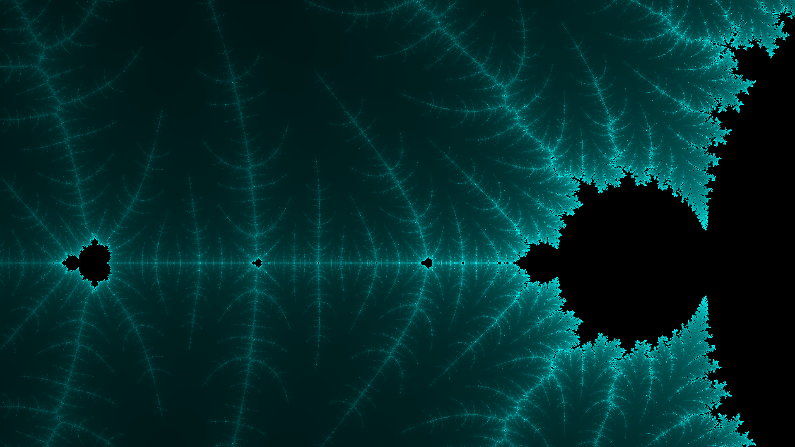

# Recorder

--------------------------------------------------
## Overview · 项目概述

知识技术的学习和应用是一个长期的持久化的过程，同一个问题会随着个人知识技术的积累而呈现多样的解决方案。**Recorder** 是我的个人项目，目的是通过记录个人知识技术体系的实际建立过程来探索其方法论。

--------------------------------------------------


--------------------------------------------------
## Index · 目录结构
* [node](./node/README.md) - 碎片化知识库：记录碎片化的知识技术片段
* [spark](./spark/README.md) - 问题想法记录库：记录问题和初步想法，捕获灵感
* [topic](./topic/README.md) - 主题研究文档库：以特定主题或问题场景为核心的研究文档库。
* [docs](./docs/) - 项目文档
* [tools](./tools/) - 项目工具

--------------------------------------------------
## Articles · 精选文章
* [Python中的内省与反射机制及其应用场景](./topic/Pythonic/Python中的内省与反射机制及其应用场景/Python中的内省与反射机制及其应用场景.md)
* [Scrapy-请求去重机制分析](./topic/Scrapy/Scrapy-请求去重机制分析/Scrapy-请求去重机制分析.md)
* [一种朴素的人工滑动轨迹生成方案](./topic/Captcha/一种朴素的人工滑动轨迹生成方案/一种朴素的人工滑动轨迹生成方案.md)
* [基于requests库的组件化扩展方案](./topic/Collector/基于requests库的组件化扩展方案/基于requests库的组件化扩展方案.md)
* [基于JavaScript和Canvas绘制曼德勃罗特集](./topic/Vision/基于JavaScript和Canvas绘制曼德勃罗特集/基于JavaScript和Canvas绘制曼德勃罗特集.md)
* [模块化URL提取器的设计与实现](./topic/Extractor/模块化URL提取器的设计与实现/模块化URL提取器的设计与实现.md)

--------------------------------------------------
## Specification · 文档规范

### Topic文档 - 目录结构规范
*topic* 目录中的子目录结构需要遵循以下规范。
1. 每个主题/子主题的根目录需要包含 *README.md* 文件，用于后期在建立管理系统的时候，通过检查 *README.md* 文件来识别主题目录。
2. 每个主题中采用文件夹对文档进行分割，文件夹名称应表达要探讨的核心问题，通常与核心文档同名。
3. *src* 目录用于存储文档中使用到的源代码。

目录结构样例如下：
```
topic
 ├─ topicA
 |   ├─ doc1
 |   |   ├─ doc1.md
 |   |   └─ src/
 |   ├─ doc2
 |   |   └─ doc2.md
 |   └─ README.md
 ├─ topicB
 |   ├─ ...
 |   └─ README.md
 ├─ topicC
 |   ├─ ...
 |   └─ README.md
 |
 ...
```

### Topic文档 - 元数据结构规范
*topic* 文档中的 *元数据* 记录文档的相关创建信息和特征，用于管理系统识别和索引的建立。通常位于文档中 *概述* 段落的 *### Meta* 标题下，其结构定义如下：

```json
{
    "node": "文档的唯一标识码(全大写的UUID)",
    "name": "文档名",
    "author": "作者(Ais)",
    "date": "文档完成日期(yyyy-mm-dd)",
    "tag": ["文档标签"] 
}
```

实际样例如下：

```json
{
    "node": "D0B58787-93D2-DBD0-E731-3817F18AED2A",
    "name": "python中的反射机制及其应用场景",
    "author": "Ais",
    "date": "2023-09-13",
    "tag": ["python", "语法研究", "高级特性", "反射机制", "内省机制", "自省", "动态构建"]
}
```
