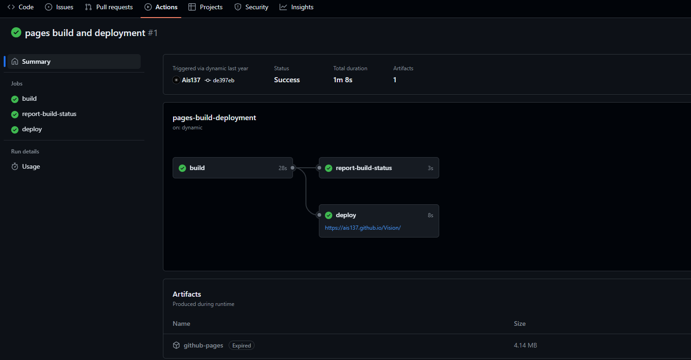

# JavaScript项目的文档自动化集成与发布方案

-------------------------------------------------------
## 1. 概述
本文主要介绍一种基于 *jsdoc*, *Github Actions* 和 *Github Pages* 技术栈的文档自动化集成与发布方案，通过 *jsdoc* 从源码中构建并集成文档，再接入 *Github Actions Workflows* 来自动发布到 *Github Pages*。

* [JavaScript项目的文档自动化集成与发布方案](#javascript项目的文档自动化集成与发布方案)
    * [1. 概述](#1-概述)
    * [2. 技术背景](#2-技术背景)
    * [3. 自定义注释规范的文档集成问题](#3-自定义注释规范的文档集成问题)
    * [4. 迁移到 jsdoc 文档方案](#4-迁移到-jsdoc-文档方案)
    * [5. 注释文档自动化构建与集成](#5-注释文档自动化构建与集成)
    * [6. 接入 Github Pages 发布文档](#6-接入-github-pages-发布文档)
    * [7. 基于 Github Actions 的文档自动化工作流](#7-基于-github-actions-的文档自动化工作流)
    * [8. 总结](#8-总结)
    * [9. 参考](#9-参考)

-------------------------------------------------------
## 2. 技术背景
优秀的项目不单取决于精心设计的架构和优雅的代码实现，注释文档的覆盖率也是衡量项目质量的一个重要指标。

虽然常常说优秀的代码是 **自描述** 的，但在实际开发过程中，一个大型项目往往是由多人合作开发完成的，由于开发者技术和代码风格的差异，从而导致代码水平参差不齐。

因此，统一的代码注释规范的作用在于 **通过屏蔽代码的底层实现细节来减少理解成本**。代码注释的作用不仅仅是用来描述代码的逻辑实现，对于整个项目而言，更是一种开发规范和约束。

-------------------------------------------------------
## 3. 自定义注释规范的文档集成问题
**[Vision](https://github.com/Ais137/Vision)** 是我的一个 *JavaScript* 项目，在项目的早期阶段就确定了统一的注释文档规范，自定义方案的样例如下：

```js
/*----------------------------------------
@func: 加法
@desc: 向量的对应分量相加
@params: 
    * vector(Vector): 操作数
@return(Vector): this
@exp: 
    1. 维数相同的情况
    let v1 = new Vector(1, 2, 3);
    let v2 = new Vector(4, 5, 6);
    v1.add(v2) -> v(5, 7, 9) -> v1
    2. 维数不同的情况
    let v1 = new Vector(1, 2, 3);
    * v1.add(new Vector(1, 2, 3, 4, 5)) -> v(2, 4, 6) -> v1
    * v1.add(new Vector(1, 2)) -> v(2, 4, 3) -> v1
----------------------------------------*/
add(vector){
    let v = vector.v;
    for(let i=0; i<this._v.length; i++) {
        this._v[i] += (v[i] || 0);
    }
    return this;
}
```

随着项目的持续推进，项目代码量持续增加，这种自定义方案的弊端逐渐显现。

由于缺乏 **文档集成** 的功能，注释片段分散在源码中。当偶尔引用一些不常用的模块时，往往需要到源码中搜索并查看注释文档以了解模块的使用方法。这种方式无疑是繁琐的，因此迫切的需要在项目中引入一种 **文档自动集成方案**，从源码中提取注释片段并自动构建 API 文档，以提高开发效率和框架的易用性。

由于自研文档集成工具的开发和验证成本较高，而且项目的开发重心现阶段还不在于构建完整工具链上，因此考虑现有的成熟解决方案。

-------------------------------------------------------
## 4. 迁移到 jsdoc 文档方案
为了解决上述提到的文档自动集成问题，引入 *jsdoc* 文档方案，并从之前的自定义注释规范迁移。

> JSDoc 是一个用于 JavaScript 的API文档生成器，类似于 Javadoc 或 phpDocumentor。可以将文档注释直接添加到源代码中。JSDoc 工具将扫描您的源代码并为您生成一个 HTML 文档网站。

*jsdoc* 通过特殊的 ```/** */``` 字符串片段来识别和解析注释。以下是将原有的自定义注释规范迁移到 *jsdoc* 的注释规范的样例：

```js
/**
 * 向量加法: 向量的对应分量相加  
 * 当操作数维数小于当前向量维数: 空缺分量默认值作为 *0* 处理  
 * 当操作数维数大于当前向量维数: 操作数分量将截取到当前向量维数进行计算
 * 
 * @param { Vector } vector - 操作数 
 * @returns { Vector } this
 * @example
 * //维数相同的情况
 * let v1 = new Vector(1, 2, 3);
 * let v2 = new Vector(4, 5, 6);
 * v1.add(v2);  // v1 -> vector(5, 7, 9)  
 * 
 * //维数不同的情况
 * let v1 = new Vector(1, 2, 3);
 * v1.add(new Vector(1, 2, 3, 4, 5));  // v1 -> vector(2, 4, 6)
 * v1.add(new Vector(1, 2));           // v1 -> vector(2, 4, 3)
 */
add(vector){
    for(let i=0, end=this.v.length; i<end; i++) {
        this.v[i] += (vector.v[i] || 0);
    }
    return this;
}
```

简单介绍一下上述注释的规范和定义：

* @description
    * 格式：@description \<some description\>
    * 功能：该标签用于添加描述信息，一般用于描述函数或方法的功能概要，如果该标签在注释开头，则可以省略。

* @param
    * 格式：@param [\<type\>] \<name\> [\<description\>]
    * 功能：用于提供函数参数的名称、类型和描述。

* @returns
    * 格式：@return [{type}] [description]
    * 功能：用于提供返回值的类型和描述。

* @example
    * 格式：@example \<some description\>
    * 功能：用于提供使用样例。

除了支持对方法和函数添加注释外，还支持对类和模块的注释：

* Module：

```js
/**
 * @module
 * @desc     模块描述
 * @project  Vision
 * @author   开发者
 * @date     创建时间(xxxx-xx-xx)
 * @version  版本(0.1.0)
 * @since    (更新时间, 开发者): 更新信息
*/
```

* class：
```js
class Test {

    /**
     * @classdesc 描述信息
     * 
     * @property { number } id - 标识id
     * @property { string } data - 数据
     * 
     * @param { number } id - 标识id
     * @param { string } [data="test"] - 数据
     * 
     * @example
     * let t = new Test(1, "aaa");
     */
    constructor(id, data="test") {
        this.id = id;
        this.data = data;
    }
}
```

支持的完整标签详见官方文档 [块级标签](https://www.jsdoc.com.cn/tags)。

-------------------------------------------------------
## 5. 注释文档自动化构建与集成

在将项目内的注释文档规范从自定义方案迁移到 *jsdoc* 方案后，就可以利用 *jsdoc* 提供的工具进行文档集成。 

切换到源码目录并执行以下命令进行文档集成：

```sh
# ~/Vision/src
../node_modules/.bin/jsdoc ./vector/vector.js
```

文档会以 HTML 格式默认输出到 *./out* 路径，打开 *./out/index.html* 可以查看上述注释集成后的样式：


由于默认样式效果不是很好，可以在文档的构建配置文件中指定其他模板，这里我使用了 [docdash](https://github.com/clenemt/docdash) 模板，并进行了一些自定义，显示效果如下：


自定义的 *jsdoc* 构建配置文件如下：

```js
//path: ~/Vision/build/jsdoc.config.json
{
    "tags": {
        //允许使用无法识别的标签(自定义标签)
        "allowUnknownTags": true
    },
    //指定集成的输入源
    "source": {
        "include": "./src",
        "includePattern": "\\.js$"
    },
    //启用的插件
    "plugins": [
        "plugins/markdown"
    ],
    //命令行选项
    "opts": {
        //指定模板路径
        "template": "./build/docdash-templates",
        //指定编码
        "encoding": "utf8",
        //指定输出源
        "destination": "api/",
        //指定 README 文件路径
        "readme": "./docs/tutorials/01-快速入门.md",
        //指定教程文档路径
        "tutorials": "./docs/tutorials",
        //扫描源码时递归子目录
        "recurse": true,
        //输出运行时的详细信息
        "verbose": true
    },
    ...
}
```

在调用 *jsdoc* 集成文档时，通过 ```-c``` 参数指定使用的配置文件：

```sh
jsdoc -c ./build/jsdoc.config.json
```

将其添加到 *package.json* 中：

```json
{
    "scripts": {
        "doc": "jsdoc -c ./build/jsdoc.config.json"
    },
}
```

后续就可以通过 ```npm run doc``` 来生成项目的API文档。

-------------------------------------------------------
## 6. 接入 Github Pages 发布文档 

> GitHub Pages 是一项静态站点托管服务，它直接从 GitHub 上的仓库获取 HTML、CSS 和 JavaScript 文件，（可选）通过构建过程运行文件，然后发布网站。

通过 *GitHub Pages* 可以为项目配置一个静态站点，这正适合用来接入API文档。

*Github Pages* 支持指定分支作为源进行发布，因此为了将API文档与源码进行分离，从 *master* 分支签出一个新的 *doc* 分支用于进行文档的构建和发布。

切换到 *doc* 分支下，修改 *jsdoc* 的输出目录为 */docs*，运行命令来构建API文档，并将变更推送到 github。

打开项目的 *Settings* 选项卡，选择左侧边栏的 *Pages* 标签，选择源的发布方式为 *通过指定分支部署(Deploy from a branch)*，指定发布源为 *doc* 分支下的 */docs* 目录。


在 *Actions* 选项卡可以看到，*Github* 自动触发了一个 *Workflows* 来进行发布。



打开项目的 *Github Pages* 查看是否发布成功。


-------------------------------------------------------
## 7. 基于 Github Actions 的文档自动化工作流

到此为止，实现了文档的集成和发布，但是整个流程还未实现完全的自动化，现在来分析一下当前方案的流程步骤：

1. 当源码发生变更时，将变更代码 *merge* 到 *doc* 分支。
2. 在 *doc* 分支下执行 ```npm run doc``` 命令自动集成API文档。
3. 将变更推送到 github 进行发布。 

在前述使用 *Github Pages* 时，除了通过指定分支作为发布源外，还支持 **使用自定义 GitHub Actions 工作流进行发布**。

> GitHub Actions 是一种持续集成和持续交付 (CI/CD) 平台，可用于自动执行生成、测试和部署管道。 您可以创建工作流程来构建和测试存储库的每个拉取请求，或将合并的拉取请求部署到生产环境。

为了解决文档构建集成和发布的完整自动化流程问题，通过引入 *Github Actions Workflows* 来实现。

1. 在存储库根目录创建 *.github/workflows* 目录，*github* 会将该目录下的 *\*.yml* 文件识别成工作流文件。

2. 在 *Github Pages* 配置页面选择 *source* 配置为 *Github Actions*，需要注意的是，当使用 *Github Actions* 作为发布源后，就不需要 *doc* 分支了，后续将基于 *master* 分支进行操作。

3. 针对文档的自动化集成和发布流程编写对应的工作流脚本。

工作流文件 **doc-automation-build-and-deploy.yml** 的内容如下：

```yml
name: doc-automation-build-and-deploy
on:
  push:
    branches:
      - master
  workflow_dispatch:
jobs:
  build:
    runs-on: ubuntu-latest
    steps:
      - name: check out the repository to the runner
        uses: actions/checkout@v4
      - name: setup node.js environment
        uses: actions/setup-node@v4
        with:
          node-version: '20'
          cache: 'npm'
      - name: install dependency package
        run: npm install
      - name: use jest run test
        run: npm run test
      - name: use jsdoc build docs
        run: npm run doc
      - name: upload pages artifact 
        uses: actions/upload-pages-artifact@v3
        with: 
          path: "api/"
  deploy:
    needs: build
    runs-on: ubuntu-latest
    permissions:
      pages: write
      id-token: write
    steps:
      - name: deploy to GitHub Pages
        uses: actions/deploy-pages@v4
```

下面简单描述一下上述 workflows 文件的意义：

* *name* : 用于指定 workflows 的名称，其会显示到项目的 *Actions* 选项卡中，如果省略该字段，将使用 workflows 的文件名。

* *on* : 用于指定 workflows 的触发条件，在这里我添加了两个条件：
    * push : 当 master 分支推送时触发。
    * workflow_dispatch : 支持在 *Actions* 选项卡页面进行手动触发。 

* *jobs* : 用于描述 workflows 的具体处理逻辑，jobs 下通常包含一个或多个子作业(job)，在这里我构建了两个子作业：
    * build : 用于进行文档的自动构建和集成。
    * deploy : 将API文档发布到 *Github Pages*。
  
主要来看看 *build* 的处理流程：

首先 ```runs-on: ubuntu-latest``` 指定了作业的运行器，除了 *ubuntu* 外还支持 *windows* 和 *macos* 等。而第二个参数 *steps* 指定了作业的具体步骤。每个步骤主要由以下几个字段构成：

* name : 用于描述该步骤的作用
* uses/run : 其中 *uses* 用于复用官方或其他开发者定义好的 action，而 *run* 则用于指定要运行的命令。
* with : 指定输入参数。

在 *build* 的前三个步骤用于配置基本运行环境和安装依赖：

```yml
# 签出存储库中的文件以便后续访问
- name: check out the repository to the runner
  uses: actions/checkout@v4
# 配置 nodejs 环境
- name: setup node.js environment
  uses: actions/setup-node@v4
  with:
    node-version: '20'
    cache: 'npm'
# 安装项目所需的依赖
- name: install dependency package
  run: npm install
```

在配置好基本运行环境后，运行测试和构建文档集成：

```yml
# 使用 jest 运行测试样例
- name: use jest run test
  run: npm run test
# 使用 jsdoc 构建并集成API文档
- name: use jsdoc build docs
  run: npm run doc
```

最后通过 *actions/upload-pages-artifact@v3* 将API文档打包上传。
 
当 *build* 作业完成后通过 *deploy* 将 API文档 发布到 *Github Pages*，需要注意的是，默认情况下 job 之间没有依赖关系，但是可以通过 ```needs: build``` 配置来指定依赖，因此只有当 *build* 成功运行完成后，才会执行 *deploy* 作业。

测试一下上述 workflows 的效果，在 *master* 触发一个 *push* 事件，并查看 workflows 的运行结果：


可以看到，workflows 成功触发并执行，在项目的 *Github Pages* 查看在线文档的效果 —— [Vision API docs](https://ais137.github.io/Vision/)。

-------------------------------------------------------
## 8. 总结

以上就是基于 *jsdoc*, *Github Actions* 和 *Github Pages* 技术栈的文档自动化集成与发布方案。通过该方案将文档的构建和发布流程进行自动化，从而减少了繁琐的手动处理流程，进而提高开发效率。

-------------------------------------------------------
## 9. 参考
* [jsdoc - github](https://github.com/jsdoc/jsdoc)
* [jsdoc - 中文文档](https://www.jsdoc.com.cn/)
* [GitHub Actions](https://docs.github.com/zh/actions)
* [GitHub Pages](https://docs.github.com/zh/pages)