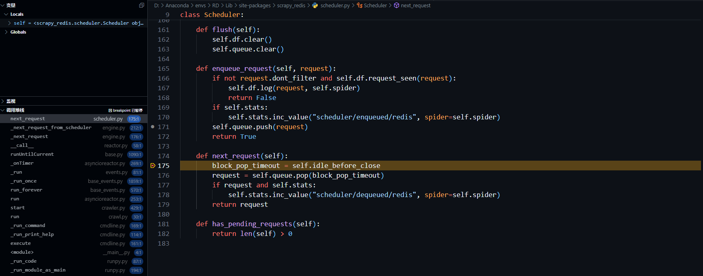
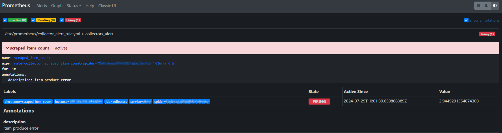

# Scrapy-Redis-大规模数据分布式采集方案

-------------------------------------------------------
## 1. 概述
*scrapy_redis* 是基于 *scrapy* 框架的分布式采集扩展方案，本文主要通过分析 *scrapy_redis* 框架的源码来描述其分布式架构的实现方式，并探讨其在大规模数据采集场景下的相关问题和优化方案。

PS : 本文讨论的代码版本为 *scrapy(2.11.2)* 和 *scrapy_redis(0.9.1)*

* [Scrapy-Redis-大规模数据分布式采集方案](#scrapy-redis-大规模数据分布式采集方案)
    * [1. 概述](#1-概述)
    * [2. 大规模数据采集场景](#2-大规模数据采集场景)
        * [2.1. 大规模多数据源采集场景](#21-大规模多数据源采集场景)
        * [2.2. 单一数据源的大规模数据量采集场景](#22-单一数据源的大规模数据量采集场景)
    * [3. 舆论论坛类采集场景](#3-舆论论坛类采集场景)
    * [4. *scrapy* 框架的困境](#4-scrapy-框架的困境)
    * [5. *scrapy\_redis* 分布式数据采集方案](#5-scrapy_redis-分布式数据采集方案)
    * [6. *scrapy\_redis* 核心模块源码分析](#6-scrapy_redis-核心模块源码分析)
        * [6.1. 采集模块 - scrapy\_redis.spiders.RedisSpider](#61-采集模块---scrapy_redisspidersredisspider)
            * [6.1.1. 初始化 *redis* 连接与相关参数配置](#611-初始化-redis-连接与相关参数配置)
            * [6.1.2. 任务数据获取流程分析](#612-任务数据获取流程分析)
            * [6.1.3. 采集进程的持久化实现与退出条件](#613-采集进程的持久化实现与退出条件)
        * [6.2. 调度模块 - scrapy\_redis.scheduler.Scheduler](#62-调度模块---scrapy_redisschedulerscheduler)
            * [6.2.1. 调度器的构建过程分析](#621-调度器的构建过程分析)
            * [6.2.2. 引擎与调度器的交互逻辑](#622-引擎与调度器的交互逻辑)
            * [6.2.3. 请求优先级调度逻辑实现](#623-请求优先级调度逻辑实现)
            * [6.2.4. 采集进程之间的协同调度](#624-采集进程之间的协同调度)
        * [6.3. 去重模块 - scrapy\_redis.dupeFilter.RFPDupeFilter](#63-去重模块---scrapy_redisdupefilterrfpdupefilter)
        * [6.4. 状态统计模块 - scrapy\_redis.stats.RedisStatsCollector](#64-状态统计模块---scrapy_redisstatsredisstatscollector)
    * [7. 应用场景中的问题探讨与优化方案](#7-应用场景中的问题探讨与优化方案)
        * [7.1. redis内存占用分析与优化](#71-redis内存占用分析与优化)
            * [7.1.1. 生产消费速度失衡导致的内存占用异常](#711-生产消费速度失衡导致的内存占用异常)
            * [7.1.2. 持续性采集导致的内存占用增长](#712-持续性采集导致的内存占用增长)
        * [7.2. 采集流程的垂直拆分](#72-采集流程的垂直拆分)
        * [7.3. 运行状态监控与预警方案](#73-运行状态监控与预警方案)
        * [7.4. 分布式采集服务的自动化部署方案](#74-分布式采集服务的自动化部署方案)
    * [8. 总结与待研究的问题](#8-总结与待研究的问题)
    * [9. 参考与引用](#9-参考与引用)

-------------------------------------------------------
## 2. 大规模数据采集场景
大规模数据采集的需求从 **数据规模的类型** 上可以划分成两个主要场景：

### 2.1. 大规模多数据源采集场景
这类需求场景的主要特征在于要采集的目标数据源的数量规模较大，且不同数据源之间的页面或者接口有结构差异。

一个典型的场景是 **多新闻源的聚合采集**，通过采集大规模的不同新闻源网站发布的新闻数据来进行信息聚合，为后续分析和业务提供数据支持。在这种场景下，最大的难点在于不同数据源具有的结构差异，导致往往需要针对对应的数据源接口进行专门的采集模块适配，这种大量的特殊适配代码会导致整个项目的代码复用率变低，后期维护难度增加，同时在框架设计时兼容性设计也将是一个难点。数据源规模越大，这些问题也会表现的越严重。

### 2.2. 单一数据源的大规模数据量采集场景
相较于第一类场景，这类需求通常只具有单一的数据源(或少量的)，往往是针对某个特定数据源的采集，其数据规模主要体现在要采集的数据量大小上。

典型的采集场景是 **社交媒体类的舆论数据采集**，以论坛类数据源为例，每个论坛的数据接口通常是一致的，因此不同于第一类场景，可以通过一个模板采集模块来完成所有论坛数据的采集，问题在于，当要采集的目标论坛数量较多时，对采集资源的要求也比较高，因此在框架设计上往往需要考虑水平扩展的特性，以适应论坛采集数量需求的变化，特别是在具有高实时性和高覆盖率数据需求的场景。

*scrapy_redis* 框架要解决的大规模数据采集问题主要是面向第二类，即 **单一数据源大规模数据量** 的采集场景。

-------------------------------------------------------
## 3. 舆论论坛类采集场景
为了后续方便讨论，本文主要以 **舆论论坛类** 数据采集场景为例，一个典型的论坛类网站通常包含三个核心数据接口：

* 列表数据接口 ( scheme://BBS/list/{forum_id}/{page} ) :  
用于进行翻页迭代并获取帖子元数据，包括帖子id，发布时间，发布者等数据，用于构建帖子详情数据请求。

* 帖子数据接口 ( scheme://BBS/post/{post_id} ) :  
获取帖子详情数据，包括帖子标题，正文，点击量统计信息等。

* 评论数据接口 ( scheme://BBS/comment/{post_id}/{page} ) :  
获取帖子评论数据，包括评论内容，发布时间，评论者信息等。

其中 *forum_id* 用于指定要采集的论坛id，*post_id* 为待采集的帖子id。基本数据采集流程如下：

1. 通过迭代 **列表数据接口** 翻页并获取 **帖子元数据**。
2. 根据 **帖子元数据** 构建对应的数据请求，获取对应帖子的详情数据和评论数据。

-------------------------------------------------------
## 4. *scrapy* 框架的困境

> Scrapy is a fast high-level web crawling and web scraping framework, used to crawl websites and extract structured data from their pages. It can be used for a wide range of purposes, from data mining to monitoring and automated testing.

*scrapy* 是数据采集方向中应用最广泛的开源爬虫框架之一，基于 *twisted* 的异步模型使其具有高效的采集性能，同时得益于高度模块化的设计，即能利用现有模块进行快速开发，也可以通过自定义模块进行高度地定制化。

*scrapy* 框架可以覆盖大部分的采集需求，但是针对大规模数据采集场景的表现效果却不太理想，核心原因是原生 *scrapy* 框架不支持 **水平扩展** 特性，无法根据数据规模的变化进行动态扩展。接下来以上述 **舆论论坛类** 数据采集场景为例，探讨 *scrapy* 框架在该场景下的困境。

```py
class BBSCollector(scrapy.Spider):

    name = "BBSCollector-scrapy"

    def start_requests(self):
        # 待采集目标论坛id列表
        target_forum_ids = ["00001", "00002", "00003", "00004", "00005", ...]
        # 构建列表数据接口初始请求
        for forum_id in target_forum_ids:
            yield scrapy.Request(
                url = f'http://BBS/list/{forum_id}/{1}',
                meta = {
                    "forum_id": forum_id,
                    "page": 1,
                    "max_page": 5,
                },
                callback = self.collect_post_meta,
                errback = self.collect_error,
                dont_filter = True,
            )

    def collect_post_meta(self, response):
        """迭代列表页，采集帖子元数据"""
        ...
```

上述代码是用 *scrapy* 实现的采集逻辑的关键片段，其中 *BBSCollector* 继承于 *scrapy.Spider* 类用于实现采集逻辑，*start_requests* 是一个生成器函数，用于迭代生成初始请求对象(*scrapy.Request*)。*target_forum_ids* 是待采集目标论坛id列表，在这里通过遍历来构造目标论坛列表的第一页请求。

*start_requests* 的具体调用位置位于 *scrapy.core.engine.ExecutionEngine* 中，其产生的请求对象将经过调度器，下载器及其相关中间件处理后，根据请求状态分别触发 *callback* 或者 *errback* 回调，进行后续帖子详情数据的采集。由于文章主题原因，具体处理流程和回调触发条件在此不深入讨论。

回归主题，问题的关键在于 **待采集目标论坛的数量规模**，即 *target_forum_ids* 列表的大小。当目标论坛的规模较小时，通过 ```scrapy crawl BBSCollector``` 命令启动一个采集进程就可以满足采集需求。随着目标论坛数量的逐步增加，可以通过 **垂直扩展** 采集节点的资源并配置框架的 *CONCURRENT_REQUESTS* 参数来提高请求并发量，从而提高采集速度。但是当目标论坛的数量扩展到一定的量级时，这种垂直扩展的方案就不太适用了，因为单个采集节点的资源通常是有上限的，此时无法单纯通过提高采集节点资源来解决问题。

需要注意的是，上述讨论的一个隐含假设是数据采集的 **实时性需求** ，如果不考虑实时性需求，即使是单个采集进程也可以通过长时间运行从一定程度上来解决大规模的数据采集问题。

那么上述问题是否可以通过部署多个采集节点来解决？答案是否定的，即使部署多个采集节点，各个节点中的组件之间也是相互独立的，无法进行交互，这只会导致采集任务的重复执行，而不能提高整体的采集速度。

本质上，*scrapy* 框架采用了一种 **单体架构** 的模式，在官方文档中明确指出 *scrapy* 框架本身不提供任何内置功能以实现分布式(多节点)方式进行采集。每个采集节点都有自己的模块实例，不同节点的组件之间无法进行交互，整个采集服务依赖于单一的采集节点(进程)，无法根据目标数据规模进行动态水平扩展，这是单体架构的一个显著缺陷。

与其他单体架构的项目一样，需要考虑的另一个关键问题在于 **单点故障风险**，由于整个采集服务依赖于单个采集节点，当该节点故障时，将导致数据产出异常，从而影响数据采集延迟，在高实时性的需求场景下这个问题无疑是致命的。

虽然 *scrapy* 框架本身不支持水平扩展的特性，但是在官方文档中提供了另一种替代的解决方案。核心思路是对整个任务集进行 **分片** 并结合 *scrapyd* 服务化的方式来实现多节点抓取。*scrapyd* 是一个应用程序，通过提供 API 接口的方式来对采集进程进行调度和监控。

> Scrapyd is an application (typically run as a daemon) that listens to requests for spiders to run and spawns a process for each one.

具体实现方法如下，首先将任务集按照要部署的节点数量进行分片，并提供一个任务分片获取服务接口。在多个采集节点上部署 *scrapyd* 服务，通过调度接口启动爬虫时，指定分片id来获取对应的任务分片集并执行来实现多节点采集。代码实现如下：

```py
# 任务分片调度服务接口

# 全量任务列表
TASKS = [f'0000{i}' for i in range(1, 10)]
# 任务分片大小
TASK_PART_SIZE = 3
# 任务分片集
TASKS_PART = [TASKS[i:i+TASK_PART_SIZE] for i in range(0, len(TASKS), TASK_PART_SIZE)]

app = FastAPI()

@app.get("/task/part/{part_id}")
def get_task(part_id:int):
    """获取分片任务数据"""
    if not (0 <= part_id < len(TASKS_PART)):
        return {"state": False, "tasks": [], "msg": f'part_id must be in [0, {len(TASKS_PART)-1}]'}
    return {"state": True, "tasks": TASKS_PART[part_id], "msg": "success"}
```

```py
# 采集进程

class BBSCollector(scrapy.Spider):

    name = "BBSCollector-scrapyd"

    def __init__(self, task_part_id=None, *args, **kwargs):
        super(BBSCollector, self).__init__(*args, **kwargs)
        # 任务分片id
        self.task_part_id = task_part_id or 0

    def start_requests(self):
        # 通过任务分片id, 获取待采集目标论坛id列表
        yield scrapy.Request(
            url = f'http://task_service/task/part/{self.task_part_id}',
            callback = self.build_request_from_forum_ids,
            errback = self.collect_error,
            dont_filter = True,
        )

    def build_request_from_forum_ids(self, response):
        """构建列表数据接口初始请求"""
        data = response.json()
        if data["state"]:
            target_forum_ids = data.get("tasks") or []
            self.logger.info(f'[{self.name}](build): start tasks({target_forum_ids})')
            for forum_id in target_forum_ids:
                yield scrapy.Request(
                    url = f'http://BBS/list/{forum_id}/{1}',
                    meta = {
                        "forum_id": forum_id,
                        "page": 1,
                        "max_page": 5,
                    },
                    callback = self.collect_post_meta,
                    errback = self.collect_error,
                    dont_filter = True,
                )
        else:
            self.logger.error(f'[{self.name}](build): get task_part({self.task_part_id}) failed')

    def collect_post_meta(self, response):
        """迭代列表页，采集帖子元数据"""
        ...
```

将上述代码部署到 *scrapyd* 服务后，通过在调度时指定任务分片id来采集指定分片数据：

```sh
curl http://localhost:6800/schedule.json -d project=demo -d spider=BBSCollector-scrapyd -d task_part_id=0
curl http://localhost:6800/schedule.json -d project=demo -d spider=BBSCollector-scrapyd -d task_part_id=1
curl http://localhost:6800/schedule.json -d project=demo -d spider=BBSCollector-scrapyd -d task_part_id=2
```

在上述命令中，通过指定 *localhost* 来配置要执行的采集节点，从而实现多节点采集。

这种方案虽然解决了 **水平扩展** 问题并一定程度上减少了 **单点故障** 导致的数据延迟风险，但是整个方案并不完善。

首先是 **任务调度** 问题，由于任务分片大小是固定的，当需要新增任务或者采集节点时，为了保证采集资源的充分利用，需要对任务集进行重新分片，无法进行自适应的动态扩展，同时也不太适用于具有优先级调度需求的场景。此外，如果某个采集节点故障，依然会导致该节点对应的任务分片执行异常，从而导致数据延迟或缺失。

另外一个问题是 **数据去重**，在采集系统中，通常会基于业务逻辑来过滤重复请求，从而减少采集资源的浪费。在 *scrapy* 框架中，去重数据通常是由每个采集进程独立处理的。因此对于上述方案，每次采集节点的去重数据之间是无法交互的，这将产生部分重复请求，从而导致采集资源的浪费，如果业务逻辑对去重有强制要求的化，该方案就不可行了。

综上所述，这些种种问题就是 *scrapy* 框架在大规模数据采集场景下的困境，核心原因在于其 **单体架构模式不支持水平扩展的特性和多个采集进程的组件之间无法交互** ，导致在大规模采集或者高实时性场景下无法有效扩展来满足采集需求，同时衍生出一系列的其他问题。为了解决这些问题，以 *redis* 为核心的 *scrapy_redis* 分布式采集方案产生了。

-------------------------------------------------------
## 5. *scrapy_redis* 分布式数据采集方案
*scrapy_redis* 并不是一个独立框架，而是一系列以 *Redis* 为核心的 **增强型组件集合**。通过替换原生 *scrapy* 框架中的部分组件，为其赋予分布式采集的特性。核心特性如下：

> Distributed crawling/scraping : 
> * You can start multiple spider instances that share a single redis queue. Best suitable for broad multi-domain crawls.
> 
> Distributed post-processing :  
> * Scraped items gets pushed into a redis queued meaning that you can start as many as needed post-processing processes sharing the items queue.
>
> Scrapy plug-and-play components : 
> * Scheduler + Duplication Filter, Item Pipeline, Base Spiders.

在经过 *scrapy_redis* 组件扩展后，整体架构如图：


其中用于实现分布式特性的核心组件如下：

* *scrapy_redis.spiders.RedisSpider* ：用于封装采集逻辑，通过持续监听 *redis* 任务队列并从中获取任务数据来构建初始请求，并执行后续采集逻辑。 

* *scrapy_redis.scheduler.Scheduler* ：请求调度器，提供调度接口与引擎进行交互，负责请求对象的排队和出队调度。其内部负责 *PriorityQueue* 和 *RFPDupeFilter* 组件相关逻辑接口的调用，利用 *redis* 的特性使不同采集节点的相关组件之间进行数据共享。

* *scrapy_redis.queue.PriorityQueue* ：基于 *redis* **zset** 数据类型实现的优先级队列，用于实现请求的优先级调度。 

* *scrapy_redis.dupeFilter.RFPDupeFilter* ：基于 *redis* **set** 数据类型实现的去重器，用于进行重复请求的过滤。

* *scrapy_redis.stats.RedisStatsCollector* ：基于 *redis* **hash** 数据类型实现的状态统计模块，用于存储框架运行时的状态数据。

在上一节探讨 *scrapy* 框架在大规模数据采集场景下的困境时指出，其关键问题在于无法利用 **水平扩展** 的方式扩展采集节点来使用采集任务规模的变化。那么 *scrapy_redis* 是如何解决这个问题的，接下来还是以 **论坛舆论数据采集** 场景为例，将前述的 *scrapy* 实现改为 *scrapy_redis* 方案：

```py
# 采集进程
class BBSCollector(RedisSpider):

    name = "BBSCollector-scrapy-redis"
    # 监听的redis任务队列键名
    redis_key = "BBSCollector.taskqueue"
    # 每次获取的任务数量
    redis_batch_size = 3

    custom_settings = {
        # redis连接参数
        "REDIS_PARAMS": {
            "host": "127.0.0.1",
            "port": 6379,
            "db": 0,
            "password": "",
        },
        # 调度器类
        "SCHEDULER": "scrapy_redis.scheduler.Scheduler",
        # 持久化开关
        "SCHEDULER_PERSIST": True,
        # 调度器队列类
        "SCHEDULER_QUEUE_CLASS": "scrapy_redis.queue.PriorityQueue",
        # 去重器类
        "DUPEFILTER_CLASS": "scrapy_redis.dupefilter.RFPDupeFilter",
        # 状态统计类
        "STATS_CLASS": "scrapy_redis.stats.RedisStatsCollector",
    }

    def make_request_from_data(self, data):
        task = json.loads(data)
        yield scrapy.Request(
            url = f'http://BBS/list/{task["forum_id"]}/{1}',
            meta = {
                "forum_id": task["forum_id"],
                "page": 1,
                "max_page": 5,
            },
            callback = self.collect_post_meta,
            errback = self.collect_error,
            dont_filter = True,
        )

    def collect_post_meta(self, response):
        """迭代列表页，采集帖子元数据"""
        ...
```

```py
# 任务推送测试

# redis连接参数
REDIS_PARAMS = {
    "host": "127.0.0.1",
    "port": 6379,
    "db": 0,
}

# 全量任务列表
TASKS = [{"forum_id": f'0000{i}'} for i in range(1, 10)]
# 任务队列键名
redis_key = "BBSCollector.taskqueue"

# 推送任务数据到 redis 任务队列
client = redis.Redis(**REDIS_PARAMS)
[client.rpush(redis_key, json.dumps(task)) for task in TASKS]
```

当通过 ```scrapy crawl BBSCollector-scrapy-redis``` 启动采集进程后，采集进程将监听 *redis* 任务队列(BBSCollector.taskqueue)，从中获取到任务数据后，调用 *make_request_from_data* 方法处理产生初始请求对象，并执行后续的采集逻辑。

从整体架构上看，这种方案是一种以 *redis* 任务队列为缓冲区的 **多生产者消费者** 架构。任务调度器(生产者)将任务数据推送到任务队列，采集进程(消费者)从任务队列中获取任务进行执行(消费)，由于多个消费者可以监听同一个任务队列，因此可以通过部署多个采集进程来实现 **水平扩展**。

接下来，逐个分析 *scrapy_redis* 核心模块的源码实现来理解其架构和设计思想。

-------------------------------------------------------
## 6. *scrapy_redis* 核心模块源码分析 

### 6.1. 采集模块 - scrapy_redis.spiders.RedisSpider

采集模块是 *scrapy_redis* 中用于封装采集逻辑的关键模块，负责任务的获取和根据任务数据来构建初始请求并基于响应来解析目标数据。

*scrapy_redis.spiders.RedisSpider* 是采集模块的基类，采集器通过继承 *RedisSpider* 并重写指定方法来实现具体的采集逻辑。*RedisSpider* 类是基于 **Mixin(混入类)** 模式多继承实现的，其定义如下：

```py
# scrapy_redis.spiders
class RedisSpider(RedisMixin, Spider):
    """Spider that reads urls from redis queue when idle."""

    @classmethod
    def from_crawler(cls, crawler, *args, **kwargs):
        obj = super(RedisSpider, cls).from_crawler(crawler, *args, **kwargs)
        obj.setup_redis(crawler)
        return obj
```

其中 *Spider* 是原生 *scrapy* 框架中的 *scrapy.spiders.Spider* 类，而 *RedisMixin* 类则是混入类，用于实现与 *redis* 的连接与任务数据的获取逻辑。*RedisMixin* 的核心代码框架如下：

```py
# scrapy_redis.spiders
class RedisMixin(object):
    """Mixin class to implement reading urls from a redis queue."""
    
    redis_key = None
    redis_batch_size = None
    redis_encoding = None
    server = None
    spider_idle_start_time = int(time.time())
    max_idle_time = None

    def start_requests(self):
        """Returns a batch of start requests from redis."""
        return self.next_requests()

    def setup_redis(self, crawler=None):
        """Setup redis connection and idle signal.

        This should be called after the spider has set its crawler object.
        """
    def next_requests(self):
        """Returns a request to be scheduled or none."""

    def make_request_from_data(self, data):
        """
        Returns a `Request` instance for data coming from Redis.
        ...
        """

    def schedule_next_requests(self):
        """Schedules a request if available"""
        ...

    def spider_idle(self):
        ...
```

#### 6.1.1. 初始化 *redis* 连接与相关参数配置

*RedisMixin.setup_redis* 方法用于初始化 *redis* 的连接和配置任务获取的相关参数，核心源码实现如下：

```py
# scrapy_redis.spiders
def setup_redis(self, crawler=None):
    """Setup redis connection and idle signal.

    This should be called after the spider has set its crawler object.
    """
    ...
    # 获取项目配置
    settings = crawler.settings

    # 配置 redis_key 参数，用于指定监听的 redis 任务队列键名。
    if self.redis_key is None:
        self.redis_key = settings.get(
            "REDIS_START_URLS_KEY",
            defaults.START_URLS_KEY,
        )
    # redis_key 参数可以接受一个格式化字符串，例如 "%(name)s:task_queue"，其中 name 是爬虫名。
    self.redis_key = self.redis_key % {"name": self.name}  
    
    # 配置 redis_batch_size 参数，用于指定每次从 redis 任务队列获取的任务数量。
    if self.redis_batch_size is None:
        # 默认使用并发数进行配置。
        self.redis_batch_size = settings.getint(
            "CONCURRENT_REQUESTS", defaults.REDIS_CONCURRENT_REQUESTS
        )
    
    # 配置 redis_encoding 参数，用于指定 redis 的默认编码格式。
    if self.redis_encoding is None:
        self.redis_encoding = settings.get(
            "REDIS_ENCODING", defaults.REDIS_ENCODING
        )

    # 根据连接配置连接 redis，其中 connection.from_settings 的具体实现位于 scrapy_redis.connection.get_redis_from_settings 中。
    self.server = connection.from_settings(crawler.settings)

    # 根据配置来确定 redis 任务队列所使用的数据类型，并将对应类型的操作函数挂载到 fetch_data 和 count_size 中，其中
    # self.fetch_data 用于从任务队列中获取任务数据。
    # self.count_size 用于计算任务队列的大小
    if settings.getbool("REDIS_START_URLS_AS_SET", defaults.START_URLS_AS_SET):
        self.fetch_data = self.server.spop
        self.count_size = self.server.scard
    elif settings.getbool("REDIS_START_URLS_AS_ZSET", defaults.START_URLS_AS_ZSET):
        self.fetch_data = self.pop_priority_queue
        self.count_size = self.server.zcard
    else:
        self.fetch_data = self.pop_list_queue
        self.count_size = self.server.llen

    # 配置 max_idle_time 参数，用于指定最大空闲时间。
    if self.max_idle_time is None:
        self.max_idle_time = settings.get(
            "MAX_IDLE_TIME_BEFORE_CLOSE", defaults.MAX_IDLE_TIME
        )
    # 将 self.spider_idle 方法挂载到 空闲信号(signals.spider_idle) 上。
    crawler.signals.connect(self.spider_idle, signal=signals.spider_idle)
```

从上述源码中可以看到，在 *setup_redis* 方法中通过 ```connection.from_settings(crawler.settings)``` 来进行 *redis* 的初始化连接，具体的连接代码位于 *scrapy_redis.connection* 模块中：

```py
# scrapy_redis.connection
# 字段映射
SETTINGS_PARAMS_MAP = {
    "REDIS_URL": "url",
    "REDIS_HOST": "host",
    "REDIS_PORT": "port",
    "REDIS_DB": "db",
    "REDIS_ENCODING": "encoding",
}

def get_redis_from_settings(settings):
    # 将 REDIS_PARAMS 与 默认连接配置合并
    params = defaults.REDIS_PARAMS.copy()
    params.update(settings.getdict("REDIS_PARAMS"))
    # 兼容 REDIS_* 格式配置
    # XXX: Deprecate REDIS_* settings.
    for source, dest in SETTINGS_PARAMS_MAP.items():
        val = settings.get(source)
        if val:
            params[dest] = val
    # 加载并指定要使用的redis客户端类
    if isinstance(params.get("redis_cls"), str):
        params["redis_cls"] = load_object(params["redis_cls"])
    # 实例化
    return get_redis(**params)

from_settings = get_redis_from_settings

def get_redis(**kwargs):
    redis_cls = kwargs.pop("redis_cls", defaults.REDIS_CLS)
    url = kwargs.pop("url", None)
    if url:
        return redis_cls.from_url(url, **kwargs)
    else:
        return redis_cls(**kwargs)
```

*redis* 的连接参数支持多种格式，但首选的配置方式是使用 *REDIS_PARAMS* 参数，样例如下：

```py
REDIS_PARAMS = {
    # 连接参数
    "host": "127.0.0.1",
    "port": 6379,
    "db": 0,
    "password": "",
    # 从默认配置中合并的参数
    # 连接超时(在socket连接之后)
    'socket_timeout': 30,
    # 连接超时(在socket连接之前)
    'socket_connect_timeout': 30,
    # 启用超时时重连
    'retry_on_timeout': True,
    # REDIS_ENCODING = 'utf-8'
    'encoding': REDIS_ENCODING,
}
```

其中 *socket_timeout*，*socket_connect_timeout*，*retry_on_timeout* 等参数是从默认配置中合并的，用于控制 *redis* 连接超时和重连机制，具体实现位于 *redis.Redis* 类中。

PS: 从这里可以衍生出一个新的研究主题，即对于 *scrapy_redis* 框架这种持久化运行的进程，怎么保证 *redis* 连接的长期可用，其内部的重连机制的实现原理是什么?

*redis* 连接默认使用的客户端类是 *redis.StrictRedis*，该参数可以通过 *REDIS_CLS* 或 *REDIS_PARAMS["redis_cls"]* 来进行自定义。

除了进行 *redis* 的初始化连接之外，在 *setup_redis* 方法中还通过配置以下与任务获取相关的参数，用于控制后续爬虫从 *redis* 获取任务数据的方式：

* ***redis_key*** : 用于指定监听的 redis 任务队列键名。
* ***redis_batch_size*** : 用于指定每次从 redis 任务队列获取的任务数量。
* ***redis_encoding*** : 用于指定 redis 的默认编码格式。
* ***fetch_data*** : 用于从任务队列中获取任务数据的操作函数。
* ***count_size*** : 用于计算任务队列的大小。
* ***max_idle_time*** : 用于指定最大空闲时间。

其中 *fetch_data* 和 *count_size* 两个属性比较特殊，是一个可调用对象。通过不同的配置来挂载对应的处理函数，这是一种兼容性设计，用于让任务队列支持多种 *redis* 数据类型。默认情况下，任务队列使用 *List* 数据类型，通过在项目中配置以下参数，让任务队列支持其他数据类型：
  * ***REDIS_START_URLS_AS_SET*** : *set*(无序集合) 数据类型。
  * ***REDIS_START_URLS_AS_ZSET*** : zset(有序集合) 数据类型。

通过分析 *fetch_data* 和 *count_size* 挂载的具体函数，可以推导出其形式定义：

```py
def fetch_data(redis_key:str, batch_size:int) -> list:
    """从redis任务队列中获取数据"""
    pass

def count_size(self, redis_key:str) -> int:
    """"获取redis任务队列的大小"""
    pass
```

PS: 需要注意的是 *zset* 数据类型在一些早期版本中并不支持(小于等于 v0.6.8 版本)，此外，在使用默认任务队列类型(List)时，获取任务数据的逻辑也进行了优化，从利用 *while* 循环依次调用 *lpop* 获取任务变成了利用 *lrange，ltrim* 结合 redis *pipeline* 进行批量任务数据获取。

```py
# v0.6.8
class RedisMixin(object):

    def next_requests(self):
        use_set = self.settings.getbool('REDIS_START_URLS_AS_SET', defaults.START_URLS_AS_SET)
        fetch_one = self.server.spop if use_set else self.server.lpop
        found = 0
        while found < self.redis_batch_size:
            data = fetch_one(self.redis_key)
        ...
```

```py
# v0.9.1
class RedisMixin(object):

    def pop_list_queue(self, redis_key, batch_size):
        with self.server.pipeline() as pipe:
            pipe.lrange(redis_key, 0, batch_size - 1)
            pipe.ltrim(redis_key, batch_size, -1)
            datas, _ = pipe.execute()
        return datas
    
    def next_requests(self):
        found = 0
        datas = self.fetch_data(self.redis_key, self.redis_batch_size)
        for data in datas:
            reqs = self.make_request_from_data(data)

```

#### 6.1.2. 任务数据获取流程分析
*scrapy_redis* 相较于 *scrapy* 框架在任务获取和处理流程上的区别在于，*scrapy* 通常是通过内部属性中的固定URL列表来产生初始请求，当初始请求及其派生请求的相关处理逻辑执行完成后，采集进程就退出了。而 *scrapy_redis* 则是通过监听 *redis* 任务队列从外部获取任务数据，并且在其相关任务处理逻辑执行完成后，进入空闲状态等待新任务，持久化的运行而不会主动退出。

*start_requests* 是 *scrapy* 框架中 *scrapy.spiders.Spider* 用于产生初始请求的关键方法。该方法在 *RedisMixin* 中进行了实现，注意这里并不是重写，因为 *RedisMixin* 与 *scrapy.spiders.Spider* 之间并没有继承关系，*RedisMixin.start_requests* "覆盖调用" *scrapy.spiders.Spider.start_requests* 方法的原理是利用 **MRO(方法解析顺序)**，可以通过 *RedisSpider.\_\_mro\_\_* 来查看其调用顺序：

```py
>>> from scrapy_redis.spiders import RedisSpider
>>> RedisSpider.__mro__
(<class 'scrapy_redis.spiders.RedisSpider'>, <class 'scrapy_redis.spiders.RedisMixin'>, <class 'scrapy.spiders.Spider'>, <class 'scrapy.utils.trackref.object_ref'>, <class 'object'>)
```

从上述结果可以看到，*start_requests* 的实际调用位置在 *scrapy_redis.spiders.RedisMixin* 类中(RedisSpider中并未实现该方法)。

*RedisMixin.start_requests* 的实现很简单，其内部调用的 ***next_requests*** 方法才是任务获取和处理的关键逻辑所在：

```py
# scrapy_redis.spiders
class RedisMixin:

    def start_requests(self):
        """Returns a batch of start requests from redis."""
        return self.next_requests()

    def next_requests(self):
        """Returns a request to be scheduled or none."""
        # XXX: Do we need to use a timeout here?
        found = 0
        # 从redis任务队列中获取一批任务
        datas = self.fetch_data(self.redis_key, self.redis_batch_size)
        for data in datas:
            # 通过任务数据构建请求对象
            reqs = self.make_request_from_data(data)
            if isinstance(reqs, Iterable):
                for req in reqs:
                    yield req
                    # XXX: should be here?
                    found += 1
                    self.logger.info(f"start req url:{req.url}")
            elif reqs:
                yield reqs
                found += 1
            else:
                self.logger.debug(f"Request not made from data: {data}")

        if found:
            self.logger.debug(f"Read {found} requests from '{self.redis_key}'")

    def make_request_from_data(self, data):
        pass
```

在 *next_requests* 方法被调用时，通过 *self.fetch_data* 从指定的 redis 任务队列(self.redis_key) 中获取一批任务数据，任务数量取决于 *self.redis_batch_size* 参数，并通过调用 *make_request_from_data* 方法根据任务数据来构建初始请求。其中 *make_request_from_data* 方法需要在继承 *RedisSpider* 的派生类中根据具体的业务逻辑进行重写。

通过分析源码和断点调试验证可以发现，*start_requests* 的初次调用位置位于 *scrapy.crawler.Crawler* 中：


```py
# scrapy.crawler
class Crawler:

    @inlineCallbacks
    def crawl(self, *args: Any, **kwargs: Any) -> Generator[Deferred, Any, None]:
        if self.crawling:
            raise RuntimeError("Crawling already taking place")
        if self._started:
            warnings.warn(
                "Running Crawler.crawl() more than once is deprecated.",
                ScrapyDeprecationWarning,
                stacklevel=2,
            )
        self.crawling = self._started = True

        try:
            # 构建spider实例
            self.spider = self._create_spider(*args, **kwargs)
            self._apply_settings()
            self._update_root_log_handler()
            # 构建引擎实例
            self.engine = self._create_engine()
            # 调用 start_requests 方法构建初始请求
            start_requests = iter(self.spider.start_requests())
            yield self.engine.open_spider(self.spider, start_requests)
            yield maybeDeferred(self.engine.start)
        except Exception:
            self.crawling = False
            if self.engine is not None:
                yield self.engine.close()
            raise
```

*start_requests()* 方法被调用后将返回一个 *生成器对象(start_requests)*，并交给引擎进行进一步处理。当其产生的请求及其后续逻辑处理完成后，框架进入空闲状态，并触发空闲信号(signals.spider_idle)，此时将再次触发任务获取方法 *next_requests* 的调用，调用栈如下：


```py
# scrapy_redis.spiders
class RedisMixin:

    def setup_redis(self, crawler=None):
        ...
        # 注册到空闲信号量
        crawler.signals.connect(self.spider_idle, signal=signals.spider_idle)

    def spider_idle(self):
        ...
        self.schedule_next_requests()
        ...
    
    def schedule_next_requests(self):
        """Schedules a request if available"""
        # TODO: While there is capacity, schedule a batch of redis requests.
        for req in self.next_requests():
            # see https://github.com/scrapy/scrapy/issues/5994
            if scrapy_version >= (2, 6):
                self.crawler.engine.crawl(req)
            else:
                self.crawler.engine.crawl(req, spider=self)
```

*next_requests* 方法是在 *spider_idle* 方法中调用的，而 *spider_idle* 则是在进行初始化时通过 *setup_redis* 注册到空闲信号上。通过这种循环过程来持久化地监听任务队列。

#### 6.1.3. 采集进程的持久化实现与退出条件
首先来研究一下原生 *scrapy* 中的采集进程是怎样退出的，通过对源码的分析可以发现，爬虫的退出逻辑在引擎中调用，关键代码如下：

```py
# scrapy.core.engine
class ExecutionEngine:

    def _next_request(self) -> None:
        ...
        if self.spider_is_idle() and self.slot.close_if_idle:
            self._spider_idle()

    def spider_is_idle(self) -> bool:
        """判断采集进程是否处于空闲状态"""
        if self.slot is None:
            raise RuntimeError("Engine slot not assigned")
        # 响应对象或数据容器(Item)是否处理完成
        if not self.scraper.slot.is_idle():  # type: ignore[union-attr]
            return False
        # 下载器中是否有待处理请求对象
        if self.downloader.active:  # downloader has pending requests
            return False
        # 初始请求是否处理完成
        if self.slot.start_requests is not None:  # not all start requests are handled
            return False
        # 调度器中是否还有未处理请求对象
        if self.slot.scheduler.has_pending_requests():
            return False
        return True

    def _spider_idle(self) -> None:
        assert self.spider is not None  # typing
        expected_ex = (DontCloseSpider, CloseSpider)
        # 触发 空闲信号(signals.spider_idle) 并捕获处理异常
        res = self.signals.send_catch_log(
            signals.spider_idle, spider=self.spider, dont_log=expected_ex
        )
        detected_ex = {
            ex: x.value
            for _, x in res
            for ex in expected_ex
            if isinstance(x, Failure) and isinstance(x.value, ex)
        }
        # 当前检测到 DontCloseSpider 异常时中断后续逻辑
        if DontCloseSpider in detected_ex:
            return None
        if self.spider_is_idle():
            ex = detected_ex.get(CloseSpider, CloseSpider(reason="finished"))
            assert isinstance(ex, CloseSpider)  # typing
            # 关闭爬虫
            self.close_spider(self.spider, reason=ex.reason)
```


爬虫关闭逻辑(*self.close_spider*) 的调用位于 *_spider_idle* 方法中，而 *_spider_idle* 方法的调用有两个前置判断条件：

1. ```self.spider_is_idle() is True``` : *spider_is_idle* 方法用于判断采集进程是否处于空闲状态，内部检查了以下状态：
    * ```if not self.scraper.slot.is_idle()``` : 响应对象或数据容器(Item)是否处理完成。
    * ```if self.downloader.active``` : 下载器中是否有待处理请求对象。
    * ```if self.slot.start_requests is not None``` : 初始请求是否处理完成。
    * ```if self.slot.scheduler.has_pending_requests()``` : 调度器中是否还有未处理请求对象。

2. ```self.slot.close_if_idle is True``` : *close_if_idle* 默认为 True，用于控制爬虫是否在空闲时关闭。

当上述两个判断条件成立后，将触发 *_spider_idle* 方法的调用，在其内部触发 *空闲信号(signals.spider_idle)* 并捕获处理异常，如果检测到 *DontCloseSpider* 异常则中断后续逻辑，否则调用 *close_spider* 关闭爬虫。

*scrapy_redis* 持久化运行的关键在于利用 *DontCloseSpider* 异常中断 *close_spider* 的调用，关键逻辑在 *RedisMixin.spider_idle* 中：

```py
# scrapy_redis.spiders
class RedisMixin:

    def spider_idle(self):
        """
        Schedules a request if available, otherwise waits.
        or close spider when waiting seconds > MAX_IDLE_TIME_BEFORE_CLOSE.
        MAX_IDLE_TIME_BEFORE_CLOSE will not affect SCHEDULER_IDLE_BEFORE_CLOSE.
        """
        if self.server is not None and self.count_size(self.redis_key) > 0:
            self.spider_idle_start_time = int(time.time())

        self.schedule_next_requests()

        # 判断空闲状态的时间是否大于设置的最大时间
        idle_time = int(time.time()) - self.spider_idle_start_time
        if self.max_idle_time != 0 and idle_time >= self.max_idle_time:
            return
        raise DontCloseSpider
```

*spider_idle* 在 *初始化(setup_redis)* 时被绑定到空闲信号上 ```crawler.signals.connect(self.spider_idle, signal=signals.spider_idle)```，当框架进入空闲状态时触发调用。通过抛出 *DontCloseSpider* 异常来阻止爬虫关闭，从而实现采集进程的持久化运行。

在上述代码中有一个关键属性 *self.max_idle_time*，该属性用于指定爬虫进入空闲状态的最大时间，由配置中的 ***MAX_IDLE_TIME_BEFORE_CLOSE*** 指定，默认为 *defaults.MAX_IDLE_TIME = 0*。在抛出 *DontCloseSpider* 异常时会先判断进入空闲状态的时间，如果不为0且大于该参数则通过 *return* 中断后续逻辑，从而触发关闭条件。


### 6.2. 调度模块 - scrapy_redis.scheduler.Scheduler

调度模块是 *scrapy/scrapy_redis* 框架的核心组件之一，负责与引擎交互来进行请求的调度与存储。接下来通过源码来分析其构建过程和调度逻辑实现。

#### 6.2.1. 调度器的构建过程分析

调度器类的加载和实例化是在 ***引擎(scrapy.core.engine.ExecutionEngine)*** 中进行的，相关代码片段如下：

```py
# scrapy.core.engine
class ExecutionEngine:

    def __init__(self, crawler: "Crawler", spider_closed_callback: Callable) -> None:
        ...
        # 加载调度器类
        self.scheduler_cls: Type["BaseScheduler"] = self._get_scheduler_class(
            crawler.settings
        )
        ...
    
    def _get_scheduler_class(self, settings: BaseSettings) -> Type["BaseScheduler"]:
        from scrapy.core.scheduler import BaseScheduler
        # 通过 settings.SCHEDULER 配置加载指定的调度器类
        scheduler_cls: Type = load_object(settings["SCHEDULER"])
        # 类型检测
        if not issubclass(scheduler_cls, BaseScheduler):
            raise TypeError(
                f"The provided scheduler class ({settings['SCHEDULER']})"
                " does not fully implement the scheduler interface"
            )
        return scheduler_cls

    @inlineCallbacks
    def open_spider(
        self, spider: Spider, start_requests: Iterable = (), close_if_idle: bool = True
    ) -> Generator[Deferred, Any, None]:
        ...
        # 构建调度器实例
        scheduler = create_instance(
            self.scheduler_cls, settings=None, crawler=self.crawler
        )
        ...
        # 调度器初始化
        if hasattr(scheduler, "open"):
            yield scheduler.open(spider)
        ...
```

引擎在初始化时，通过调用 *_get_scheduler_class* 方法来加载调度器类，其内部使用 *load_object* 函数通过 **动态加载(importlib)** 的方式从配置 *SCHEDULER* 中加载指定的类对象，*scrapy* 框架默认使用的调度器类是 ***scrapy.core.scheduler.Scheduler***，而 *scrapy_redis* 中则替换为 ***scrapy_redis.scheduler.Scheduler***。加载后的类对象被挂载到 *self.scheduler_cls* 属性上，并在引擎的 *open_spider* 方法被调用时通过 *create_instance* 函数用于构建调度器类的实例。

上述过程中用到的两个函数 *load_object* 和 *create_instance* 是 *scrapy* 框架实现 **对象注入机制** 的核心逻辑。正是这种机制极大的提高了框架的扩展性，通过配置组件使用的具体类来进行高度的定制化。

在使用 *create_instance* 构建调度器实例时，实际上是通过调用 *from_crawler* 实现的，*scrapy_redis.scheduler.Scheduler* 调度器类的实例化和初始化逻辑如下：

```py
# scrapy_redis.scheduler
class Scheduler:

    @classmethod
    def from_crawler(cls, crawler):
        instance = cls.from_settings(crawler.settings)
        # FIXME: for now, stats are only supported from this constructor
        instance.stats = crawler.stats
        return instance

    @classmethod
    def from_settings(cls, settings):
        kwargs = {
            # 持久化标记，用于控制是否在结束时清除缓存
            "persist": settings.getbool("SCHEDULER_PERSIST"),
            # 用于控制是否在启动时清除缓存
            "flush_on_start": settings.getbool("SCHEDULER_FLUSH_ON_START"),
            # 从队列获取元素的超时时间
            "idle_before_close": settings.getint("SCHEDULER_IDLE_BEFORE_CLOSE"),
        }

        # 加载默认配置
        # If these values are missing, it means we want to use the defaults.
        optional = {
            # TODO: Use custom prefixes for this settings to note that are
            # specific to scrapy-redis.
            # 调度器redis键名("%(spider)s:requests")
            "queue_key": "SCHEDULER_QUEUE_KEY",
            # 调度器内部使用的队列类("scrapy_redis.queue.PriorityQueue")
            "queue_cls": "SCHEDULER_QUEUE_CLASS",
            # 去重器redis键名("%(spider)s:dupefilter")
            "dupefilter_key": "SCHEDULER_DUPEFILTER_KEY",
            # We use the default setting name to keep compatibility.
            # 调度器内部使用的去重器类("scrapy_redis.dupefilter.RFPDupeFilter")
            "dupefilter_cls": "DUPEFILTER_CLASS",
            # 序列化器
            "serializer": "SCHEDULER_SERIALIZER",
        }
        for name, setting_name in optional.items():
            val = settings.get(setting_name)
            if val:
                kwargs[name] = val
        
        # 加载并实例化去重器对象
        dupefilter_cls = load_object(kwargs["dupefilter_cls"])
        if not hasattr(dupefilter_cls, "from_spider"):
            kwargs["dupefilter"] = dupefilter_cls.from_settings(settings)

        # Support serializer as a path to a module.
        # 加载序列化器
        if isinstance(kwargs.get("serializer"), str):
            kwargs["serializer"] = importlib.import_module(kwargs["serializer"])

        # 连接 redis 
        server = connection.from_settings(settings)
        # Ensure the connection is working.
        server.ping()

        return cls(server=server, **kwargs)
    
    def open(self, spider):
        self.spider = spider
        # 构建请求队列实例
        try:
            self.queue = load_object(self.queue_cls)(
                server=self.server,
                spider=spider,
                key=self.queue_key % {"spider": spider.name},
                serializer=self.serializer,
            )
        except TypeError as e:
            raise ValueError(
                f"Failed to instantiate queue class '{self.queue_cls}': {e}"
            )
        # 构建去重器对象实例
        if not self.df:
            self.df = load_object(self.dupefilter_cls).from_spider(spider)
        # 判断并清除缓存
        if self.flush_on_start:
            self.flush()
        # notice if there are requests already in the queue to resume the crawl
        if len(self.queue):
            spider.log(f"Resuming crawl ({len(self.queue)} requests scheduled)")

    def flush(self):
        self.df.clear()
        self.queue.clear()
```

从上述源码可以看到，调度器在进行实例化和初始化时主要进行了以下操作：

1. 加载与调度器相关的配置参数。
2. 加载并构建去重器实例。
3. 连接 *redis* 服务器。
4. 加载并构建请求队列实例。
5. 清除请求队列和去重器缓存。

*self.queue(请求队列)* 和 *self.df(去重器)* 属性是调度器的两个重要组成部分。其中请求队列用于存储调度器接收的请求对象，而去重器则用于进行重复请求的过滤。

#### 6.2.2. 引擎与调度器的交互逻辑

引擎与调度器交互主要是通过 *enqueue_request* 和 *next_request* 两个核心方法。

其中引擎通过调用 *enqueue_request* 方法将 **请求对象** 传递给调度器进行排队，具体调用逻辑如下：

```py
# scrapy.core.engine
class ExecutionEngine:

    def crawl(self, request: Request) -> None:
        """Inject the request into the spider <-> downloader pipeline"""
        if self.spider is None:
            raise RuntimeError(f"No open spider to crawl: {request}")
        # 请求调度
        self._schedule_request(request, self.spider)
        self.slot.nextcall.schedule()  # type: ignore[union-attr]

    def _schedule_request(self, request: Request, spider: Spider) -> None:
        # 触发 signals.request_scheduled(请求调度) 信号
        request_scheduled_result = self.signals.send_catch_log(
            signals.request_scheduled,
            request=request,
            spider=spider,
            dont_log=IgnoreRequest,
        )
        # 检测请求是否被忽略
        for handler, result in request_scheduled_result:
            if isinstance(result, Failure) and isinstance(result.value, IgnoreRequest):
                logger.debug(
                    f"Signal handler {global_object_name(handler)} dropped "
                    f"request {request} before it reached the scheduler."
                )
                return
        # 调用 enqueue_request 方法进行请求排队
        if not self.slot.scheduler.enqueue_request(request):  # type: ignore[union-attr]
            # 触发 signals.request_dropped(请求丢弃) 信号
            self.signals.send_catch_log(
                signals.request_dropped, request=request, spider=spider
            )


# scrapy_redis.scheduler
class Scheduler:

    def enqueue_request(self, request):
        # 请求去重判断
        if not request.dont_filter and self.df.request_seen(request):
            self.df.log(request, self.spider)
            return False
        # 统计数据更新
        if self.stats:
            self.stats.inc_value("scheduler/enqueued/redis", spider=self.spider)
        # 将请求添加到内部队列
        self.queue.push(request)
        return True
```

*enqueue_request* 接收一个 *request(scrapy.http.request.Request)* 对象，通常是由爬虫模块产生的。首先通过 *self.df(去重器)* 对请求对象进行去重判断，然后调用 *self.queue(请求队列)* 的 *push* 方法将请求对象添加到队列中，从而完成请求的排队，并返回一个状态标记。

引擎通过 *_schedule_request* 方法来调用 *enqueue_request* 方法。首先触发 *signals.request_scheduled(请求调度)* 信号，检查该请求是否被信号监听的处理函数所忽略，然后将其添加到调度器进行排队，并在排队失败时触发 *signals.request_dropped(请求丢弃)* 信号。

*next_request* 方法用于从调度器中获取下一个待处理的请求对象，引擎通过调用该方法来获取待处理请求对象，并将其传递给下载器进行后续处理：

```py
# scrapy.core.engine
class ExecutionEngine:

    def _next_request_from_scheduler(self) -> Optional[Deferred]:
        ...
        # 获取下一个待处理请求对象
        request = self.slot.scheduler.next_request()
        if request is None:
            return None

        # 传递给下载器进行后续处理
        d = self._download(request)
        ...


# scrapy_redis.scheduler
class Scheduler:

    def next_request(self):
        block_pop_timeout = self.idle_before_close
        # 从请求队列中获取请求对象
        request = self.queue.pop(block_pop_timeout)
        # 更新统计值
        if request and self.stats:
            self.stats.inc_value("scheduler/dequeued/redis", spider=self.spider)
        return request
```

以上就是引擎与调度器的交互逻辑，从中可以发现，调度器本身实际上并没有实现 **调度逻辑(排队/出队)** 和 **去重逻辑**，而是通过调用内部组件 *self.queue(请求队列)* 和 *self.df(去重器)* 实现的。通过组合 *SCHEDULER_QUEUE_CLASS(调度器请求队列类)* 和 *DUPEFILTER_CLASS(去重器类)* 来实现不同的调度和去重逻辑。从设计上看调度器类实际上是一个引擎与其子组件的交互中间层，不管子组件的组合如何变化，调度器类提供了与引擎一致性的交互接口，换而言之，调度器子组件对引擎是透明的。
 
#### 6.2.3. 请求优先级调度逻辑实现 

在构建请求对象时，可以通过配置 *priority* 属性来指定其优先级，*priority* 的值越高优先级越高，在调度时将被优先调度。

在上一节的分析中已经知道，调度器本身并不包含调度逻辑的实现，因此请求对象的优先级调度实际上是由 *self.queue(请求队列)* 实现的，调度器默认使用的请求队列是 *scrapy_redis.queue.PriorityQueue*，这是一个基于 *redis* 实现的优先级队列，具体的源码片段实现如下：

```py
# scrapy_redis.queue
class PriorityQueue(Base):
    """Per-spider priority queue abstraction using redis' sorted set"""

    def __len__(self):
        """Return the length of the queue"""
        return self.server.zcard(self.key)

    def push(self, request):
        """Push a request"""
        # 对请求对象进行序列化
        data = self._encode_request(request)
        # 获取请求对象的优先级
        score = -request.priority
        # We don't use zadd method as the order of arguments change depending on
        # whether the class is Redis or StrictRedis, and the option of using
        # kwargs only accepts strings, not bytes.
        # 利用 zset(有序集合) 的特性进行存储
        self.server.execute_command("ZADD", self.key, score, data)

    def pop(self, timeout=0):
        """
        Pop a request
        timeout not support in this queue class
        """
        # use atomic range/remove using multi/exec
        pipe = self.server.pipeline()
        pipe.multi()
        # 获取并移除第一个元素(最高优先级)
        pipe.zrange(self.key, 0, 0).zremrangebyrank(self.key, 0, 0)
        results, count = pipe.execute()
        if results:
            return self._decode_request(results[0])
```

*PriorityQueue* 实现优先级队列的关键在于利用 *redis* 中的 **zset(有序集合)** 数据类型的特性。*zset* 与 *set* 一样是集合类型，因此不允许有重复元素，其区别在于 *zset* 为每个元素关联了一个 **score(分数)**，并通过分数升序排序。这个分数就对应于请求对象的 *priority* 值，每次调用 *pop* 方法从队列中获取元素时，取分数最低的一个(最高优先级)，```score = -request.priority```，以下是一个测试样例：

```py
import redis
from scrapy import Request, Spider
from scrapy_redis.queue import PriorityQueue
from scrapy_redis.defaults import SCHEDULER_QUEUE_KEY


# 构建请求队列实例
queue = PriorityQueue(
    server = redis.Redis(password="test123?"),
    spider = Spider(name="request_priority_queue_test"),
    key = SCHEDULER_QUEUE_KEY,
)

# 请求排队
print("[PriorityQueue]: enqueue_request")
reqs = [
    ("url://test/1", 10),
    ("url://test/2", 20),
    ("url://test/3", 10),
    ("url://test/4", 20),
    ("url://test/5", 30),
]
for url, priority in reqs:
    print(url, priority)
    queue.push(Request(url=url, priority=priority))

# 请求出队
print("[PriorityQueue]: next_request")
while queue:
    req = queue.pop()
    print(req.url, req.priority)
```

```sh
[PriorityQueue]: enqueue_request
url://test/1 10
url://test/2 20
url://test/3 10
url://test/4 20
url://test/5 30
[PriorityQueue]: next_request
url://test/5 30
url://test/2 20
url://test/4 20
url://test/1 10
url://test/3 10
```

以上就是请求优先级调度逻辑的实现，除了使用 *PriorityQueue* 作为调度器的请求队列外，*scrapy_redis* 框架还支持以下两种队列：

* *scrapy_redis.queue.FifoQueue* : FIFO-先进先出队列，内部使用 **List** 数据类型实现，通过 *lpush* 和 *brpop* 来实现进出队操作。
* *scrapy_redis.queue.LifoQueue* : LIFO-后进先出队列，内部同样使用 **List** 数据类型实现，不过是通过 *lpush* 和 *blpop* 来实现进出队操作。

上述三种队列类都继承于 *scrapy_redis.queue.Base* 基类，并通过重写 *push* 和 *pop* 方法来实现具体的调度逻辑。因此，可以根据需求继承 *Base* 类来实现自定义的队列类型，并通过配置 ***SCHEDULER_QUEUE_CLASS*** 来启用自定义队列类。

#### 6.2.4. 采集进程之间的协同调度

在上一节分析调度逻辑的具体实现时发现，*scrapy_redis* 支持的三种请求队列都是基于 *redis* 数据类型实现的，那么如果多个采集进程配置同样的请求队列参数，它们之间会协同调度嘛？下面通过一段测试来验证，测试相关的关键配置如下：

```py
# 配置调度器类
SCHEDULER = "scrapy_redis.scheduler.Scheduler"
# 配置调度器队列类
SCHEDULER_QUEUE_CLASS = "scrapy_redis.queue.PriorityQueue"
# 开启持久化机制，防止请求数据在采集进程退出后被清理
SCHEDULER_PERSIST = True
# 禁止采集进程在启动时清除之前的缓存数据
SCHEDULER_FLUSH_ON_START = False
```

1. 第一步是在调试模式下启动一个采集进程A，并在调度器 *scrapy_redis.scheduler.Scheduler* 的 *next_request* 方法内添加一个断点，目的让请求进入到调度器中进行排队，并防止采集进程A从请求队列中获取请求：



2. 检查请求队列对应的 *redis* 键中存储的请求对象：

```py
127.0.0.1:6379> ZRANGE BBSCollector-scrapy-redis:requests 0 -1
1) "\x80\x05\x95\n\x01\x00\x00\x00\x00\x00\x00}\x94(\x8c\x03url\x94\x8c\x17http://bbs/list/00001/1\x94\x8c\bcallback\x94\x8c\x11collect_post_meta\x94\x8c\aerrback\x94\x8c\rcollect_error\x94\x8c\aheaders\x94}\x94\x8c\x06method\x94\x8c\x03GET\x94\x8c\x04body\x94C\x00\x94\x8c\acookies\x94}\x94\x8c\x04meta\x94}\x94(\x8c\bforum_id\x94\x8c\x0500001\x94\x8c\x04page\x94K\x01\x8c\bmax_page\x94K\x05u\x8c\bencoding\x94\x8c\x05utf-8\x94\x8c\bpriority\x94K\x00\x8c\x0bdont_filter\x94\x88\x8c\x05flags\x94]\x94\x8c\tcb_kwargs\x94}\x94u."
```

尝试使用 *scrapy_redis.picklecompat.loads* 方法对上述请求对象字符串进行反序列化：

```py
{'url': 'http://bbs/list/00001/1', 'callback': 'collect_post_meta', 'errback': 'collect_error', 'headers': {}, 'method': 'GET', 'body': b'', 'cookies': {}, 'meta': {'forum_id': '00001', 'page': 1, 'max_page': 5}, 'encoding': 'utf-8', 'priority': 0, 'dont_filter': 
True, 'flags': [], 'cb_kwargs': {}}
```

3. 终止采集进程A，并清空任务队列(不是请求队列)，启动采集进程B。


可以看到，采集进程B 成功的获取到了 采集进程A 排队调度的请求对象。

综上所述，在启用 *scrapy_redis.scheduler.Scheduler* 调度器的情况下，多个采集进程之间是共享请求队列的，不同采集进程之间可以协同调度。这种设计带来了一种采集异常的自动恢复机制，如果其中一个采集进程异常，在请求对象已经通过调度器排队的前提下，其余采集进程可以自动恢复执行后续逻辑。

这种机制的核心实现原理是利用一个共享的 *redis* 数据容器作为请求队列来进行请求对象的持久化存储。具体数据容器类型取决于 *SCHEDULER_QUEUE_CLASS* 调度器队列类的内部实现。

请求对象在通过 *redis* 数据容器在不同采集进程之间传递的关键在于 **序列化和反序列化机制**。在 *scrapy_redis* 框架中，这种序列化机制是由 *pickle* 模块实现的，具体代码位于 *scrapy_redis.picklecompat* 模块中。 

> 模块 pickle 实现了对一个 Python 对象结构的二进制序列化和反序列化。 "pickling" 是将 Python 对象及其所拥有的层次结构转化为一个字节流的过程，而 "unpickling" 是相反的操作，会将（来自一个 binary file 或者 bytes-like object 的）字节流转化回一个对象层次结构。

通过配置 ***SCHEDULER_SERIALIZER*** 参数可以自定义序列化器，自定义序列化器必须是一个模块且包含 *loads* 和 *dumps* 两个成员函数，代码形式定义如下：

```py
def loads(request_str:str) -> dict:
    """反序列化 : 将请求字符串反序列化成字典"""
    pass

def dumps(request_dict:dict) -> str:
    """序列化 : 将请求字典序列化成字符串"""
    pass
```

上述两个函数的调用位置位于请求队列基类 *scrapy_redis.queue.Base* 中：

```py
# scrapy_redis.queue
class Base:
    """Per-spider base queue class"""

    def _encode_request(self, request):
        """Encode a request object"""
        try:
            obj = request.to_dict(spider=self.spider)
        except AttributeError:
            obj = request_to_dict(request, self.spider)
        return self.serializer.dumps(obj)

    def _decode_request(self, encoded_request):
        """Decode an request previously encoded"""
        obj = self.serializer.loads(encoded_request)
        return request_from_dict(obj, spider=self.spider)
```

### 6.3. 去重模块 - scrapy_redis.dupeFilter.RFPDupeFilter

去重模块用于过滤重复请求，以提高采集资源的利用效率。在前文描述 *scrapy* 框架的困境时提到，原生 *scrapy* 框架中多个采集进程之间的去重数据无法共享，导致无法有效地进行去重。而在 *scrapy_redis* 框架中，通过引入基于 *redis* 的 *scrapy_redis.dupeFilter.RFPDupeFilter* 去重器来解决多个采集进程之间的去重数据共享问题。

在分析引擎与调度器的交互逻辑时可以知道，调度器调用去重器进行请求去重是在 *enqueue_request* 方法中：

```py
class Scheduler:

    def enqueue_request(self, request):
        if not request.dont_filter and self.df.request_seen(request):
            self.df.log(request, self.spider)
            return False
        ...
        return True
```

去重逻辑的关键是在去重器的 *request_seen* 方法中，下面来对比分析一下 *scrapy* 和 *scrapy_redis* 在去重器实现上的差异。

原生 *scrapy* 框架的去重器实现位于 *scrapy.dupefilters.RFPDupeFilter*，去重逻辑的关键源码如下：

```py
# scrapy.dupefilters
class RFPDupeFilter(BaseDupeFilter):
    """Request Fingerprint duplicates filter"""

    def request_seen(self, request: Request) -> bool:
        # 根据请求对象生成请求指纹
        fp = self.request_fingerprint(request)
        # 判断请求指纹是否在去重集中
        if fp in self.fingerprints:
            return True
        # 将请求指纹添加到去重集
        self.fingerprints.add(fp)
        # 如果开启了持久化将请求指纹同步写入文件
        if self.file:
            self.file.write(fp + "\n")
        return False

    def request_fingerprint(self, request: Request) -> str:
        # 生成请求指纹
        return self.fingerprinter.fingerprint(request).hex()
```

从上述代码中可以看到，请求指纹数据是存储到 *self.fingerprints* 属性中的，这是一个 Set(集合) 数据类型，是存储到内存中的，当采集进程结束后就释放了，因此是无法持久化的。但是可以通过配置 ```JOBDIR = "./temp"``` 来开启持久化，开启持久化后，去重数据将被同步写入 *"./temp/requests.seen"* 文件中，去重数据样例如下：

```
b316b48f31f4ba5494a7965318fe3c48120678e3
bd83693b0dc0e8e9a3ca38d9e42a88c266c1a49c
1db8a7ae096a2c84fc237028744f85f143bc8ae3
```
 
由于去重数据的存储方案，即使在开启持久化同步写入文件的情况下，对于跨节点的采集进程之间也是无法共享去重数据的，为了解决这个问题，*scrapy_redis.dupeFilter.RFPDupeFilter* 去重器通过将去重数据写入到 *redis* 数据容器中来实现共享：

```py
# scrapy_redis.dupeFilter
class RFPDupeFilter(BaseDupeFilter):
    """Redis-based request duplicates filter.

    This class can also be used with default Scrapy's scheduler.

    """

    def request_seen(self, request):
        """Returns True if request was already seen."""
        # 生成请求指纹
        fp = self.request_fingerprint(request)
        # This returns the number of values added, zero if already exists.
        # 将请求指纹写入 redis set 数据容器中
        added = self.server.sadd(self.key, fp)
        return added == 0

    def request_fingerprint(self, request):
        """Returns a fingerprint for a given request."""
        fingerprint_data = {
            "method": to_unicode(request.method),
            "url": canonicalize_url(request.url),
            "body": (request.body or b"").hex(),
        }
        fingerprint_json = json.dumps(fingerprint_data, sort_keys=True)
        return hashlib.sha1(fingerprint_json.encode()).hexdigest()
```

通过利用 *redis* 的 *set* 集合数据类型来存储请求指纹，从而实现去重逻辑。其中 *self.key* 用于指定去重集的键名，通过 ***SCHEDULER_DUPEFILTER_KEY*** 来配置，默认为 ```"%(spider)s:dupefilter"```，在部署多个采集进程时，通过配置相同的参数来实现去重数据的共享。需要注意的是，请求指纹的生成方式与原生 *scrapy* 中的生成方式不一致，请求指纹的样例如下：

```
127.0.0.1:6379> SMEMBERS "BBSCollector-scrapy-redis:dupefilter"
 1) "74813208ba9c859f4f6adf781d9b5dfcd6a76399"
 2) "bff58006bca2b4ff8bdedb092e208e5bbf3b0727"
 3) "689d4fc87fc288a095dbef7ef45675e9e628c363"
```

需要特别注意的是，在使用 *scrapy_redis.dupeFilter.RFPDupeFilter* 时，一定要配置 ```SCHEDULER_PERSIST=True``` 来进行持久化，否则去重数据将在采集进程退出后清除。

### 6.4. 状态统计模块 - scrapy_redis.stats.RedisStatsCollector

状态统计模块用于存储框架运行时的状态数据，为后续监控提供数据指标支持。原生 *scrapy* 框架使用的状态统计模块类是 *scrapy.statscollectors.MemoryStatsCollector*，其状态数据是存储在内存中的，而 *scrapy_redis* 框架则提供了 *scrapy_redis.stats.RedisStatsCollector* 类，通过 *redis* *Hash* 数据类型来存储状态数据以实现持久化和共享。其源码片段如下：

```py
# scrapy_redis.stats
class RedisStatsCollector(StatsCollector):
    """
    Stats Collector based on Redis
    """

    def __init__(self, crawler, spider=None):
        super().__init__(crawler)
        self.server = redis_from_settings(crawler.settings)
        self.spider = spider
        self.spider_name = spider.name if spider else crawler.spidercls.name
        self.stats_key = crawler.settings.get("STATS_KEY", STATS_KEY)
        self.persist = crawler.settings.get("SCHEDULER_PERSIST", SCHEDULER_PERSIST)

    def _get_key(self, spider=None):
        """Return the hash name of stats"""
        if spider:
            return self.stats_key % {"spider": spider.name}
        if self.spider:
            return self.stats_key % {"spider": self.spider.name}
        return self.stats_key % {"spider": self.spider_name or "scrapy"}

    def get_stats(self, spider=None):
        """Return the all of the values of hash stats"""
        stats = self.server.hgetall(self._get_key(spider))
        if stats:
            return convert_bytes_to_str(stats)
        return {}

    def set_value(self, key, value, spider=None):
        """Set the value according to hash key of stats"""
        if isinstance(value, datetime):
            value = value.timestamp()
        self.server.hset(self._get_key(spider), key, value)
```

通过配置 ```STATS_CLASS="scrapy_redis.stats.RedisStatsCollector"``` 来启用，```STATS_KEY``` 用于指定状态数据存储的键名，默认为 ```"%(spider)s:stats"```，同时需要开启持久化配置 ```SCHEDULER_PERSIST=True``` 防止采集进程退出后清除状态数据。状态数据的样例如下：

```py
127.0.0.1:6379> HGETALL BBSCollector-scrapy-redis:stats
 1) "log_count/INFO"
 2) "1959"
 3) "start_time"
 4) "1721723035.454854"
 5) "scheduler/enqueued/redis"
 6) "180"
 7) "scheduler/dequeued/redis"
 8) "180"
 9) "downloader/request_count"
10) "90"
11) "downloader/request_method_count/GET"
12) "90"
13) "downloader/request_bytes"
14) "23220"
15) "downloader/response_count"
16) "90"
17) "downloader/response_status_count/200"
18) "90"
19) "downloader/response_bytes"
20) "310500"
21) "response_received_count"
22) "90"
23) "item_scraped_count"
24) "1800"
25) "request_depth_max"
26) "4"
```

-------------------------------------------------------
## 7. 应用场景中的问题探讨与优化方案

### 7.1. redis内存占用分析与优化

*redis* 服务是 *scrapy_redis* 框架的核心依赖组件，其可用性决定了采集服务的正常运行。因此在部署 *redis* 服务时可以选择 *集群模式* 来实现服务的高可用。

*redis* 服务的核心资源是内存资源，因此在内存资源有限的情况下，需要在采集端考虑 **内存占用优化**。通过对前文 *scrapy_redis* 框架的核心模块的源码分析可以知道，利用 *redis* 进行存储和共享的关键数据有以下几类：

* 任务数据 : 包含构建初始请求的采集参数，由任务调度器生产，*redis* 作为缓冲区存储，被爬虫采集模块消费并触发后续采集逻辑。
 
* 请求数据 : 请求对象序列化后的字符串，由调度模块(调度器内部请求队列)产出，利用 *redis* 进行数据共享，实现在多个采集进程之间的协同调度。

* 去重数据 : 请求指纹数据，用于过滤重复请求，由去重模块产出，利用 *redis* 进行数据持久化和共享。

其中任务数据和去重数据是导致 *redis* 内存占用问题的主要原因，因此从这两个方向考虑其优化方法。

#### 7.1.1. 生产消费速度失衡导致的内存占用异常

对于增量型数据采集项目，通常是通过定时任务来触发任务调度器生产任务，在这种场景下，生产速度与消费速度失衡(不匹配)是导致 **任务队列/数据** 内存占用异常的主要原因。当消费速度大于生产速度时，*任务队列数量-时间* 折线表现为周期型类倒 "V" 型折线：


正常情况下任务队列中任务数量的最大值不会超过蓝色虚线，从时间维度来看，任务队列产生的内存消耗通常是稳定的，这是采集系统运行的理想状态。在采集资源允许的情况下，消费速度大于而不是等于的生产速度原因在于提供采集冗余，当某个采集节点异常导致整体消费速度下降时，可以通过冗余来保证速度依然大于或等于生产速度。

如果异常采集节点过多，导致消费速度小于生产速度，那么将导致任务队列占用的内存资源异常上升，任务调度器调度频率越高，任务数量越多，上升越明显：


为了解决这个问题，最直接的方法是在任务调度器中添加一个 **最大任务数量阈值**，任务调度器在进行任务调度时，首先计算 **可调度任务数量(最大任务数量阈值-当前任务队列数量)**，根据实际的可调度任务数量来决定后续调度逻辑。当采集节点异常导致消费速度小于生产速度时，这种方式能有效的控制任务队列数量的不可控增长，使其内存占用消耗保持在一个可接受水平。

上述方法并没有从根本上解决问题，对于高实时性数据需求的项目，这种方案只能解决内存占用的不可控增长问题，消费速度降低必然会导致数据延迟，因此更进一步的做法是持续监控任务队列的消耗速度和采集节点的运行状态，并在监控指标不符合预期模式的情况下进行预警以进行异常修复。

#### 7.1.2. 持续性采集导致的内存占用增长

长时间持续性的增量采集任务或者大规模的历史数据采集任务，通常会导致去重数据的内存占用过高。去重数据主要是由去重器产生的 **请求指纹** 数据，通常以字符串的形式存储在 *redis* 的 *set* 数据容器中。

去重数据内存占用优化最直接的方式是从去重数据的存储结构考虑，通过使用 **布隆过滤器** 来替换 *scrapy_redis* 框架默认的去重器来进行优化，相较于原有的 *set* + *str* 的存储方案，使用 *bitmap* 的 **布隆过滤器** 可以显著地降低内存占用开销。但是需要注意的是，**布隆过滤器** 的去重检查并不是绝对的，而是有一定的误判率，因此在业务有强制去重要求的情况下需要谨慎使用。

另一个角度是从采集逻辑考虑，对于增量型采集任务，通常是扫描固定的列表页，并通过去重数据来筛选新增数据，由于目标数据源会持续的产生新数据，将会导致数据产生滚动效应，随着新数据的持续增加旧数据将会滚动到需要扫描的列表页外，这时，去重数据中的这一块数据实际上就无效了，在列表页有序的情况下，这些去重数据基本不会命中，但还是会产生内存开销。因此可以利用这种特性，设计一种按时间(或者固定长度)滚动的有序数据结构来存储去重数据，通过制定失效策略(比如按照写入时间或者命中次数)定期清除无效去重数据来保持去重数据的内存占用稳定。

而对于大规模的历史数据采集任务，可以考虑从任务表出发，通过保证任务的唯一性(比如利用数据库主键约束)，来避免重复采集，从而减少去重数据的内存开销。

### 7.2. 采集流程的垂直拆分

一个完整的采集系统通常是由大量采集任务构成的，而每个采集任务对应采集流程又可以拆解成多个子任务。利用 *scrapy_redis* 框架具有的水平扩展特性解决大规模数据采集问题的可行性的根本原因在于，采集任务之间没有依赖关系，因此可以并发/并行执行。如果每个采集任务的执行时间和资源消耗是稳定的，那么采集系统的整体数据产出速度就是稳定可控的，但是现实的场景往往更加复杂。

以增量型论坛类数据采集场景为例，核心采集需求是获取指定论坛下的帖子数据(详情+评论)，因此从水平上可以按照目标论坛列表划分成多个采集任务，每个采集任务对应一个论坛的帖子数据采集流程，而对于单个采集任务，又可以将采集流程拆解成以下步骤：

1. 根据采集任务参数(通常包含目标论坛id等)，扫描目标论坛下的帖子列表页，产出一系列帖子元数据(通常包含帖子id等)。
2. 根据帖子元数据(帖子id)获取对应的帖子详细数据。
3. 根据帖子详细数据(评论数量字段)判断并采集对应的评论数据。

上述三个步骤之间都有依赖关系，其中对于 (1)，(2) 步骤来说执行时间是大致稳定可控的。在 (1) 中可以通过迭代终止条件(比如最大迭代页数)来控制迭代长度，而 (2) 中产出的子任务数取决于 (1) 的迭代页数(迭代页数*分页数据量)。不可控因素在于步骤 (3)，由于评论数据通常是多层嵌套的树状结构，因此评论数量与具体的请求数并不具有显式的对应关系，同时由于不同帖子之间的差异，某些热帖中的评论数据可能显著大于平均水平，正是这些因素导致了子任务执行时间的不可控。(在保证数据完整性的前提下，否则可以通过限制迭代页数和深度来控制)。

在常规设计中，上述三个步骤通常是集中在一个采集服务中，这种耦合设计会导致以下问题：

1. 长耗时任务对采集系统整体并发的影响，从并发模式来看，*scrapy_redis* 采用的是批处理并发模式，需要一批任务执行完成，进入空闲状态后触发下一批任务的获取和执行。在这种并发模式下，长耗时任务将会影响采集进程的整体并发处理速度(批处理并发模式下，每一批任务的执行耗时取决于执行时间最长的任务)。因此这种耦合设计会导致长耗时的评论采集子任务影响到列表页的扫描效率，从而影响整体数据产出的实时性。

2. 任务调度缺乏灵活性，无法对子任务进行更细粒度的调度和控制，当需要对某些特定帖子的详情或者评论数据进行更新时，在现有架构下，无法复用当前采集模块来实现。

3. 无法根据数据的重要程度有效的分配采集资源，在某些需求场景下，帖子详细数据与评论数据可能有不同的重要程度，比如需要优先保证帖子详细数据的实时性和完整性，但是由于这种耦合设计，无法单独为这两种不同的子任务分配对应的采集资源。

为了解决上述一系列问题，可以考虑将上述采集流程进行 **垂直拆分**，将原有的采集服务拆解成两个：

1. 列表扫描服务：负责扫描目标论坛列表页产生帖子元数据，并基于元数据构建详情采集子任务(包含帖子id)。
2. 详情采集服务：根据子任务数据采集对应帖子的详情数据和评论数据。

在进行 **垂直拆分** 后，列表扫描和详情采集分离到两个采集服务中，详情采集中的长耗时任务不再影响列表页的扫描。同时任务调度逻辑也按照不同的服务进行单独调度，支持根据需求对详情子任务进行单独调度。此外可以根据不同的服务的需求部署对应数量的采集节点，实现采集资源的合理分配和充分利用。

需要注意的是，是否需要对采集流程进行 **垂直拆分** 需要根据具体的需求场景来定，垂直拆分不单带来了好处，也导致了采集系统整体复杂度的增加。

### 7.3. 运行状态监控与预警方案

运行状态监控与预警是构建稳定的采集系统的必要组成，通过对关键状态参数的持续监控来分析系统的运行状态，并制定预警规则在系统异常时发出告警，以便进行快速修复。得益于 *scrapy_redis* 状态统计模块(*scrapy_redis.stats.RedisStatsCollector*) 的设计，不同采集节点的状态参数可以进行集中统计，不需要对每个节点进行单独监控，因此 *scrapy_redis* 框架的 **运行状态监控与预警方案** 将围绕 *scrapy_redis.stats.RedisStatsCollector* 来构建。

总体思路是自定义一个 *exporter* 将 *scrapy_redis.stats.RedisStatsCollector* 中的运行状态数据暴露出来，并接入 *Prometheus* 来持续监控和预警，再通过 *Grafana* 进行可视化。

第一步是在 *settings* 配置中启用 *scrapy_redis* 的状态统计模块，```STATS_CLASS = "scrapy_redis.stats.RedisStatsCollector"```，当采集进程运行时，运行状态数据将被写入到 *redis* 中，默认情况下位于 ```STATS_KEY = "%(spider)s:stats"``` 中。

构建一个 *exporter* 对接 *redis* 中的数据，并将其转换成 *Prometheus* 的监控指标格式：

```py
class CollectorMonitor(object):
    """采集器监控组件"""

    def __init__(self, service_name:str, spider_name:str, redis_params:dict, redis_keys:dict=None, metrics_prefix="collector"):
        # 测量值前缀
        self.metrics_prefix = metrics_prefix
        # 采集服务名
        self.service_name = service_name
        # 爬虫名
        self.spider_name = spider_name
        # 连接 redis 服务
        self.redis_connect = redis.Redis(**redis_params)
        
        redis_keys = redis_keys or {}
        # 任务队列
        self.task_queue = redis_keys["task_queue"]
        # 请求队列
        self.request_queue = redis_keys.get("request_queue", f'{self.spider_name}:requests')
        # 去重集
        self.dupefilter = redis_keys.get("dupefilter", f'{self.spider_name}:dupefilter')
        # 运行状态集
        self.stats = redis_keys.get("stats", f'{self.spider_name}:stats')

        # 计数方法映射
        self._count_size_method_map = {
            "list": self.redis_connect.llen,
            "set": self.redis_connect.scard,
            "zset": self.redis_connect.zcard,
        }
        # 计数方法缓存
        self._count_size_method_cache = {}

    def metrics(self) -> str:
        """测量"""
        _metrics = []
        for metric_method_name, metric_method in inspect.getmembers(self, inspect.ismethod):
            if not metric_method_name.startswith("metric_"):
                continue
            _metrics.append(metric_method())
        return "\n".join(_metrics)

    def _count_size(self, redis_key) -> int:
        """统计指定键的数据长度"""
        # 获取 redis 对应的计数方法
        if not self.redis_connect.exists(redis_key):
            return 0
        count_size_method = self._count_size_method_cache.setdefault(
            redis_key,
            self._count_size_method_map[self.redis_connect.type(redis_key).decode("utf-8")]         
        )
        return count_size_method(redis_key)
    
    def _metric(self, metric_name:str, metric_value=None, metric_type:str="", metric_desc="", metric_labels=None) -> str:
        """构建测量值"""
        metric_labels = {"service": self.service_name, "spider": self.spider_name, **(metric_labels or {})} 
        metric_labels = ", ".join([f'{k}="{v}"' for k, v in metric_labels.items()])
        metric = []
        metric_desc and metric.append(f'# HELP {metric_name} {metric_desc}')
        metric_type and metric.append(f'# TYPE {metric_name} {metric_type}')
        (metric_value is not None) and metric.append(f'{metric_name} {{{metric_labels}}} {metric_value}')
        return "\n".join(metric)

    def metric_task_queue(self) -> str:
        """测量任务队列指标"""
        return self._metric(
            metric_name = f'{self.metrics_prefix}_task_queue_size',
            metric_desc = "collector service redis task_queue size metric",
            metric_type = "gauge",
            metric_value = self._count_size(self.task_queue),
        )

    def metric_request_queue(self) -> str:
        """测量请求队列指标"""
        return self._metric(
            metric_name = f'{self.metrics_prefix}_request_queue_size',
            metric_desc = "collector service redis request_queue size metric",
            metric_type = "gauge",
            metric_value = self._count_size(self.request_queue),
        )

    def metric_dupefilter(self) -> str:
        """测量去重集指标"""
        return self._metric(
            metric_name = f'{self.metrics_prefix}_dupefilter_size',
            metric_desc = "collector service redis dupefilter set size metric",
            metric_type = "gauge",
            metric_value = self._count_size(self.dupefilter),
        )

    def metric_stats(self) -> str:
        """测量运行状态指标"""
        stats = {k.decode("utf-8"):v.decode("utf-8") for k, v in self.redis_connect.hgetall(self.stats).items()}
        metrics = [
            self._metric(
                metric_name = f'{self.metrics_prefix}_downloader_request_count',
                metric_desc = "collector service downloader processed request num",
                metric_type = "counter",
                metric_value = stats.get("downloader/request_count") or 0
            ),
            self._metric(
                metric_name = f'{self.metrics_prefix}_downloader_response_count',
                metric_desc = "collector service downloader processed response num",
                metric_type = "counter",
                metric_value = stats.get("downloader/response_count") or 0
            ),
            self._metric(
                metric_name = f'{self.metrics_prefix}_downloader_response_bytes',
                metric_desc = "collector service downloader processed response bytes",
                metric_type = "counter",
                metric_value = stats.get("downloader/response_bytes") or 0
            ),
            self._metric(
                metric_name = f'{self.metrics_prefix}_scraped_item_count',
                metric_desc = "collector service scraped item num",
                metric_type = "counter",
                metric_value = stats.get("item_scraped_count") or 0
            ),
        ]
        response_status_count = [self._metric(
            metric_name = f'{self.metrics_prefix}_downloader_response_status_count',
            metric_desc = "collector service downloader response_status(200, 404, ...) count",
            metric_type = "counter",
        )]
        for stats_name, stats_value in stats.items():
            if not stats_name.startswith("downloader/response_status_count/"):
                continue
            response_status_count.append(
                self._metric(
                    metric_name = f'{self.metrics_prefix}_downloader_response_status_count',
                    metric_labels = {"status_code": stats_name.split("/")[-1]},
                    metric_value = stats_value
                )
            )
        metrics.append("\n".join(response_status_count))
        return "\n".join(metrics)
```

上述模块中监控的主要运行指标有以下几个：

* collector_task_queue_size : 任务队列的长度。
* collector_task_request_queue_size : 请求队列的长度。
* collector_task_dupefilter_size : 去重集大小。
* collector_task_downloader_request_count : 下载器处理的请求对象数量。
* collector_task_downloader_response_count : 下载器处理的响应对象数量。
* collector_task_downloader_response_bytes : 下载器处理的响应的字节数。
* collector_task_scraped_item_count : 产生的 Item 对象的数量。
* collector_task_downloader_response_status_count : 按照响应状态分类统计的响应数量。

通过构建一个 *FastAPI* 接口将监控指标数据暴露给 *Prometheus* 服务：

```py
import uvicorn
from fastapi import FastAPI
from fastapi.responses import HTMLResponse
from collector_monitor import CollectorMonitor


monitor = CollectorMonitor(
    service_name = "BBS",
    spider_name = "BBSCollector-scrapy-redis",
    redis_params =  {
        "host": "127.0.0.1",
        "port": 6379,
        "db": 0,
        "password": "...",
    },
    redis_keys = {
        "task_queue": "BBSCollector.taskqueue"
    }
)

app = FastAPI()

@app.get("/")
def home_page():
    return "采集服务监控"

@app.get("/metrics")
def collector_monitor():
    return HTMLResponse(
        content = monitor.metrics()
    )

if __name__ ==  "__main__":
    uvicorn.run("collector_exporter:app", host="0.0.0.0", port=8081) 
```

调用 *exporter* 的 *metrics* 接口，运行状态数据样例如下：

```
# HELP collector_task_queue_size collector service redis task_queue size metric
# TYPE collector_task_queue_size gauge
collector_task_queue_size {service="BBS", spider="BBSCollector-scrapy-redis"} 10
...
```

将上述监控指标接口添加到 *Prometheus* 配置，并接入 *Grafana* 进行可视化：

```yml
scrape_configs:
  - job_name: 'collectors'
    static_configs:
      - targets: ['monitor_service_A', 'monitor_service_B', ...]
```


上述两张监控指标图中，分别显示了 任务队列数据(collector_task_queue_size) 和 Item的产出速度(collector_scraped_item_count)，其中黄色和绿色两条线分别代表了两个不同采集进程的运行状态指标。

在接入运行状态数据后，可以利用 *Prometheus* 的预警机制进行告警，比如可以对 Item 的产出速度进行预警，通过添加以下预警规则来实现：

```yml
groups:
- name: collectors_alert
  rules:
  - alert: scraped_item_count
    expr: rate(collector_scraped_item_count{spider="..."}[5m]) < 5
    for: 1m
    annotations:
      description: item produce error
```

当 *collector_scraped_item_count* 指标，即 *Item* 的产出速度小于 5 时触发告警：




### 7.4. 分布式采集服务的自动化部署方案

分布式采集服务通常由多个采集节点构成，因此在进行项目部署时需要考虑自动化的方案，下面探讨一种基于 *Docker Swarm* 和 *Gitlab CI/CD* 的自动化部署方案。

> Docker Swarm 是使用 SwarmKit 构建的 Docker 引擎内置（原生）的集群管理和编排工具。

首先通过 *Dockerfile* 将项目打包成 *docker* 镜像，一个简单的样例如下，可根据具体需求扩展：

```docker
FROM python:3.8-slim

COPY . /code/
COPY ./requirements.txt .

WORKDIR /code/

RUN pip install -r ./requirements.txt -i https://pypi.tuna.tsinghua.edu.cn/simple

CMD ["scrapy", "crawl", "spider_name"]
```

使用 ```docker build -t bbs:v0.1.0 .``` 命令构建镜像：

```sh
(base) root@VM-16-48-ubuntu:~# docker images                                      
REPOSITORY                 TAG        IMAGE ID       CREATED         SIZE  
bbs                        v0.1.0     89f70a8758fa   5 seconds ago   233MB
```

将构建好的镜像推送到私有仓库，其中 *\<registry_addr\>* 是私有仓库地址 ：

```sh
docker tag bbs:v0.1.0 <registry_addr>/bbs:v0.1.0
docker push <registry_addr>/bbs:v0.1.0
```

接下来构建 Docker Swarm 集群，选择一台服务器作为管理节点进行初始化：

```sh
(base) root@VM-16-48-ubuntu:~# docker swarm init
Swarm initialized: current node (...) is now a manager.

To add a worker to this swarm, run the following command:

    docker swarm join --token <token> <addr>

To add a manager to this swarm, run 'docker swarm join-token manager' and follow the instructions.
```

选择其他服务器作为工作节点加入集群：

```sh
(base) root@VM-16-25-ubuntu:~# docker swarm join --token <token> <addr>
This node joined a swarm as a worker.
```

切换到管理节点，通过 ```docker node ls``` 查看集群状态：

```
(base) root@VM-16-48-ubuntu:~# docker node ls
ID                            HOSTNAME          STATUS    AVAILABILITY   MANAGER STATUS   ENGINE VERSION
tc1z.....................     VM-16-25-ubuntu   Ready     Active                          20.10.5
hzhr.....................     VM-16-34-ubuntu   Ready     Active                          20.10.5
q44j..................... *   VM-16-48-ubuntu   Ready     Active         Leader           20.10.5
```

使用 ```docker service create``` 启动服务，其中 *--replicas* 参数用于指定副本数量：

```sh
(base) root@VM-16-48-ubuntu:~/src# docker service create --replicas 3 --with-registry-auth --name bbs_collector <registry_addr>/bbs:v0.1.0
7bfg.....................
overall progress: 3 out of 3 tasks 
1/3: running   [==================================================>] 
2/3: running   [==================================================>] 
3/3: running   [==================================================>] 
verify: Service converged 
```

等待服务启动完成，通过 ```docker service ps``` 查看采集服务的运行状态：

```sh
(base) root@VM-16-48-ubuntu:~/src# docker service ps bbs_collector
ID             NAME              IMAGE                       NODE              DESIRED STATE   CURRENT STATE                ERROR     PORTS
c3u7........   bbs_collector.1   <registry_addr>/bbs:v0.1.0   VM-16-48-ubuntu   Running         Running 6 minutes ago                  
9n8m........   bbs_collector.2   <registry_addr>/bbs:v0.1.0   VM-16-25-ubuntu   Running         Running 51 seconds ago                 
nfx3........   bbs_collector.3   <registry_addr>/bbs:v0.1.0   VM-16-34-ubuntu   Running         Running about a minute ago             
```

以上就是分布式多采集节点的部署方案，接下来通过 *Gitlab CI/CD* 接入自动化部署流程。

首先为仓库添加一个 *gitlab-runner* 用于进行后续自动化部署流程的执行，需要注意的是，最好与前文的 *Docker Swarm* 管理节点部署到同一台服务器上。


接着将上述流程封装到项目根目录的 *.gitlab-ci.yml* 文件中：

```yml
stages:
  - build
  - deploy

variables:
  DOCKER_REGISTRY_ADDR: <registry_addr>
  DOCKER_REGISTRY_USERNAME: <username>
  DOCKER_REGISTRY_PASSWORD: <password>
  DOCKER_IMAGE_NAME: bbs
  DOCKER_IMAGE_VERSION: v0.1.0
  DOCKER_SERVICE_NAME: bbs_collector

build_job:
  stage: build
  tags:
    - deploy-runner
  script:
    - docker build -t $DOCKER_IMAGE_NAME:$DOCKER_IMAGE_VERSION .
    - docker login --username=$DOCKER_REGISTRY_USERNAME $DOCKER_REGISTRY_ADDR --password $DOCKER_REGISTRY_PASSWORD
    - docker tag $DOCKER_IMAGE_NAME:$DOCKER_IMAGE_VERSION $DOCKER_REGISTRY_ADDR/$DOCKER_IMAGE_NAME:$DOCKER_IMAGE_VERSION
    - docker push $DOCKER_REGISTRY_ADDR/$DOCKER_IMAGE_NAME:$DOCKER_IMAGE_VERSION
    
deploy_job:
  stage: deploy
  tags:
    - deploy-runner
  script:
    - docker login --username=$DOCKER_REGISTRY_USERNAME $DOCKER_REGISTRY_ADDR --password $DOCKER_REGISTRY_PASSWORD
    - docker service rm $DOCKER_SERVICE_NAME
    - docker service create --replicas 3 --with-registry-auth --name $DOCKER_SERVICE_NAME $DOCKER_REGISTRY_ADDR/$DOCKER_IMAGE_NAME:$DOCKER_IMAGE_VERSION
```

上述流水线分为两个子作业：

1. build : 用于构建 docker 镜像并上传到私有仓库。
2. deploy : 通过 *Docker Swarm* 部署采集服务。

其中的 variables 变量也可以在触发时手动指定，比如指定镜像版本 *DOCKER_IMAGE_VERSION*：


当代码更新推送时，触发流水线，从而实现自动化部署流程：


流水线的触发条件可以通过 *workflow* 字段来配置，由于篇幅原因，完整的部署方案及其构建流程在此暂不详细描述，以上就是分布式采集服务的自动化部署方案。


-------------------------------------------------------
## 8. 总结与待研究的问题

以上就是 *scrapy_redis* 的核心源码分析与相关问题探讨。从整体架构上来看，*scrapy_redis* 采用了一种 **多生产者消费者** 模式，通过增加采集节点(消费者进程)来实现水平扩展，从而动态地适应数据规模的变化。同时基于 *redis* 特性构建的核心组件，使不同采集节点的组件之间可以进行交互和数据共享，提高了采集系统运行的稳定性，单个采集节点的异常不会影响整体的运行。

同时通过 *运行状态监控与预警方案* 和 *分布式项目的自动化部署方案* 两个方案从工程化的角度解决分布式采集系统的监控和部署问题。

除了上述讨论的问题，还可以从中衍生出以下待研究的问题：

* 配置化架构：scrapy_redis 在第一类问题场景，即大规模多数据源采集场景下的应用。
* 性能优化：链式迭代结构与树状迭代结构对调度器队列的影响。
* 去重数据优化：基于命中次数的去重数据失效策略研究。
* 运行状态监控：如何通过框架的 EXTENSIONS(扩展系统) 来添加新的监控指标。
* 协同调度的应用场景：协同调度的基础在于请求对象的可序列化，对于请求对象中包含不可序列化对象或者具有中间状态时，会对 scrapy_redis 调度器的协同调度产生什么影响。
* 序列化安全：在调度器进行请求对象的序列化和反序列化时使用的是 pickle 模块，该流程是否有反序列化漏洞，能否通过在 URL 中注入特殊字段来触发？
* 请求调度：DepthMiddleware 中间件用于对请求迭代深度的控制，使用不当是否会对采集逻辑产生影响(比如采集任务与预期不符的中断)，同时在请求之间继承 meta 时对请求优先级的影响有哪些？


-------------------------------------------------------
## 9. 参考与引用
* [scrapy - Github](https://github.com/scrapy/scrapy)
* [scrapy_redis - Github](https://github.com/rmax/scrapy-redis)
* [scrapy - 官方文档](https://docs.scrapy.org/en/latest/)
* [scrapy_redis - 官方文档](https://github.com/rmax/scrapy-redis/wiki/Introduction)
* [Docker Swarm - 教程](https://docker-practice.github.io/zh-cn/swarm_mode/overview.html)
* [Gitlab CI/CD - 文档](https://docs.gitlab.cn/jh/ci/quick_start/)