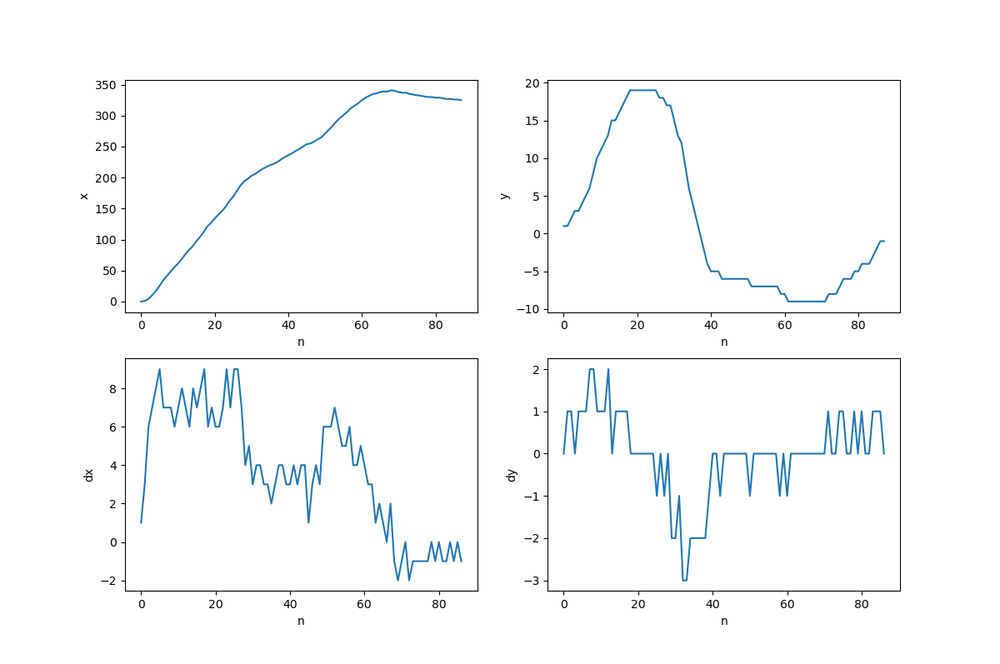

# ArtificialTrailSamples · 一种朴素的人工滑动轨迹生成方案

-------------------------------------------------------
## 1. 概述

本文主要介绍一种朴素的人工滑动轨迹生成方案，用于解决在目标网站进行轨迹模式检测场景下的绕过问题。

* [ArtificialTrailSamples · 一种朴素的人工滑动轨迹生成方案](#artificialtrailsamples--一种朴素的人工滑动轨迹生成方案)
    * [1. 概述](#1-概述)
    * [2. 问题场景](#2-问题场景)
    * [3. 核心思路](#3-核心思路)
    * [4. 解决方案](#4-解决方案)
        * [4.1. 构建人工滑动轨迹样本库](#41-构建人工滑动轨迹样本库)
        * [4.2. 轨迹容器设计](#42-轨迹容器设计)
        * [4.3. 轨迹插值算法设计](#43-轨迹插值算法设计)
        * [4.4. 轨迹样本库容器设计](#44-轨迹样本库容器设计)
    * [4. 方案验证](#4-方案验证)
    * [5. 总结](#5-总结)


-------------------------------------------------------
## 2. 问题场景
在进行滑动验证码的识别和绕过时，通常需要先计算出缺口的偏移量，再构建一段滑动轨迹坐标来生成轨迹参数(接口实现)或进行模拟滑动(模拟器实现)，滑动轨迹通常是基于一些简单算法生成的，在某些场景下目标服务器可能会通过检查滑动轨迹模式来进行人机识别(反爬)，因此需要一种轨迹生成方案来生成模拟的人工滑动轨迹。


-------------------------------------------------------
## 3. 核心思路

由于本人的技术水平有限，没有机器学习相关的技术积累，因此采用一种朴素的视角来解决这个问题。

假设现在有一段长度为 **100(x轴总偏移量)** 的人工轨迹样本。

```json
[[0, -1], [1, -1], [4, -3], "...", [100, 2]]
```

如果缺口的目标偏移量正好是 100，那么这个人工轨迹样本刚好可以符合。但如果目标偏移量是 150，上述轨迹就有 *-50* 的偏差，这时可以考虑设计一种 **插值算法**，通过对这个轨迹样本进行插值，从而让其长度与目标偏移量一致。

基于这个 **人工轨迹样本** 和 **插值算法** 就可以模拟任意长度的人工滑动轨迹。但这里还有一个问题，**插值算法** 会带来畸变，当目标偏移量与轨迹样本长度差异过大时，插值产生的畸变就越严重。为了解决这个问题，可以考虑构建一个 **人工轨迹样本库**。

```json
[
    [[0, -1], [1, -1], [4, -3], "...", [100, 2]],
    [[2,  0], [3,  0], [4,  0], "...", [150, 1]],
    [[0, -1], [1, -1], [4, -3], "...", [200, -1]],
    "......",
    [[1,  0], [2,  0], [4,  0], "...", [500, 3]]
]
```

上述 **人工轨迹样本库** 以 **长度间隔(x轴总偏移量) d=50** 构建，当构建人工轨迹时，从样本库中选取一条与目标偏移量最近(偏差最小)的轨迹进行插值，以减弱插值导致的轨迹畸变。同时为了增加轨迹的随机性，可以为每类长度的轨迹生成多个样本来进行随机选择。


-------------------------------------------------------
## 4. 解决方案

### 4.1. 构建人工滑动轨迹样本库

解决方案的第一步是构建 **人工滑动轨迹样本库**，通过一个基于 *HTML* 的 **人工轨迹样本捕获器** 来构建样本库。其界面如下：


采集器完整代码位于 [Artificial_Trail_Samples_Builder](./src/Artificial_Trail_Samples_Builder.html)。

通过设定目标偏移量，按照长度间隔 *d=50* 来构建人工轨迹数据，并将人工轨迹库导出到本地 [source_trail_samples](./src/source_trail_samples.json)。人工滑动轨迹样例如下：

```json
[[1,0,199],[2,1,205],[6,5,222],[8,7,239],[10,9,256],[11,9,272],[12,9,372],[14,9,389],[18,9,405],[25,9,422],[31,9,439],[36,9,455],[40,9,472],[44,9,489],[48,9,505],[51,9,522],[54,8,539],[56,7,555],[57,7,572],[60,6,589],[64,5,605],[66,5,622],[69,3,639],[73,2,655],[76,1,672],[78,0,688],[80,0,705],[82,-1,722],[84,-1,738],[88,-3,755],[91,-4,772],[97,-5,788],[103,-7,805],[109,-7,822],[114,-8,838],[120,-9,855],[125,-10,871],[130,-10,888],[136,-10,905],[140,-11,922],[144,-11,938],[149,-11,955],[155,-11,971],[162,-11,988],[170,-11,1005],[177,-10,1021],[185,-9,1038],[192,-8,1055],[201,-7,1072],[212,-5,1088],[223,-3,1105],[234,-1,1121],[245,2,1138],[255,4,1155],[265,6,1171],[274,8,1188],[282,10,1205],[290,12,1221],[297,13,1238],[304,15,1254],[310,16,1271],[316,18,1288],[320,18,1304],[325,19,1321],[329,20,1338],[333,20,1354],[335,20,1371],[337,20,1388],[339,20,1404],[343,19,1421],[347,18,1438],[354,17,1454],[360,16,1471],[366,15,1488],[374,14,1504],[382,13,1521],[392,13,1538],[405,12,1554],[419,11,1571],[430,11,1588],[443,10,1604],[451,9,1621],[456,8,1638],[459,8,1654],[461,7,1671],[464,7,1688],[467,5,1704],[471,4,1721],[475,4,1737],[480,3,1754],[484,2,1771],[488,2,1787],[490,1,1804],[491,1,1837],[494,1,1854],[496,1,1871],[498,0,1887],[499,0,1947],[500,0,1957],[501,0,1971],[503,-1,1987],[503,0,2226],[503,1,2270],[503,2,2287],[502,2,2892],[501,2,2903],[500,2,2920],[499,1,2970]]
```

其中每条轨迹数据是一个数组，内部元素是一个有三个分量的数组 **[x, y, t]** ，分别记录 x, y轴的总偏移量和滑动时间。

### 4.2. 轨迹容器设计

***Trail(轨迹容器)*** 用于存储滑动轨迹，其内部包含三个主要属性：

* **offset_sequence**：轨迹坐标偏移序列，与上述的 *人工轨迹样本捕获器* 捕获的原始轨迹结构一致。
* **diff_sequence**：轨迹坐标间隔序列，通过计算 offset_sequence 中相邻元素的差值计算出的间隔序列，后续将用于插值算法的计算。
* **interpolator**：轨迹插值器，插值算法实现，用于对轨迹进行插值。

其中 **interpolator** 是轨迹容器在初始化时传入的一个可调用对象，其将在 *interpolation* 方法中进行调用，通过对 diff_sequence 进行插值来生成目标轨迹：

```py
# artificial_trail_samples.Trail

def interpolation(self, target, offset_type="x"):
    """轨迹插值

    对轨迹的指定分量进行插值

    Args:
        * target(int): 目标值
        * offset_type(str): 轨迹分量(["x", "y", "t"])

    Returns:
        self
    """
    if not target:
        return self
    if not callable(self.interpolator):
        raise ValueError(f'interpolator({self.interpolator}) is not Callable')
    if offset_type not in self.offset_type_index:
        raise ValueError(f'unknown offset_type({offset_type})')
    # 插值操作
    self.diff_sequence = self.interpolator(self.diff_sequence, target, self.offset_type_index[offset_type])
    # 更新轨迹数据
    self.offset_sequence = Trail.build_offset_sequence(self.diff_sequence, self.start)
    return self
```

### 4.3. 轨迹插值算法设计

轨迹插值算法用于将样本库中的轨迹通过插值操作来生成符合需求的目标轨迹。轨迹插值器是其具体实现，形式定义如下：

```py
def trail_interpolator(diff_sequence: list, target: int, w:int=0) -> list
```

其中 *diff_sequence* 是 **轨迹坐标间隔序列**，*target* 是目标值，*w* 为要插值的序列分量(["x", "y", "t"])。插值算法的实现如下：

设 diff_sequence 为某个轨迹的 *轨迹坐标间隔序列*，n 为轨迹点数量，target 为目标总偏移量。

```
diff_sequence = [d1, d2, d3, ..., dx]
```

则有目标总偏移量的差值 `diff = target - sum(diff_sequence)`, (sum(diff_sequence)为当前轨迹的总偏移量)

分解增量令 `diff = dn*n + di`

其中： 
  * 整体插值增量 **dn = int(d/n)**
  * 间隔插值增量 **di = d%n**

通过以下方式对轨迹坐标序列进行插值：

1. 整体插值: 当 diff>=n 时有 dn>0：
```
    [d1, d2, d3, d4, ..., dx]
+   [dn, dn, dn, dn, ..., dn]
->  [d1+dn, d2+dn, d3+dn, ..., dx+dn]
```

2. 间隔插值: 当 diff<n 或 di>0 时：
```
    [d1, d2, d3, d4, ..., dx]
+   [1,  0,  1,  0, ...,  di]
->  [d1+1, d2+0, d3+1, ..., dx+di]
```
其中插值间距为 `round(n/di)`

由上述可知，增量偏移序列的轨迹点增量为
```
diff_sequence[i] = diff_sequence[i] + dn + di
```

轨迹插值器的完整实现如下：

```py
# ArtificialTrailSamples.trail_interpolator

def trail_interpolator(diff_sequence: list, target: int, w:int=0) -> list:
    # 轨迹点数量
    n = len(diff_sequence)
    # 计算偏移量的差值
    diff = target - sum([t[w] for t in diff_sequence])
    # 分解增量
    dn, di = int(diff/n), (abs(diff)%n)
    # (diff >= n): 整体插值 -> [dn, dn, dn, ...0]
    if dn:
        for i in range(n):
            diff_sequence[i][w] += dn
    # (diff < n):  间隔插值 -> [1, ..., 1, ..., 1, ...]
    if di:
        for i in list(range(0, n, round(n/di)))[:di]:
            diff_sequence[i][w] += (1 if diff>0 else -1)
    return diff_sequence
```

### 4.4. 轨迹样本库容器设计

*ArtificialTrailSamples(轨迹样本库容器)* 基于 **原始人工滑动轨迹样本库** 与 **插值算法** 来构建任意长度的模拟人工滑动轨迹。

实例的 *trail_samples* 属性是一个数组，用于存储 ***Trail(轨迹容器)*** 实例，其通过 *load* 方法从 *人工滑动轨迹样本库数据(trail_samples.json)* 中加载。

**build** 是用于构建任意长度的模拟人工滑动轨迹的核心方法，源码实现如下：

```py
# ArtificialTrailSamples.build

def build(self, x_offset, t_offset=None):
    # 基于 trail_search_range 参数从指定范围内随机获取一个样本轨迹
    trail = random.choice([
        trail for trail in self.trail_samples 
        if (x_offset-self.trail_search_range <= trail.x_offset <= x_offset+self.trail_search_range)
    ]).copy()
    # 对轨迹样本进行插值
    return trail.interpolation(x_offset, "x").interpolation(t_offset, "t")
```

首先从 *trail_samples* 样本库中随机选取一个 *x_offset(x轴总偏移量)* 范围在 *(x_offset-d, x_offset+d)* 中样本轨迹容器，并通过轨迹容器的 *interpolation* 插值方法根据插值参数 *x_offset(目标x轴总偏移量)* 和 *t_offset(目标滑动总时间)* 构建一个符合条件的轨迹。

完整代码位于 [ArtificialTrailSamples](./src/artificial_trail_samples.py)。

-------------------------------------------------------
## 4. 方案验证

通过以下流程对上述方案进行验证：

1. 通过 *Artificial_Trail_Samples_Builder(人工轨迹样本捕获器)* 按照长度间隔(x轴总偏移量) *d=50* 生成一系列 *原始轨迹数据(./source_trail_samples.json)* 。

```json
[
    [[0,   0, 164], "...", [100,  2, 2032]],
    [[-1, -1, 181], "...", [150, -3, 1797]],
    [[0,   0, 137], "...", [200,  2, 1705]],
    [["........."], "...", ["..........."]],
    [[0,   0,  94], "...", [600, -8, 2891]],
]
```

2. 通过 *ArtificialTrailSamples.build_trail_samples* 方法将原始轨迹数据转换成 *轨迹样本库数据(./trail_samples.json)* 

```py
# 构建轨迹样本库
ArtificialTrailSamples.build_trail_samples(
    # 原始轨迹数据文件路径
    source_trail_samples_filepath = "./source_trail_samples.json",
    # 轨迹样本库导出路径
    trail_samples_export_path = "./trail_samples.json",
    # 排序方式
    sort_by = "x_offset"
)
```

生成的轨迹样本库中的轨迹样例如下：

```json
[
    {
        "x_offset": 200, 
        "y_offset": 2, 
        "t_offset": 1568, 
        "tn": 67, 
        "start": [0, 0, 137], 
        "offset_sequence": [
            [0, 0, 137], 
            [1, 0, 146],
            ["......."], 
            [200, 2, 1705]
        ], 
        "diff_sequence": [
            [1, 0, 9], 
            [3, 0, 17], 
            ["......."], 
            [0, 1, 342]
        ]
    },
    "..."
]
```

3. 构建 *ArtificialTrailSamples(轨迹样本库容器)* 实例，加载 *轨迹样本数据(./trail_samples.json)*，并通过 *build* 方法构建任意长度的模拟人工滑动轨迹。

```py
trail = ArtificialTrailSamples().load().build(x_offset=325, t_offset=3000).display()
```

通过生成的 *trail(轨迹容器)* 的 *display* 方法来查看轨迹的可视化参数。

```
TRAIL_SAMPLES(tn=88): 
[x_offset]: ---> 325
[y_offset]: ---> -2
[t_offset]: ---> 3000
[start]: ------> [0, 1, 126]
[end]: --------> [325, -1, 3126]
```



4. 通过 *trail(轨迹容器)* 的 *slider* 方法使用 selenium 进行轨迹的滑动模拟，测试代码位于 [模拟滑动测试(trail_slide_test.py)](./src/trail_slide_test.py)：

```py
ats.build(offset).slider(
    driver = driver,
    slider_xpath = '//div[@class="JDJRV-slide-inner JDJRV-slide-btn"]'  
 )
```


-------------------------------------------------------
## 5. 总结

上述人工滑动轨迹生成方案是在我有限知识技术背景下的一种探索性尝试，相对于成熟的机器学习方案的效果可能不太理想，同时插值算法的设计也不是很严谨，后续随着自己知识技术水平的积累和发展，会从新的视角来探索这个问题更完善的解决方案。
