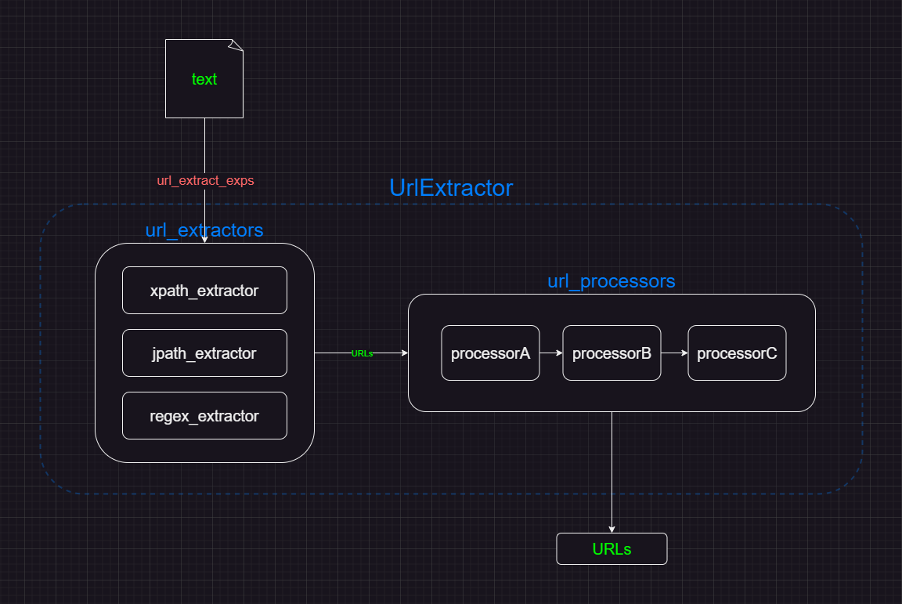

# 模块化URL提取器的设计与实现

-------------------------------------------------------
## 1. 概述
本文主要探讨在大规模数据采集场景下的页面URL提取问题。通过一种 **自下而上** 的方式，从具体的问题场景逐步抽象到上层架构来描述 **模块化URL提取器** 的设计与实现，从多种页面结构的数据中提取出目标URL列表，并通过组合不同的子模块来实现自定义的功能扩展来应对复杂多样的场景。

* Code : [UrlExtractor](./src/url_extractor/__init__.py)  

* [模块化URL提取器的设计与实现](#模块化url提取器的设计与实现)
    * [1. 概述](#1-概述)
    * [2. 问题场景](#2-问题场景)
    * [3. 核心设计目标](#3-核心设计目标)
    * [4. 复杂多样的页面结构](#4-复杂多样的页面结构)
        * [4.1. HTML(XML)页面结构](#41-htmlxml页面结构)
        * [4.2. JSON页面结构](#42-json页面结构)
        * [4.3. 嵌套页面结构](#43-嵌套页面结构)
        * [4.4. 其他结构](#44-其他结构)
    * [5. URL提取模块设计](#5-url提取模块设计)
    * [6. URL处理模块设计](#6-url处理模块设计)
    * [7. UrlExtractor 模块设计](#7-urlextractor-模块设计)
    * [8. 自定义的扩展特性](#8-自定义的扩展特性)
    * [9. 总结](#9-总结)

* Meta
```json
{
    "node": "9CBE6BDB-0829-E22E-4C66-6B831A81EAC7",
    "name": "模块化URL提取器的设计与实现",
    "author": "Ais",
    "date": "2023-10-12",
    "tag": ["UrlExtractor", "数据提取", "URL", "python", "模块化架构"] 
}
```


-------------------------------------------------------
## 2. 问题场景
在数据采集开发过程中，从当前页面中提取URL来构建后续迭代请求是一个常见的场景。由于不同网站的结构差异，通常需要对目标页面针对性地编写URL提取和处理逻辑。在简单的应用场景下，这种方式没什么问题，但是针对大规模站点的采集场景，由于复杂多样的页面结构，这种针对特定站点设计的URL提取代码的通用性并不强，复用率也相对较低，同时这种代码结构缺乏一致性导致后期维护相对繁琐。

因此为了解决这种场景下的URL提取和处理问题，在下文中探讨一种 **模块化URL提取器(UrlExtractor)** 的设计和实现方案。


-------------------------------------------------------
## 3. 核心设计目标
**UrlExtractor** 的核心设计目标是通过 **模块化** 的架构提供一个具有 **一致性** 和 **可扩展性** 的 **URL提取和处理模块/框架**。

* **一致性**：这里的一致性有两个意义，一个指的是框架在处理同类别子模块时具有一致的处理逻辑(这要求同类子模块有相同的形式定义)，另一个指的是通过提供一个统一的调用入口或者调用方式，在面对不同的应用场景时，使调用代码具有相对一致的结构。

* **可扩展性**：在设计上需要具有可扩展的特性，支持通过构建多样化的自定义子模块，来适应不同的应用场景。

* **可复用性**：面对相似的应用场景时，通过子模块之间的组合来解决，提高代码的复用率。


-------------------------------------------------------
## 4. 复杂多样的页面结构
通过对大量网站页面结构样例进行考察可以发现，其中大部分主要由 **HTML(XML)** 和 **JSON** 格式的数据构成。因此首先从这两种结构入手来探索URL的提取方法。需要注意的是，这里的 **页面结构** 泛指URL所在的文本数据结构。

### 4.1. HTML(XML)页面结构

```html
<!DOCTYPE html>
<html lang="en">
<head>
    <meta charset="UTF-8">
    <meta name="viewport" content="width=device-width, initial-scale=1.0">
    <title>Document</title>
</head>
<body>
    <ul id="article">
        <li><a href="https://www.test.org/article/1"></a></li>
        <li><a href="https://www.test.org/article/2"></a></li>
        <li><a href="https://www.test.org/article/3"></a></li>
        <li><a href="https://www.test.org/article/4"></a></li>
        <li><a href="https://www.test.org/article/5"></a></li>
    </ul>
</body>
</html>
```

上述HTML格式是最常见的页面结构，从中提取出URL最常见的方案是通过 *lxml* 或者 *BeautifulSoup* 库将其解析成可操作的对象，并通过对象提供的一系列查找方法进行目标URL数据的提取。但考虑到通用性和场景覆盖率的问题，其中的 *xpath* 方法是最佳的选择。

> XPath 为 XML路径语言（XML Path Language），XPath基于XML的树状结构，提供在数据结构树中找寻节点的能力。

通过对 *lxml* 库中的 *xpath* 方法进行封装，构建一个基于xpath表达式的URL提取模块。

```py
def xpath_extractor(expression:str, text:str, params:dict=None) -> list:
    """xpath-URL提取器"""
    if isinstance(text, str):
        data = text
    elif isinstance(text, (list, tuple)):
        data = "".join(text)
    else:
        raise ValueError(f'Unsupported text({type(text)})')
    html = lxml.etree.HTML(data)
    return html.xpath(expression)
```

通过 *xpath_extractor* 解析上述页面中URL列表的样例如下:

```py
>>> xpath_extractor("//ul[@id='article']/li/a/@href", text)
['https://www.test.org/article/1', 'https://www.test.org/article/2', 'https://www.test.org/article/3', 'https://www.test.org/article/4', 'https://www.test.org/article/5']
```

### 4.2. JSON页面结构
除了最常见的HTML结构，对于大多数通过POST请求传递URL列表数据的网站，通常是基于JSON结构的：

```json
{
    "page_num": 1,
    "page_size": 5,
    "isEnd": false,
    "article": [
        {
            "title": "test-article-1",
            "url": "https://www.test.org/article/1"
        },
        {
            "title": "test-article-2",
            "url": "https://www.test.org/article/2"
        },
        {
            "title": "test-article-3",
            "url": "https://www.test.org/article/3"
        },
        {
            "title": "test-article-4",
            "url": "https://www.test.org/article/4"
        },
        {
            "title": "test-article-5",
            "url": "https://www.test.org/article/5"
        }
    ] 
}
```

对于这种结构的URL提取，可以采用我之前设计的 [**JsonPath**](../一种基于路径表达式的json数据提取器/一种基于路径表达式的json数据提取器.md) 模块来实现。**JsonPath** 是一种基于路径表达式的 *json* 数据提取器，用于解决复杂 *json* 数据下的提取问题，其中的 *find* 方法可以对上述数据中的具有 *并行结构* 的URL进行批量提取。

```py
def jpath_extractor(expression:str, text:str, params:dict=None) -> list:
    """jpath-URL提取器"""
    if isinstance(text, str):
        data = json.loads(text)
    elif isinstance(text, (list, tuple)):
        data = [json.loads(d) if isinstance(d, str) else d for d in text]
    elif isinstance(text, dict):
        data = text
    else:
        raise ValueError(f'Unsupported text({type(text)})')
    return JsonPathExtractor(data).find(expression, default=[])
```

```py
>>> jpath_extractor("/article/\d+/url", text)
['https://www.test.org/article/1', 'https://www.test.org/article/2', 'https://www.test.org/article/3', 'https://www.test.org/article/4', 'https://www.test.org/article/5']
```

### 4.3. 嵌套页面结构
除了上述两类常见的页面结构外，某些站点还存在 *HTML* 和 *JSON* 结构相互嵌套的情况：

```json
{
    "page_num": 1,
    "page_size": 5,
    "isEnd": false,
    "article": [
        {
            "title": "test-article-1",
            "html": "<div class='article'><h3>test-article-1</h3><a href='https://www.test.org/article/1'></a></div>"
        },
        {
            "title": "test-article-2",
            "html": "<div class='article'><h3>test-article-2</h3><a href='https://www.test.org/article/2'></a></div>"
        },
        {
            "title": "test-article-3",
            "html": "<div class='article'><h3>test-article-3</h3><a href='https://www.test.org/article/3'></a></div>"
        },
        {
            "title": "test-article-4",
            "html": "<div class='article'><h3>test-article-4</h3><a href='https://www.test.org/article/4'></a></div>"
        },
        {
            "title": "test-article-5",
            "html": "<div class='article'><h3>test-article-5</h3><a href='https://www.test.org/article/5'></a></div>"
        }
    ] 
}
```

对于这种情况，可以通过 *jpath_extractor* 和 *xpath_extractor* 的组合使用来解决：

```py
>>> urls = jpath_extractor("/article/\d+/html", text)
>>> xpath_extractor("//div[@class='article']/a/@href", urls)
['https://www.test.org/article/1', 'https://www.test.org/article/2', 'https://www.test.org/article/3', 'https://www.test.org/article/4', 'https://www.test.org/article/5']
```

又或者是HTML标签中嵌套JSON数据：

```html
<!DOCTYPE html>
<html lang="en">
<head>
    <meta charset="UTF-8">
    <meta name="viewport" content="width=device-width, initial-scale=1.0">
    <title>Document</title>
</head>
<body>
    <div class="article" data='{"title": "test-article-1", "url": "https://www.test.org/article/1"}'></div>
    <div class="article" data='{"title": "test-article-2", "url": "https://www.test.org/article/2"}'></div>
    <div class="article" data='{"title": "test-article-3", "url": "https://www.test.org/article/3"}'></div>
    <div class="article" data='{"title": "test-article-4", "url": "https://www.test.org/article/4"}'></div>
    <div class="article" data='{"title": "test-article-5", "url": "https://www.test.org/article/5"}'></div>
</body>
</html>
```

```py
>>> urls = xpath_extractor("//div[@class='article']/@data", text)
>>> jpath_extractor("/\d+/url", urls)
['https://www.test.org/article/1', 'https://www.test.org/article/2', 'https://www.test.org/article/3', 'https://www.test.org/article/4', 'https://www.test.org/article/5']
```

### 4.4. 其他结构

*jpath_extractor* 和 *xpath_extractor* 的组合已经可以覆盖绝大多数的URL提取需求，对于其他的额外场景，可以考虑采用正则表达式来提取。

```html
<!DOCTYPE html>
<html lang="en">
<head>
    <meta charset="UTF-8">
    <meta name="viewport" content="width=device-width, initial-scale=1.0">
    <title>Document</title>
</head>
<body>
    <title>News</title>
    <script>
        data={"page_num": 1, "page_size": 5,"isEnd":false, "article": [{"title": "test-article-1","url": "https://www.test.org/article/1"},{"title": "test-article-2","url": "https://www.test.org/article/2"},{"title": "test-article-3","url": "https://www.test.org/article/3"},{"title": "test-article-4","url": "https://www.test.org/article/4"},{"title":"test-article-5", "url":"https://www.test.org/article/5"}]}
    </script>
</body>
</html>
```

```py
def regex_extractor(expression:str, text:str, params:dict=None) -> list:
    """regex-URL提取器"""
    params = params or {}
    if isinstance(text, str):
        data = text
    elif isinstance(text, (dict, list, tuple)):
        data = json.dumps(text)
    else:
        raise ValueError(f'Unsupported text({type(text)})')
    urls = re.findall(expression, data)
    return "".join(urls) if params.get("toStr") else urls
```

```py
>>> urls = regex_extractor("data=(.+?)\n", text, params={"toStr": True})
>>> jpath_extractor("/article/\d+/url", urls)
['https://127.0.0.1:8000/article/1', 'https://127.0.0.1:8000/article/2', 'https://127.0.0.1:8000/article/3', 'https://127.0.0.1:8000/article/4', 'https://127.0.0.1:8000/article/5']
```

-------------------------------------------------------
## 5. URL提取模块设计

通过上述实际的URL提取场景，并结合 *xpath*, *jpath*, *regex* 三种提取方式来归纳定义 **URL提取模块** 的抽象形式：

```py
def extractor(expression:str, text:str, params:dict=None) -> list:
    return []
```

*extractor(提取模块)* 是一个可调用对象，并且应该尽量设计成 **纯函数** 的形式，这意味着对于相同的输入有同样的输出，并且执行时不产生副作用。其形式参数的意义如下：

* *expression(str)*：提取模块接受的 **提取表达式**，通过该表达式来指定待提取的URL模式。
* text(str)：目标URL所在的文本数据，通常是一个字符串，但是也可以接受其他类型的参数，提取模块可以在内部转换成可处理的类型。
* params(dict)：扩展参数字段，用于通过其他参数来控制提取模块的行为。 

每个提取模块处理某一类特定的应用场景，通过 **提取表达式** 从指定数据中提取出目标URL列表。


-------------------------------------------------------
## 6. URL处理模块设计

从页面中提取出URL后，往往需要对这些URL进行进一步的处理，比如对重复URL进行去重，按照指定规则过滤，又或者需要拼接完整的URL等。可以将这些逻辑封装成单独的处理模块：

* URL去重器：对重复URL进行过滤，使用 set 数据结构进行去重处理。

```py
def UrlDupeFilter():
    """URL去重器"""
    url_dupefilter_set = set()
    def url_dupefilter(urls:list) -> list:
        urls = set(urls) - url_dupefilter_set
        url_dupefilter_set.update(urls)
        return list(urls)
    return url_dupefilter


>>> url_dupefilter = UrlDupeFilter()
>>> url_dupefilter(["https://www.test.com/page/1", "https://www.test.com/page/2"]
['https://www.test.com/page/2', 'https://www.test.com/page/1']
>>> url_dupefilter(["https://www.test.com/page/2", "https://www.test.com/page/3"]
['https://www.test.com/page/3']
```

* URL域名过滤器：通过指定的域名集合对URL列表进行过滤。

```py
def UrlDomainFilter(allow_domain:set=None, ignore_domain:set=None):
    """URL域名过滤器"""
    def url_domain_filter(urls:list) -> list:
        if allow_domain:
            return [url for url in urls if urlparse(url).netloc in allow_domain]
        if ignore_domain:
            return [url for url in urls if urlparse(url).netloc not in ignore_domain]
        return urls
    return url_domain_filter


>>> url_domain_filter = UrlDomainFilter(allow_domain={"www.test.com"})
>>> url_domain_filter(["https://www.test.com/", "https://www.data.com/"])
['https://www.test.com/']
>>> url_domain_filter = UrlDomainFilter(ignore_domain={"www.data.com"})
>>> url_domain_filter(["https://www.test.com/", "https://www.data.com/"])
['https://www.test.com/']
```

* URL装配器：通过指定参数来组合URL，用于构建完整URL。

```py
def UrlAssembler(url_prefix:str="", url_templates:str=""):
    """URL装配器"""
    def url_assembler(urls:list) -> list:
        if url_prefix:
            return [urljoin(url_prefix, url) for url in urls]
        if url_templates:
            return [url_templates.format(url) for url in urls]
        return urls
    return url_assembler


>>> url_assembler = UrlAssembler(url_prefix="https://www.test.com")
>>> url_assembler(["/article/1234.html", "/article/4567.html"])
['https://www.test.com/article/1234.html', 'https://www.test.com/article/4567.html']
>>> url_assembler = UrlAssembler(url_templates="https://www.test.com/article/{}.html")
>>> url_assembler(["1234", "4567"])
['https://www.test.com/article/1234.html', 'https://www.test.com/article/4567.html']
```

从上述代码中可以抽象出 **URL处理模块** 的设计形式：

```py
def processor(urls:list) -> list:
    return urls
```

与 **URL提取模块** 一样，**URL处理模块** 同样是一个 **可调用对象**，区别在于由于某些处理逻辑需要保存中间状态的原因(例如去重器)，因此不需要设计成纯函数的形式。同时每个模块从设计上应该具有单一的功能，功能混合的模块不利于复用。URL提取模块只具有一个形式参数：

* urls：待处理的URL列表

出于调用的便利性考虑，可以看到这里并没有像URL提取模块一样设计扩展参数(params)，因此为了保证形式参数的一致性，可以考虑利用闭包的特性：

```py
def processor_builder(**params):
    def processor(urls:list) -> list:
        return urls
    return processor
```
 
-------------------------------------------------------
## 7. UrlExtractor 模块设计

在实现 **URL提取模块** 和 **URL处理模块** 的设计后，为了处理逻辑和调用方式的一致性，构建一个 执行容器(**UrlExtractor**) 来组织这些模块，整体架构如下：



```py
class UrlExtractor(object):

    def __init__(self, url_extractors:dict=None, url_extract_exps:list=None, url_processors:list=None):
        # URL提取模块容器
        self.url_extractors = url_extractors or {
            "xpath": xpath_extractor,
            "jpath": jpath_extractor,
            "regex": regex_extractor
        }
        # URL提取表达式
        self.url_extract_exps = url_extract_exps or []
        # URL处理模块容器
        self.url_processors = url_processors or []

    def extract(self, text:str, url_extract_exps:list=None) -> list:
        """提取URL(调用入口)
        
        根据 URL提取表达式 从文本中提取出URL列表。

        Args:
            * text: 目标文本
            * url_extract_exps: URL提取表达式，当该参数为空时，使用类初始化时传入的 url_extract_exps 参数。

        Returns:
            提取出的URL列表

        Raises:
            * ValueError: text 或者 url_extract_exps(self.url_extract_exps) 为空时抛出异常。
        """
        url_extract_exps = url_extract_exps or self.url_extract_exps
        if not text or not url_extract_exps:
            raise ValueError("text or url_extract_exps must be not None")
        urls = self.extract_urls(url_extract_exps, text)
        return self.process_urls(urls) if urls else []        

    def extract_urls(self, url_extract_exps:list, text:str) -> list:
        """提取URL(内部实现)

        根据 URL提取表达式 从 self.url_extractors 查找指定提取模块来提取URL。
        """
        urls = []
        for url_extract_exp in url_extract_exps:
            if len(url_extract_exp) == 3:
                extractor_id, extract_exp, extend_params = url_extract_exp
            else:
                extractor_id, extract_exp, extend_params = *url_extract_exp, {}
            # 调用指定的提取模块解析执行提取表达式
            urls = self.url_extractors[extractor_id](extract_exp, urls or text, extend_params)
            if not urls:
                break
        return urls
    
    def process_urls(self, urls:list) -> list:
        """处理URLs
        
        通过 self.url_processors(URL处理模块) 依次处理提取出的URL列表。
        """
        for processor in self.url_processors:
            urls = processor(urls)
            if not urls:
                break
        return urls 
```

使用样例如下：

```py
from url_extractor import UrlExtractor
from url_extractor.extractors import xpath_extractor, jpath_extractor, regex_extractor
from url_extractor.processors import UrlDupeFilter, UrlDomainFilter

extractor = UrlExtractor(
    url_extractors = {
        "xpath": xpath_extractor,
        "jpath": jpath_extractor,
        "regex": regex_extractor
    },
    url_extract_exps = (
        ("jpath", "/article/\d+/html"),
        ("xpath", "//div[@class='article']/a/@href"),
    ),
    url_processors = (
        UrlDupeFilter(),
        UrlDomainFilter(allow_domain="www.test.org")
    )
)

urls = extractor.extract(text)
```

**UrlExtractor** 在实例化的时候有三个构建参数：

* *url_extractors*：URL提取模块容器，通过字典结构存储URL提取模块，并建立 *extractor_id(键名)* 到 *URL提取模块(键值)* 的映射关系。

* *url_extract_exps*：URL提取表达式，用于描述URL的提取方式，该参数是一个序列(list or tuple)，其中每个子元素是一条 **URL提取指令**，定义如下：
    ```py
    url_extract_exps = (
        (extractor_id, extract_expression),
        (extractor_id, extract_expression, extend_params),
        ...
    )
    ```

* url_processors：URL处理模块容器，一个序列结构，每个子元素是一个 **URL处理模块**。

通过调用 **UrlExtractor.extract** 方法，并传入 text(目标URL所在的数据文本) 进行URL的提取。 **extract** 方法从设计上只是提供给外部调用的入口，具体的URL提取和处理逻辑被拆分到 **UrlExtractor.extract_urls** 和 **UrlExtractor.process_urls** 两个子方法中。

**UrlExtractor.extract_urls** 方法负责处理URL提取逻辑，按照 *url_extract_exps* 中的序列顺序依次处理 **URL提取指令**，指令中的第一个参数 *extractor_id* 指定了要调用的URL提取模块，通过在 *url_extractors* 中查找对应模块，并传入 *text* 和 *extract_expression(URL提取表达式)* 等参数实现URL的提取。从这里可以看到，URL提取指令的有效值取决于 *url_extractors* 中的模块构成。

**UrlExtractor.process_urls** 方法则负责URL处理逻辑，当从 *extract_urls* 方法中提取出URL列表后，会根据 *url_processors* 的序列顺序依次调用其中的URL处理模块进行处理。

从这里可以发现，实际上不论是 *extract_urls* 方法还是 *process_urls* 方法，其内部都不包含具体的URL提取和处理逻辑，而只是作为一个调用骨架，真正的处理逻辑被封装 *url_extractors* 和 *url_processors* 内部的子模块中。同时得益于之前的抽象接口设计，可以对这些子模块进行一致性地处理。 


-------------------------------------------------------
## 8. 自定义的扩展特性

**UrlExtractor** 的架构设计使其具有很灵活的扩展性，可以根据不同的需求场景进行自定义。例如可以根据需求添加一种自定义的URL提取模块：

```py
def custom_extractor(expression:str, text:str, params:dict=None):
    return []

extractor = UrlExtractor(
    url_extractors = {
        "custom": custom_extractor,
    },
    url_extract_exps = (
        ("custom", "......"),
    )
)
```

URL处理模块的自定义方式与之类似，需要注意的是定义要遵循对应模块的形式约束，以保证在模块被调用时处理的一致性。

同时为了 **UrlExtractor** 实例化的便利性和复用的考虑，可以根据具体的应用场景创建一个客制化的 **构建器(工厂)** 来封装其构建逻辑。

```py
def CustomUrlExtractorBuilder(url_extract_exps:list) -> UrlExtractor:
    return UrlExtractor(
        url_extractors = {
            "xpath": xpath_extractor,
            "jpath": jpath_extractor,
            "regex": regex_extractor,
            "custom": custom_extractor,
        },
        url_extract_exps = url_extract_exps,
        url_processors = (
            UrlDupeFilter(),
            custom_processor,
        )
    )

extractor = CustomUrlExtractorBuilder((
    ("jpath", "/article/\d+/html"),
    ("xpath", "//div[@class='article']/a/@href"),
    ("custom", "......"),
))
```

-------------------------------------------------------
## 9. 总结

通过模块化URL提取器 **UrlExtractor** 的设计与实现，在大规模数据采集场景中，可以很好的解决复杂多样的页面结构下的URL提取需求。但是需要注意的是，应该根据具体的应用场景来确定是否需要引入这种设计，*UrlExtractor* 带来优点的同时，也增加了系统的复杂度，需要开发者酌情考虑。

同时从这里还可以提炼出一种实验性的 **自下而上** 的模块化系统的构建思路，即从具体的应用场景出发，将整个复杂问题拆分成单一部分，对每个部分通过归纳和抽象来定义出子模块的形式，再逐步构建上层模块对这些抽象子模块进行组合和调用，从而向上构建出整体框架。后续将对上述实验性方法论进行进一步讨论和验证。

