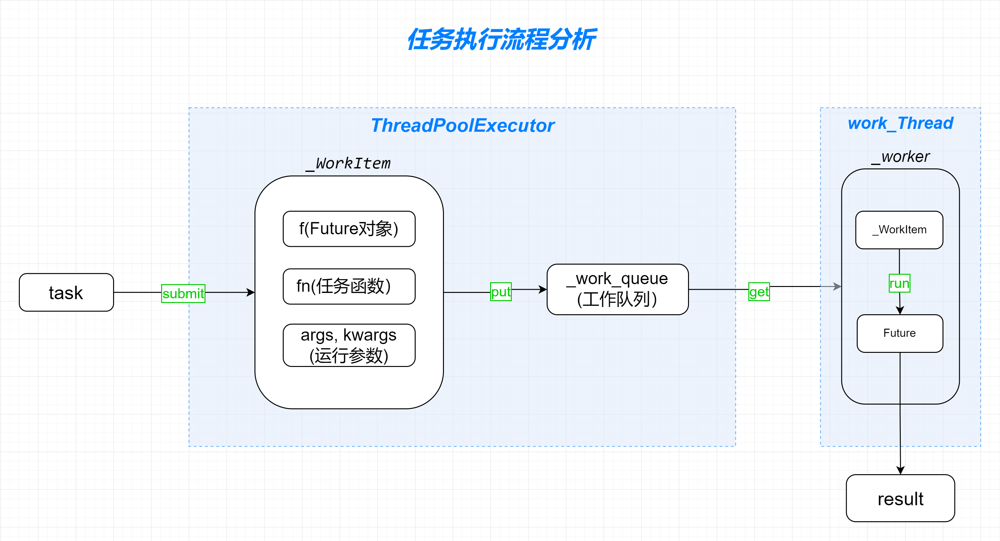
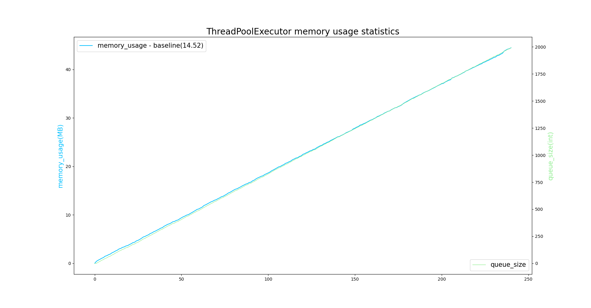
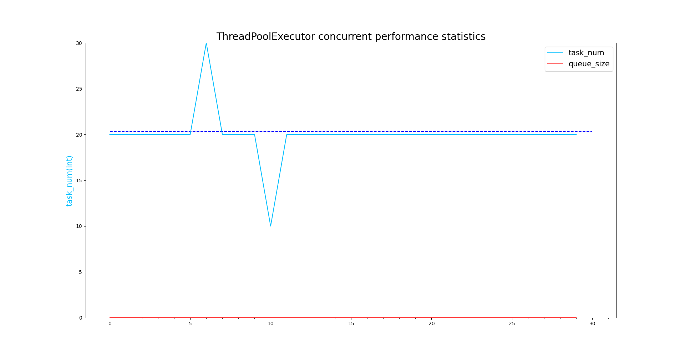
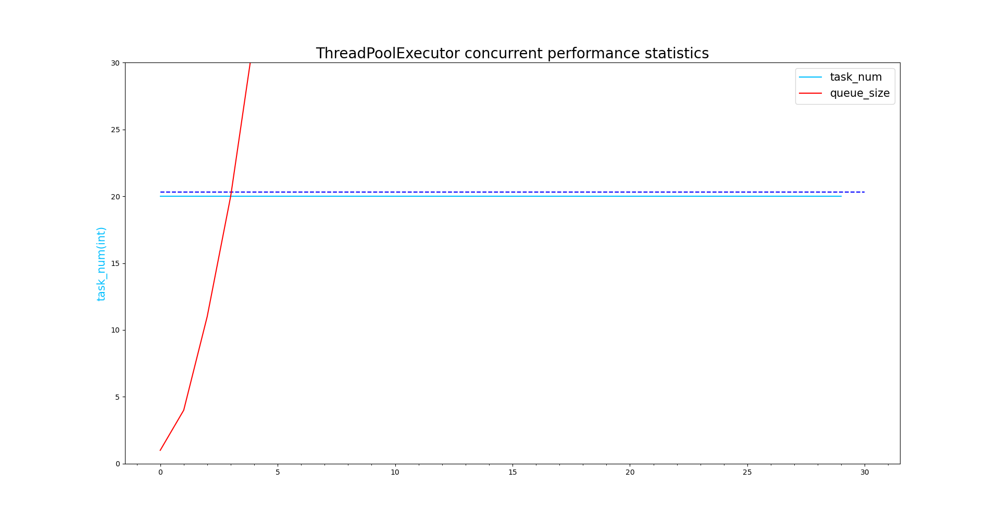

# Python线程池的源码实现分析与相关问题探讨

-------------------------------------------------------
## 1. 概述
线程池是一种多线程调度策略，通过持久化的工作进程，来减少频繁创建和销毁线程所产生的资源开销。**ThreadPoolExecutor** 是 Python 的官方线程池实现方案，本文主要通过分析相关源码实现来理解其架构设计，同时探讨由于使用不当导致的内存占用过高等相关问题。

* [Python线程池的源码实现分析与相关问题探讨](#python线程池的源码实现分析与相关问题探讨)
    * [1. 概述](#1-概述)
    * [2. 任务执行流程分析](#2-任务执行流程分析)
    * [3. 工作线程调度逻辑分析](#3-工作线程调度逻辑分析)
        * [3.1. 工作线程的创建流程](#31-工作线程的创建流程)
        * [3.2. 工作线程的销毁机制](#32-工作线程的销毁机制)
            * [3.2.1. 通过 shutdown 调用触发销毁机制](#321-通过-shutdown-调用触发销毁机制)
            * [3.2.2. 线程池对象被垃圾回收触发销毁机制](#322-线程池对象被垃圾回收触发销毁机制)
            * [3.2.3. 解释器退出时触发销毁机制](#323-解释器退出时触发销毁机制)
    * [4. 问题探讨](#4-问题探讨)
        * [4.1. 内存占用问题：线程池的拒绝策略](#41-内存占用问题线程池的拒绝策略)
            * [4.1.1. 线程池内存占用模拟](#411-线程池内存占用模拟)
            * [4.1.2. 任务数据的惰性加载](#412-任务数据的惰性加载)
            * [4.1.3. 通过 as\_completed 分批处理](#413-通过-as_completed-分批处理)
        * [4.2. 并发性能问题：线程池的 “短板效应”](#42-并发性能问题线程池的-短板效应)
            * [4.2.1. 线程池并发性能的 “短板效应”](#421-线程池并发性能的-短板效应)
            * [4.2.2. 合理设置 *as\_completed* 的超时时间](#422-合理设置-as_completed-的超时时间)
            * [4.2.3. 避免任务混合 - 分离长耗时任务](#423-避免任务混合---分离长耗时任务)
            * [4.2.4. 其他方案探索](#424-其他方案探索)
    * [5. 扩展](#5-扩展)
    * [6. 总结](#6-总结)
    * [7. 参考](#7-参考)

```json
{
    "node": "A54660CD-99B5-2C55-4338-1CC8BE707203",
    "name": "Python线程池的源码实现分析与相关问题探讨",
    "author": "Ais",
    "date": "2024-04-18",
    "tag": ["python", "concurrent", "Thread", "ThreadPoolExecutor", "语法研究", "高级特性", "并发编程"] 
}
```

-------------------------------------------------------
## 2. 任务执行流程分析



通过官方文档中 **ThreadPoolExecutor** 的使用样例来分析任务的执行流程，样例代码如下：

```py
import concurrent.futures
import urllib.request

URLS = ['http://www.foxnews.com/',
        'http://www.cnn.com/',
        'http://europe.wsj.com/',
        'http://www.bbc.co.uk/',
        'http://nonexistant-subdomain.python.org/']

# Retrieve a single page and report the URL and contents
def load_url(url, timeout):
    with urllib.request.urlopen(url, timeout=timeout) as conn:
        return conn.read()

# We can use a with statement to ensure threads are cleaned up promptly
with concurrent.futures.ThreadPoolExecutor(max_workers=5) as executor:
    # Start the load operations and mark each future with its URL
    future_to_url = {executor.submit(load_url, url, 60): url for url in URLS}
    for future in concurrent.futures.as_completed(future_to_url):
        url = future_to_url[future]
        try:
            data = future.result()
        except Exception as exc:
            print('%r generated an exception: %s' % (url, exc))
        else:
            print('%r page is %d bytes' % (url, len(data)))
```

上述代码通过 ```with```(上下文管理器) 的方式创建了一个 **ThreadPoolExecutor** 线程池实例，并通过 ```executor.submit``` 方法将任务函数 ```load_url``` 及其调用参数添加到线程池中，```submit``` 方法的核心源码实现如下：

```py
# concurrent.futures.thread

class ThreadPoolExecutor(_base.Executor):
    ...

    def submit(*args, **kwargs):
        if len(args) >= 2:
            self, fn, *args = args
        ...

        with self._shutdown_lock:
            if self._broken:
                raise BrokenThreadPool(self._broken)

            if self._shutdown:
                raise RuntimeError('cannot schedule new futures after shutdown')
            if _shutdown:
                raise RuntimeError('cannot schedule new futures after '
                                   'interpreter shutdown')

            f = _base.Future()
            w = _WorkItem(f, fn, args, kwargs)

            self._work_queue.put(w)
            self._adjust_thread_count()
            return f
    submit.__text_signature__ = _base.Executor.submit.__text_signature__
    submit.__doc__ = _base.Executor.submit.__doc__
```

```submit``` 的主要逻辑在于将任务函数 *fn(load_url)* 和运行参数 *args, kwargs(url, timeout)* 以及一个 *f(Future)* 对象一起封装到 *_WorkItem* 对象的实例中，并将其添加到 **工作队列(_work_queue)**。

需要注意的是，要将任务成功添加到工作队列有三个必要条件：

* ```self._broken == False``` ：*self._broken* 属性用于标记工作线程进行初始化的成功状态，即 **ThreadPoolExecutor** 的初始化参数 ```initializer``` 的调用状态，当工作线程初始化失败时，*self._broken* 属性将被赋值为一个非空字符串，从而触发 *BrokenThreadPool* 异常，导致任务提交失败。

* ```self._shutdown == False``` ：*self._shutdown* 属性用于描述  **ThreadPoolExecutor** 是否关闭，当关闭时，将在 *submit* 中触发 *RuntimeError* 异常。

* ```_shutdown == False``` ：*_shutdown* 是一个模块属性，用于描述解释器的关闭状态。

*_WorkItem* 是线程池处理的工作单元，其定义如下：

```py
class _WorkItem(object):
    def __init__(self, future, fn, args, kwargs):
        self.future = future
        self.fn = fn
        self.args = args
        self.kwargs = kwargs

    def run(self):
        if not self.future.set_running_or_notify_cancel():
            return

        try:
            result = self.fn(*self.args, **self.kwargs)
        except BaseException as exc:
            self.future.set_exception(exc)
            # Break a reference cycle with the exception 'exc'
            self = None
        else:
            self.future.set_result(result)
```

*_WorkItem* 对象有4个实例属性，由实例化时传入：

* *self.future* : 该属性是一个 *concurrent.futures._base.Future* 对象实例，用于代表一个异步运算的最终结果。

* *self.fn* : 目标任务函数。

* *self.args* : 任务函数的位置参数。

* *self.kwargs* : 任务函数的关键词参数。

除了上述属性，*_WorkItem* 还提供了一个 ```run``` 方法，在这里可以看到任务函数的调用 ```self.fn(*self.args, **self.kwargs)```。同时还可以看到 *Future* 对象的作用，用于存储任务函数的运行结果和异常信息。

通过这里对任务函数的调用方式可以衍生猜想一下，*fn* 参数不单是支持函数的形式，广泛的看应该是支持是一个 *可调用对象*，这意味着在某些复杂的场景下，可以使用实现了 ```__call__``` 方法的对象作为 “任务函数”。

```py
class Task(object):

    def __init__(self, url, timeout) -> None:
        self.url = url
        self.timeout = (timeout, timeout) if isinstance(timeout, int) else timeout
        self.res = None
        self.start = None
        self.end = None

    def __call__(self):
        self.start = time.time()
        self.res = requests.get(
            url = self.url, 
            timeout = self.timeout,
        )
        self.end = time.time()
        return self

with ThreadPoolExecutor(max_workers=3) as executor:
    futures = [executor.submit(Task(url, 30)) for url in URLS]
```

任务函数在经过 *_WorkItem* 对象进行封装后，再通过  ```self._work_queue.put()``` 将其推送到 *工作队列* 中，*self._work_queue* 是在 *ThreadPoolExecutor* 实例化时创建的一个 队列对象(*queue.SimpleQueue*)，主要用于与 **工作线程** 进行通信以进行任务数据的交换。

继续追踪任务的执行位置可以发现，```_WorkItem.run()``` 的调用代码位于 **工作线程** 的运行逻辑中，即 **_worker** 函数中：

```py
def _worker(executor_reference, work_queue, initializer, initargs):
    ...
    try:
        while True:
            work_item = work_queue.get(block=True)
            if work_item is not None:
                work_item.run()
                # Delete references to object. See issue16284
                del work_item
        ...
    except BaseException:
        _base.LOGGER.critical('Exception in worker', exc_info=True)
    ...
```

工作线程通过调用 ```work_queue.get()``` 方法，从 **工作队列** 中获取一个 *_WorkItem* 对象并执行，从而实现任务函数的调用。

到此为止，关于 *ThreadPoolExecutor* 中任务执行的完整流程已经明了：

1. 通过 ```ThreadPoolExecutor.submit()``` 方法将任务函数和运行参数封装到 *_WorkItem* 对象，并推送到 **工作队列**。
2. **工作线程** 通过 ```get()``` 方法从 **工作队列** 中获取 *_WorkItem* 对象，并通过执行 ```_WorkItem.run()``` 来调用具体的任务函数。

从这里可以看到，实际上 *ThreadPoolExecutor* 采用的是一种 **生产消费者架构**，通过 *work_queue(工作队列)* 作为缓冲区，生产者通过 ```submit``` 方法将任务推送到 **工作队列**，消费者(工作线程) 再通过 ```get()``` 方法从队列中获取任务来执行。 

-------------------------------------------------------
## 3. 工作线程调度逻辑分析

在分析完任务的执行流程后，知道了任务函数的具体调用位置是在工作线程中，接下来分析一下线程池中的工作线程是怎样创建和调度的。先通过一段测试代码来观察一下工作线程的创建方式：

```py
import time
import threading
from itertools import count
from concurrent.futures import ThreadPoolExecutor, as_completed


def task():
    """测试的任务函数"""
    time.sleep(5)

def dotter():
    """打点器"""
    step = count().__next__
    def dotting(event:str):
        print(f'[step]({step()}): workThreads({threading.active_count()-1}) -> {event}')
    return dotting


if __name__ ==  "__main__":
    
    dotting = dotter()

    dotting("test start")
    executor = ThreadPoolExecutor(max_workers=3)  
    dotting("ThreadPoolExecutor created")
    futures = []
    for i in range(5):
        futures.append(executor.submit(task))
        dotting(f"submit task({i+1})")
    results = [future.result() for future in as_completed(futures)]
    time.sleep(1)
    dotting("tasks completed")
    executor.shutdown()
    time.sleep(1)
    dotting("ThreadPoolExecutor shutdown")
    time.sleep(1)
    dotting("test end")
```

在上述代码中，有两个主要函数：

* ```task``` : 该函数是用于测试的任务函数。

* ```dotter``` ：打点器，用于打印当前步骤的事件和工作线程的数量。

测试代码的运行结果如下：

```
[step](0): workThreads(0) -> test start
[step](1): workThreads(0) -> ThreadPoolExecutor created
[step](2): workThreads(1) -> submit task(1)
[step](3): workThreads(2) -> submit task(2)
[step](4): workThreads(3) -> submit task(3)
[step](5): workThreads(3) -> submit task(4)
[step](6): workThreads(3) -> submit task(5)
[step](7): workThreads(3) -> tasks completed
[step](8): workThreads(0) -> ThreadPoolExecutor shutdown
[step](9): workThreads(0) -> test end
```

从测试结果可以看到，当 *ThreadPoolExecutor* 线程池实例化时，并未主动创建工作线程。工作线程的实际创建时间是在 ```submit``` 提交任务时。

同时从 *step(2) -> step(6)* 可以看到，随着任务的依次提交，工作线程也依次创建，当工作线程数量达到最大值，即 ```max_workers=3``` 时便不再增加。

当 *step(7)* 所有任务执行完成后，工作线程依旧存在，直到手动调用线程池的 ```shutdown``` 方法才被销毁。

从这里可以看到，*ThreadPoolExecutor* 的 **工作线程** 采用了一种 **惰性** 的创建机制。接下来通过分析源码来验证上述代码的测试结果。

### 3.1. 工作线程的创建流程

在之前分析任务执行流程时，在 ```submit``` 方法中，将 *_WorkItem* 推送到工作队列后，还执行了一个函数调用 ```self._adjust_thread_count()```，该方法的实现逻辑如下：

```py
# concurrent.futures.thread

class ThreadPoolExecutor(_base.Executor):
    ...

    def _adjust_thread_count(self):
        # if idle threads are available, don't spin new threads
        if self._idle_semaphore.acquire(timeout=0):
            return

        # When the executor gets lost, the weakref callback will wake up
        # the worker threads.
        def weakref_cb(_, q=self._work_queue):
            q.put(None)

        num_threads = len(self._threads)
        if num_threads < self._max_workers:
            thread_name = '%s_%d' % (self._thread_name_prefix or self,
                                     num_threads)
            t = threading.Thread(name=thread_name, target=_worker,
                                 args=(weakref.ref(self, weakref_cb),
                                       self._work_queue,
                                       self._initializer,
                                       self._initargs))
            t.daemon = True
            t.start()
            self._threads.add(t)
            _threads_queues[t] = self._work_queue
```

逐步分析上述代码来理解工作线程的创建逻辑：

工作线程成功创建的第一个条件是 ```self._idle_semaphore.acquire(timeout=0) == False```。

其中 *self._idle_semaphore* 是一个 **信号量对象**，在这里用于统计空闲的工作线程数量。该属性在线程池实例化时创建 ```self._idle_semaphore = threading.Semaphore(0)```，*acquire* 的调用结果有两种情况：

* 当有空闲的工作线程，即信号量的内部计数器大于零，因此 *acquire* 调用时将内部计数器减一并返回 True，此时 *_adjust_thread_count* 方法提前返回，工作线程的创建流程终止。

* 当没有空闲的工作线程，即信号量的内部计数器等于零，由于 ```timeout=0```，*acquire* 在调用时不会阻塞，而是返回 False，进而继续后续的工作线程创建流程。

在这里可能有个疑问，空闲线程数量是在哪里增加的，即信号量 ```release``` 方法的调用位置。经过分析可以发现，其调用位置在 ```_worker``` 函数中，主要逻辑如下：

```py
def _worker(executor_reference, work_queue, initializer, initargs):
    ...

    work_item = work_queue.get(block=True)
    if work_item is not None:
        work_item.run()
        # Delete references to object. See issue16284
        del work_item

        # attempt to increment idle count
        executor = executor_reference()
        if executor is not None:
            executor._idle_semaphore.release()
        del executor
        continue
```

可以看到在工作线程内部，当一个任务执行完成后，将调用 ```executor._idle_semaphore.release()``` 将空闲的工作线程计数量增加。

工作线程创建的第二个限制条件是 ```num_threads < self._max_workers```，其中：

* *num_threads* : 当前工作线程的数量，通过 ```num_threads = len(self._threads)``` 统计，*self._threads* 是一个集合(set)，用于存储工作线程的引用。

* *self._max_workers* : 在 *ThreadPoolExecutor* 实例化时设置的 *max_workers* 参数，用于限制最大的工作线程数量，当该参数未设置时，最大工作线程数默认为 **(机器的CPU数+4)**，最大为 **32**，```max_workers = min(32, (os.cpu_count() or 1) + 4)```。

当上述两个限制条件都满足时，将通过 **threading.Thread** 来创建工作线程。

```py
t = threading.Thread(
    name=thread_name, 
    target=_worker,
    args=(
        weakref.ref(self, weakref_cb),
        self._work_queue,
        self._initializer,
        self._initargs
    )
)
```

* *name* : 工作线程名称，由线程名称前缀和当前线程数量共同构成 ```%s_%d({self._thread_name_prefix}_len(self._threads))```，*self._thread_name_prefix* 是线程池实例化时传入的 *thread_name_prefix* 参数，默认为 ```"ThreadPoolExecutor-%d" % self._counter())```。*self._counter* 是一个类属性，用于对线程池实例进行计数，仅用于构建默认的 *self._thread_name_prefix* 参数。
 
* *target* : 用于 *threading.Thread.run()* 方法调用的可调用对象，工作线程的主要运行逻辑。即 *concurrent.futures.thread._worker* 函数。

* *args* : *_worker* 函数的调用参数，主要由以下参数：
    * ```weakref.ref(self, weakref_cb)``` ：对线程池对象的 **弱引用**，用于在工作线程中访问线程池的属性。
    * self._work_queue : 工作队列。
    * self._initializer : 一个可调用对象，用于工作线程的初始化操作。
    * self._initargs : self._initializer 的调用参数。

当工作线程通过以上参数实例化后，会被设置为守护线程 ```t.daemon = True```，并通过 ```t.start()``` 来启动。

需要注意的是，通过上述流程成功创建工作线程并启动后，工作线程并不一定能成功的持久化运行，一个隐性的条件是 *_worker* 中的 *self._initializer* 是否调用成功：

```py
def _worker(executor_reference, work_queue, initializer, initargs):
    ...
    if initializer is not None:
        try:
            initializer(*initargs)
        except BaseException:
            _base.LOGGER.critical('Exception in initializer:', exc_info=True)
            executor = executor_reference()
            if executor is not None:
                executor._initializer_failed()
            return
```
 
可以看到，当工作线程初始化失败，即 ```initializer(*initargs)``` 调用异常时，将通过线程池的 **弱引用对象(executor_reference)** 触发线程池 ```_initializer_failed``` 方法的调用：

```py
# concurrent.futures.thread

class ThreadPoolExecutor(_base.Executor):
    ...

    def _initializer_failed(self):
        with self._shutdown_lock:
            self._broken = ('A thread initializer failed, the thread pool '
                            'is not usable anymore')
            # Drain work queue and mark pending futures failed
            while True:
                try:
                    work_item = self._work_queue.get_nowait()
                except queue.Empty:
                    break
                if work_item is not None:
                    work_item.future.set_exception(BrokenThreadPool(self._broken))
```

*_initializer_failed* 中的主要逻辑有两点：

1. 为 *self._broken* 属性赋值一个非空字符串，这里的作用主要有两点，一是之前在分析 *任务执行流程* 时提到的，当 ```self._broken is not False``` 时，会阻止 ```submit``` 方法中向工作队列中添加任务。二是作为 *BrokenThreadPool* 异常的提示信息。

2. 循环获取工作队列中的 *_WorkItem* 任务对象，并为其设置异常 ```set_exception(BrokenThreadPool(self._broken))```，直到队列为空后跳出。

以上就是工作线程的完整创建流程。

在这里补充一些 **弱引用** 的概念，弱引用的官方描述是：

> 对象的弱引用不能保证对象存活：当所指对像的引用只剩弱引用时，垃圾回收可以销毁所指对象，并将其内存重新用于其它用途。但是，在实际销毁对象之前，即使没有强引用，弱引用也能返回该对象。
> 
> 弱引用的一个主要用途是实现一个存储大型对象的缓存或映射，但又不希望该大型对象仅因为它只出现在这个缓存或映射中而保持存活。

简单的讲，弱引用用于访问对象，但又不会影响其垃圾回收。

### 3.2. 工作线程的销毁机制

在了解了工作线程的创建流程后，来分析其销毁机制与触发条件。

#### 3.2.1. 通过 shutdown 调用触发销毁机制

先考虑一种最常见的场景，即使用 ```with```(上下文管理器) 来构建线程池时，工作线程是怎样销毁的？

```py
with concurrent.futures.ThreadPoolExecutor(max_workers=5) as executor:
    ...
```

当上下文中的代码执行结束后，将触发上下文协议 ```__exit__``` 的调用，对于线程池对象，```__exit__``` 的具体实现位于其基类 **_base.Executor** 中，具体逻辑如下：

```py
def __exit__(self, exc_type, exc_val, exc_tb):
    self.shutdown(wait=True)
    return False
```

可以看到，内部通过调用 ```self.shutdown``` 方法来执行退出逻辑，而 *self.shutdown* 则被 **ThreadPoolExecutor** 类进行了重写：

```py
def shutdown(self, wait=True):
    with self._shutdown_lock:
        self._shutdown = True
        self._work_queue.put(None)
    if wait:
        for t in self._threads:
            t.join()
shutdown.__doc__ = _base.Executor.shutdown.__doc__
```

```shutdown``` 的实现逻辑很简单，首先将 ```self._shutdown``` 属性标记为 **True**，同时向工作队列中推送了一个 **None** 值，然后在 ```wait=True``` 时，调用工作线程的 ```join()``` 方法等待其结束。需要注意的是这个 ```self._work_queue.put(None)``` 是一个关键操作。

通过分析 *_worker* 函数中的逻辑，来看看工作线程是怎样处理的：

```py
def _worker(executor_reference, work_queue, initializer, initargs):
    ...
    try:
        while True:
            work_item = work_queue.get(block=True)
            if work_item is not None:
                ...
                continue

            executor = executor_reference()
            # Exit if:
            #   - The interpreter is shutting down OR
            #   - The executor that owns the worker has been collected OR
            #   - The executor that owns the worker has been shutdown.
            if _shutdown or executor is None or executor._shutdown:
                # Flag the executor as shutting down as early as possible if it
                # is not gc-ed yet.
                if executor is not None:
                    executor._shutdown = True
                # Notice other workers
                work_queue.put(None)
                return
            del executor
    except BaseException:
        _base.LOGGER.critical('Exception in worker', exc_info=True)
```

工作线程通过 ```while True``` 来持久运行，在每次循环的开头，通过 ```work_queue.get(block=True)``` 获取一个 *_WorkItem* 任务对象来处理，当任务对象不为空时，处理完成后跳过本次循环。而当 *_WorkItem* 为 **None** 时，则进行后续逻辑的处理。

在这里，由于线程池在调用 ```shutdown``` 时将 ```executor._shutdown``` 标记为 **True**，因此将执行条件分支内的代码，从而通过 ```return``` 结束 *_worker* 函数，工作线程退出并销毁。

需要注意的是，在线程池中的 ```self._work_queue.put(None)``` 除了让工作线程执行其他分支代码外，还起到了唤醒工作线程的作用。这是由于 *_work_queue(工作队列)* 是 **queue.SimpleQueue** 类的实例，当队列为空时，```get(block=True)``` 将导致工作线程阻塞。由于队列内有一个信号量对象，因此通过 ```put(None)``` 来触发信号量对象的 ```release()``` 方法，进而通知其他工作线程。

这种用法在工作线程的退出分支代码中也可以看到 ```work_queue.put(None)```，从而继续唤醒其他工作线程执行销毁逻辑。

当所有工作线程退出后，线程池阻塞在 ```shutdown``` 上的调用被释放。

#### 3.2.2. 线程池对象被垃圾回收触发销毁机制

除了通过调用 ```shutdown``` 方法来关闭线程池触发工作线程的销毁机制外，当线程池对象被垃圾回收时，也会触发销毁机制，通过下面的代码来验证一下：

```py
import time
import weakref
import threading
from itertools import count
from concurrent.futures import ThreadPoolExecutor


def task():
    """测试任务函数"""
    time.sleep(5)

executor_reference = None
def tarck_executor_reference():
    """追踪 executor 的引用"""
    step = count().__next__
    def tracker():
        global executor_reference
        print(f'[step]({step()}): workThreads({threading.active_count()-1}) --- ref({executor_reference})')
    return tracker
tracker = tarck_executor_reference()

def main():
    tracker()
    executor = ThreadPoolExecutor(max_workers=3) 
    global executor_reference
    def weakref_cb(_):
        print("executor is garbage collected")
    executor_reference = weakref.ref(executor, weakref_cb)
    tracker()
    [executor.submit(task) for i in range(10)]
    tracker()
main()

while True:
    time.sleep(1)
    tracker()
    if threading.active_count() == 1:
        break
```

上述代码在 ```main``` 函数中创建一个线程池，并构建了一个弱引用对象赋值到全局变量 *executor_reference* 上用于检测线程池对象的状态，再通过 *tracker* 来打印当前进程中的 **子线程(工作线程)数量** 和 **弱引用变量的状态**，通过弱引用变量的状态来间接判断线程池是否被垃圾回收。代码的测试结果如下：

```
[step](0): workThreads(0) --- ref(None)
[step](1): workThreads(0) --- ref(<weakref at 0x000001EED4C2B220; to 'ThreadPoolExecutor' at 0x000001EED4B72070>)
[step](2): workThreads(3) --- ref(<weakref at 0x000001EED4C2B220; to 'ThreadPoolExecutor' at 0x000001EED4B72070>)
executor is garbage collected
[step](3): workThreads(3) --- ref(<weakref at 0x000001EED4C2B220; dead>)
...
[step](21): workThreads(1) --- ref(<weakref at 0x000001EED4C2B220; dead>)
[step](22): workThreads(0) --- ref(<weakref at 0x000001EED4C2B220; dead>)
```

测试结果表明，在 *step(2)* 后，由于 *main()* 函数执行结束，导致线程池对象被垃圾回收，这里可以通过在创建弱引用对象时，注册的回调函数的调用结果来判断。即使没有主动调用 ```shutdown```，当线程池被回收后，可以观察到工作线程触发了销毁机制，数量逐步减小。

线程池对象被垃圾回收后触发工作线程销毁机制的流程如下：

1. 当线程池被垃圾回收后，将触发 ```put(None)``` 来唤醒工作线程并执行销毁逻辑。这是由于在创建工作线程中，在构建线程池的弱引用对象时，为其绑定了一个回调函数 *weakref_cb*，当线程池对象被垃圾回收时触发调用。

```py
def _adjust_thread_count(self):
    ...
        def weakref_cb(_, q=self._work_queue):
            q.put(None)
    ...
        t = threading.Thread(name=thread_name, target=_worker,
                                 args=(weakref.ref(self, weakref_cb),
                                       self._work_queue,
                                       self._initializer,
                                       self._initargs))
        
```

2. 当工作线程被唤醒，通过判断是否符合销毁条件来确认是否进行退出，这里由于线程池对象被释放，弱引用对象将返回None，因此将执行销毁条件分支内的代码：

```py
def _worker(executor_reference, work_queue, initializer, initargs):
    ...
            executor = executor_reference()
            # 销毁条件判断
            # Exit if:
            #   - The interpreter is shutting down OR
            #   - The executor that owns the worker has been collected OR
            #   - The executor that owns the worker has been shutdown.
            if _shutdown or executor is None or executor._shutdown:
                ...
                return
```

在这里还可以理解 *_worker* 函数中 *work_queue* 形参的设计目的，在第一次阅读 *_worker* 的源码时，可能有个疑问，既然可以通过 *executor_reference* 来访问线程池的属性。为什么还需要额外设置一个 *work_queue* 形参来引用工作队列，直接通过 ```executor._work_queue``` 访问不行嘛？

在理解了上述销毁机制的设计便可以知道，之所以把 *work_queue* 分离出来，是由于当线程池对象被回收时，*executor_reference* 便无法访问，因此需要单独的引用 *work_queue* 工作队列，以便工作线程完成后续的销毁逻辑。

#### 3.2.3. 解释器退出时触发销毁机制

通过销毁条件代码可以看到，除了上述两种工作线程销毁机制的触发条件外，还有一种方式，在解释器退出时触发销毁机制，即通过判断 *_shutdown* 变量的值来触发。*_shutdown* 是一个全局的模块属性，其相关的操作代码如下：

```py
_threads_queues = weakref.WeakKeyDictionary()
_shutdown = False

def _python_exit():
    global _shutdown
    _shutdown = True
    items = list(_threads_queues.items())
    for t, q in items:
        q.put(None)
    for t, q in items:
        t.join()

atexit.register(_python_exit)
```

**atexit** 模块是 python标准库 之一，其主要作用如下：

> atexit 模块定义了清理函数的注册和反注册函数. 被注册的函数会在解释器正常终止时执行. atexit 会按照注册顺序的逆序执行; 如果你注册了 A, B 和 C, 那么在解释器终止时会依序执行 C, B, A.

因此，当解释器退出时，将触发 *_python_exit* 的调用，在函数内会更新 *_shutdown* 变量的状态 ```_shutdown = True```，并通过 ```q.put(None)``` 来唤醒工作线程从而执行销毁逻辑。

*_threads_queues* 是一个弱引用字典，在 *ThreadPoolExecutor._adjust_thread_count* 方法中来添加对工作线程的引用：```_threads_queues[t] = self._work_queue```。

以上就是工作线程销毁机制的实现逻辑与所有触发条件。

-------------------------------------------------------
## 4. 问题探讨

### 4.1. 内存占用问题：线程池的拒绝策略

**线程池的拒绝策略** 指的是当提交的任务数量超过线程池的并发处理能力时将通过某种策略机制来拒绝任务的提交，比如抛出异常，丢弃任务或者阻塞等。

在 Java 中有多种可选的拒绝策略，但是对于 python 的原生线程池对象 *ThreadPoolExecutor*，却并未设计有效的拒绝策略，因此在某些场景下，线程池使用不当可能导致内存占用过高的问题。

核心问题在于线程池内部使用的工作队列类型：```self._work_queue = queue.SimpleQueue()```

```py
class _PySimpleQueue:
    '''Simple, unbounded FIFO queue.

    This pure Python implementation is not reentrant.
    '''
    # Note: while this pure Python version provides fairness
    # (by using a threading.Semaphore which is itself fair, being based
    #  on threading.Condition), fairness is not part of the API contract.
    # This allows the C version to use a different implementation.

    def __init__(self):
        self._queue = deque()
        self._count = threading.Semaphore(0)

    ...

if SimpleQueue is None:
    SimpleQueue = _PySimpleQueue
```

*SimpleQueue* 与 *queue.Queue* 队列最大的区别在于，其内部元素没有数量上限。对于 *queue.Queue* 队列，在实例化时可以通过设置 ```maxsize``` 参数来设置队列的元素上限，当 ```put``` 方法调用时，如果超过上限将会阻塞调用。而 *SimpleQueue* 队列并未对元素添加做限制，理论上可以无限添加元素。

#### 4.1.1. 线程池内存占用模拟

正是这个特性导致其在使用时需要额外注意任务的内存占用，考虑这样一种场景，当使用线程池当作消费者来实现任务并发处理时，如果任务的生产速度远远大于线程池的消费速度，将导致线程池内部的工作队列的任务堆积，从而导致程序的内存占用增加。通过以下的测试程序来实际模拟一下：

```py
import os
import time
import json
import psutil
import random
from concurrent.futures import ThreadPoolExecutor


class Task(object):
    """测试任务"""

    def __init__(self, data_size, execute_time_range):
        # 任务数据
        self.data_info = "A" * data_size
        # 执行时间范围
        self.execute_time_range = execute_time_range

    def __call__(self):
        time.sleep(random.randint(*self.execute_time_range))


class Dotter(object):
    """打点器"""
    
    def __init__(self, tp):
        # 线程池对象
        self.tp = tp
        # 记录数据
        self.records = []
        # 步数
        self.step = 0
    
    def dotting(self):
        """打点"""
        record = {
            "step": self.step,
            "queue_size": self.tp._work_queue.qsize(),
            "memory_usage": psutil.Process(os.getpid()).memory_info().rss,
        }
        self.records.append(record)
        print(f'[{self.step}]: queue_size({record["queue_size"]}) -> memory_usage({record["memory_usage"]})')
        self.step += 1


if __name__ ==  "__main__":

    # 测试配置
    CONFIGS = {
        # 任务并发数
        "TP_MAX_WORKERS": 10,
        # 每批添加的任务数量
        "TASK_BATCH_SIZE": 10,
        # 任务数据大小
        "TASK_DATA_SIZE": 20 * 1024,
        # 任务执行时间范围
        "TASK_EXECUTE_TIME_RANGE": (1, 5),
        # 打点时间间隔
        "DOTTING_INTERVAL": 0.5,
        # 打点次数
        "DOTTING_NUM": 240,
    }

    executor = ThreadPoolExecutor(max_workers=CONFIGS["TP_MAX_WORKERS"])
    # 构建打点器
    dotter = Dotter(executor)

    dotter.dotting()
    for i in range(CONFIGS["DOTTING_NUM"]):
        time.sleep(CONFIGS["DOTTING_INTERVAL"]) 
        # 模拟生产者向工作队列添加任务  
        [
            executor.submit(Task(CONFIGS["TASK_DATA_SIZE"], CONFIGS["TASK_EXECUTE_TIME_RANGE"])) 
            for i in range(CONFIGS["TASK_BATCH_SIZE"])
        ]
        dotter.dotting()

    executor.shutdown(wait=False)

    with open('./memory_usage_records.json', 'w', encoding='utf-8') as f:
        f.write(json.dumps(dotter.records, ensure_ascii=False))
```

测试程序构建了一个线程池来并发处理任务，并在主线程中定时向线程池添加新的任务，同时通过 *dotter(打点器)* 来监测线程池工作队列内的任务数量和当前进程的内存占用。测试参数的意义如下：

* TP_MAX_WORKERS : 线程池最大工作线程数量，该参数用于衡量线程池的并发处理能力。
* TASK_BATCH_SIZE : 主线程每次循环添加的任务数量，通过该参数可以模拟控制生产者的生产速度。
* TASK_DATA_SIZE : 任务数据大小，通过控制该参数，可以更显著的模拟高消耗内存型任务的影响。
* TASK_EXECUTE_TIME_RANGE : 任务执行时间范围，用于模拟任务的执行耗时。
* DOTTING_INTERVAL : 打点时间间隔，主线程循环间隔时间，用于控制打点频率和生产任务的速度。
* DOTTING_NUM : 打点次数，主进程循环次数。

运行上述测试程序并将输出结果可视化：



可以看到，在模拟任务的生产速度大于消费速度的场景下，进程的内存使用量呈递增趋势。同时单个任务的内存消耗越大，增长越明显。为了解决这个问题，可以通过以下方案进行优化。

#### 4.1.2. 任务数据的惰性加载

针对任务数据内存占用较大的场景，可以考虑通过 **惰性加载** 任务数据来减少内存占用开销，比如可以将一些任务所需的资源数据缓存到磁盘中，并在任务信息中设置一个字段来指定资源路径，通过在任务执行时进行加载和释放来减轻内存占用开销。需要注意的是，这种方案要考虑额外IO开销对整体性能的影响。

#### 4.1.3. 通过 as_completed 分批处理

更通用的解决方案是通过 *as_completed* 将目标任务进行分批处理。

```py
executor = ThreadPoolExecutor(max_workers=5)
while True:
    futures = [executor.submit(Task(info)) for info in get_task_info(task_batch_size=5)]
    results = [future.result() for future in as_completed(futures, timeout=60*10)]
```

上述代码通过 ```get_task_info(task_batch_size=5)``` 获取一批任务提交到线程池执行，并通过  ```as_completed(futures, timeout=60*10)``` 来同步，*as_completed* 调用会阻塞主进程直到一批任务执行完成或者超时，通过这种方式，可以保证线程池有稳定的内存占用开销。

需要注意的是，上述两个方案都是通过 **外部** 的方式来解决，一个更直接的方案是直接替换线程池内部的工作队列类型，将其换成 *queue.Queue* 并设置最大元素数量，但是由于工作队列的是线程池的内部属性 *_work_queue*，按照约定这种内部属性不应该直接访问修改，因此在未进行完整测试的情况下，不建议使用这种激进的解决方案。

### 4.2. 并发性能问题：线程池的 “短板效应”

在通过 *as_completed* 分批处理来解决线程池的内存占用问题时，设置 *超时时间(timeout)* 是很关键且必要的。如果未设置超时时间，当任务中出现长耗时任务时，会产生一种 “短板效应”，导致线程池的整体 **并发性能** 降低。更甚至在某些极端情况下，可能导致线程池异常阻塞。

#### 4.2.1. 线程池并发性能的 “短板效应”

> 线程池的实际并发性能可以通过单位时间内处理的任务数量来衡量。

线程池并发性能的 “短板效应” 指的是，针对任务分批处理的并发系统，每一批任务的完成时间取决于其中耗时最长的任务完成时间。正常情况下，并发性能应该是在系统的平均并发性能附近水平波动的，但是由于长耗时任务的影响，在某些时间段会导致并发性能降低，在 **并发-时间** 图上表现出一种下降趋势。

通过一个模拟程序来演示一下：

```py
import time
import json
import random
from threading import Thread, Lock
from concurrent.futures import ThreadPoolExecutor, as_completed


class Task(object):
    """测试任务"""

    def __init__(self, tid, execute_time):
        # 任务id
        self.tid = tid
        # 模拟执行时间
        self.execute_time = execute_time

    def __repr__(self):
        return f'<Task({self.tid}) - execute_time({self.execute_time})>'

    def __call__(self):
        for i in range(self.execute_time):
            time.sleep(1)
            # print(f'[{current_thread().name}]({self.tid}): step({i})')


class TaskSource(object):
    """模拟的数据源"""

    def __init__(self, task_execute_time_rules):
        # 任务计数器
        self._task_counter = 0
        self._task_counter_lock = Lock()
        # 任务执行时间生成规则
        self._task_execute_time_rules = task_execute_time_rules

    def get(self, task_batch_size):
        """获取任务"""
        with self._task_counter_lock:
            tasks = []
            for i in range(task_batch_size):
                self._task_counter += 1
                tasks.append(Task(self._task_counter, self._task_execute_time_rules(self._task_counter)))
            return tasks
    
    def size(self):
        with self._task_counter_lock:
            return self._task_counter
    

class Dotter(Thread):
    """打点器"""

    def __init__(self, task_source, work_queue, dotting_interval=1, dotting_num=120):
        Thread.__init__(self)
        # 任务源
        self._task_source = task_source
        # 线程池工作队列
        self.work_queue = work_queue
        # 打点记录数据
        self._records = []
        self._step = 0
        # 打点间隔时间
        self._dotting_interval = dotting_interval
        # 打点次数
        self._dotting_num = dotting_num
        # 设置守护进程
        self.daemon = True

    def run(self):
        _task_size = self._task_source.size()
        for step in range(self._dotting_num):
            time.sleep(self._dotting_interval)
            task_size = self._task_source.size()
            record = {
                "step": step, 
                "task_size": task_size,
                "queue_size": self.work_queue.qsize(),
                "task_diff": task_size - _task_size
            }
            _task_size = task_size
            self._records.append(record)
            t = time.strftime("%Y-%m-%d %H:%M:%S", time.localtime(int(time.time())))
            print(f'[{self.__class__.__name__}][{t}]({record["step"]}): size({record["task_size"]}) - diff({record["task_diff"]}) - queue({record["queue_size"]})')
        with open('./concurrent_performance_records.json', 'w', encoding='utf-8') as f:
            f.write(json.dumps(self._records, ensure_ascii=False))


if __name__ ==  "__main__":
    
    # 测试配置
    CONFIGS = {
        # 任务并发数
        "TP_MAX_WORKERS": 10,
        # 每次从任务源获取的任务数
        "TASK_BATCH_SIZE": 10,
        # 打点时间间隔
        "DOTTING_INTERVAL": 10,
        # 打点次数
        "DOTTING_NUM": 30,
        # 每批任务的超时时间
        "TASK_TIMEOUT": 60 * 10,
        # "TASK_TIMEOUT": 5,
        # 任务执行时间生成规则
        # "TASK_EXECUTE_TIME_RULES": lambda task_id: random.randint(3, 5),
        "TASK_EXECUTE_TIME_RULES": lambda task_id: random.randint(3, 5) if task_id % 20 else 10,
    }

    task_source = TaskSource(CONFIGS["TASK_EXECUTE_TIME_RULES"])
    executor = ThreadPoolExecutor(max_workers=CONFIGS["TP_MAX_WORKERS"])
    
    Dotter(
        task_source = task_source,
        work_queue = executor._work_queue,
        dotting_interval = CONFIGS["DOTTING_INTERVAL"],
        dotting_num = CONFIGS["DOTTING_NUM"],
    ).start()

    while True:
        try:
            futures = [executor.submit(task) for task in task_source.get(task_batch_size=CONFIGS["TASK_BATCH_SIZE"])]
            results = [future.result() for future in as_completed(futures, timeout=CONFIGS["TASK_TIMEOUT"])]
        except: 
            pass

```

测试程序使用 *TaskSource* 来模拟任务源，并通过一个子进程 *Dotter* 来定时监测任务消耗数量，从而衡量线程池并发性能，相关的测试参数与上一节的参数意义相差不大，除了两个新增参数：

* TASK_TIMEOUT : *as_completed* 方法的超时时间，用于控制每批任务的最大执行时间。 

* TASK_EXECUTE_TIME_RULES : 该参数用于指定任务执行时间的生成规则，是一个可调用对象，形式定义为 —— ```def rules(task_id)```，其中 *task_id* 是任务源在生成任务时的一个自增id。

通过指定不同的生成规则，可以模拟长耗时任务对线程池并发性能的影响。

* ```lambda task_id: random.randint(3, 5)``` : 该规则在生成任务时，在 *(3, 5)s* 范围内随机指定一个任务执行时间。



* ```lambda task_id: random.randint(3, 5) if task_id % 20 else 10``` : 每隔 20 个任务生成一个长耗时任务。


需要注意的是，只有当 **红色曲线(queue_size)** 在 0 附近保持水平时，**蓝色曲线(task_num)** 才反应了线程池的实际任务并发处理水平。从上述测试结果可以看到，长耗时任务对分批处理的线程池并发性能有明显的影响

为了解决上述问题，可以通过以下几个方向来优化：

#### 4.2.2. 合理设置 *as_completed* 的超时时间

通过合理的设置 ```as_completed(fs, timeout=None)``` 函数的超时时间参数，来控制分批任务的最大执行时间，从而防止线程池所在主线程由于异常的长耗时任务导致阻塞。

但是需要注意的是，*timeout* 参数并不能控制已经在执行的任务抛出超时异常，这意味着正在执行的长耗时任务不会停止，将持续占用一个工作线程的资源继续执行，直到结束或者抛出异常，使用 *timeout* 的主要作用在于减少线程池被异常阻塞的时间，从而充分利用其他空闲线程。在极端情况下，如果异常长耗时任务大于最大工作线程数，线程池的将无法处理新任务。

通过 ```lambda task_id: 5 if task_id % 10 else 10000``` 规则来模拟这种极端情况，*as_completed* 的超时时间设置为 5s ：



上述 *task_num* 曲线的平稳状态并不能反应线程池实际的任务并发处理水平，这是由于 *queue_size* 曲线是递增的，意味着任务在线程池的内部工作队列中产生了堆积，原因是工作线程被异常的长耗时任务占用，导致新任务无法被处理。这造成了一种隐式的内存泄漏。

因此 *as_completed* 的 *timeout* 并不能从根本上杜绝异常的长耗时任务对线程池并发性能的影响，但是可以考虑做为一种优化手段。要从根本上解决这个问题，需要在具体的任务函数逻辑中添加超时处理逻辑，特别是针对IO密集型任务，务必添加超时机制来防止预期外的执行耗时。

#### 4.2.3. 避免任务混合 - 分离长耗时任务

另一个方案是避免将逻辑或结构差异过大的任务混合在同一个线程池中执行，通过将可预见的长耗时任务分离到一个单独线程池中执行，来避免不同任务之间的相互影响。但是这种方案无法解决不可预见的异常耗时任务对线程池的影响。

#### 4.2.4. 其他方案探索

上述两个方案都有不同的缺陷，那么是否有一个通用解决方案呢？比如通过为函数设计一个超时时间机制，当函数的执行时间超过设置参数时，抛出超时异常，来防止异常阻塞工作线程。这里先说明一下结论，可以通过 **信号机制(single模块)** 设计上述解决方案，但是无法应用到线程池中。

```py
import time
import signal

def timeout(timeout_sec):
    def timeout_decorater(func):
        def timeout_handler(signum, frame):
            raise TimeoutError()
        def timeout_func(*args, **kwargs):
            # 设置信号处理函数
            signal.signal(signal.SIGALRM, timeout_handler)
            signal.alarm(timeout_sec)
            # 调用目标函数
            result = func(*args, **kwargs)
            signal.alarm(0)
            return result
        return timeout_func
    return timeout_decorater

if __name__ ==  "__main__":
    
    @timeout(5)
    def test(t):
        time.sleep(t)
        print(f'test({t})')

    test(3)
    test(4)
    test(5)
```

上述代码的输出结果如下：

```
test(3)
test(4)
Traceback (most recent call last):
  File "/root/src/concurrent_performance/test_timeout.py", line 36, in <module>
    test(5)
  File "/root/src/concurrent_performance/test_timeout.py", line 20, in timeout_func
    result = func(*args, **kwargs)
             ^^^^^^^^^^^^^^^^^^^^^
  File "/root/src/concurrent_performance/test_timeout.py", line 31, in test
    time.sleep(t)
  File "/root/src/concurrent_performance/test_timeout.py", line 14, in timeout_handler
    raise TimeoutError()
TimeoutError
```

*timeout* 装饰器通过 *signal.SIGALRM* 信号实现了函数调用的超时机制，但是应用在子线程中时，会抛出以下异常：

*ValueError: signal only works in main thread of the main interpreter*

在 python 的官方文档中，描述了上述异常的产生原因：

> Python 信号处理程序总是会在主 Python 主解释器的主线程中执行，即使信号是在另一个线程中接收的。 这意味着信号不能被用作线程间通信的手段。

同时由于 signal 模块在不同系统上的差异，导致 *signal.SIGALRM* 仅在 *Unix* 上可用，这意味着上述方案无法覆盖 win 的运行场景。

因此，对于最终的通用解决方案，还需要进行深入的研究和探索，对于现有的两个方案，可以根据具体的应用场景选择最合适的来使用。 

-------------------------------------------------------
## 5. 扩展

除了通过 *submit* 方法来提交任务，线程池还提供了一个 *map* 方法：

```py
with ThreadPoolExecutor(max_workers=5) as executor:
    for result in executor.map(task, range(10), timeout=60):
        print(result)
```

该方法是在 *concurrent.futures._base.Executor* 中定义的，主要是通过封装 ```submit``` 来实现。

*as_completed* 也提供了一个功能更多的 ```wait(fs, timeout=None, return_when=ALL_COMPLETED)``` 函数，其中 *return_when* 参数用于控制等待条件，主要有以下几种：

* FIRST_COMPLETED : 函数将在任意可等待对象结束或取消时返回。
* FIRST_EXCEPTION : 该函数将在任何 future 对象通过引发异常而结束时返回。
* ALL_COMPLETED : 函数将在所有可等待对象结束或取消时返回。

上述两种方法的具体调用参数可以参考官方文档或者直接阅读源码。

-------------------------------------------------------
## 6. 总结

**ThreadPoolExecutor** 线程池整体上采用 **生产者消费者架构**，通过工作队列在线程池的主线程和工作线程之间进行任务数据交换，整体结构设计清晰明了。工作线程的创建采用了一种惰性机制，在任务添加后会根据一系列条件进行新增。而销毁机制则结合不同的场景有多种触发条件，其中通过弱引用来进行状态同步是一个可以深入研究的问题。

但是线程池的缺点也很明显，由于很多组件采用内部私有属性定义，同时也不提供外部注入接口，导致线程池的整体扩展性相对较差，同时在实现分批处理架构时，在某些特定场景下，内存占用问题和并发性能问题也是需要特别注意的一点。

除了上述分析的相关源码实现和相关问题，线程池还有可以深入研究的东西，比如 *as_completed* 的具体实现方案，又或者是 *Future* 类的状态机架构等，后续再考虑深入研究。

PS: 上述问题的相关研究和测试代码位于 [src](./src/)。
 
-------------------------------------------------------
## 7. 参考

[oncurrent.futures --- 启动并行任务](https://docs.python.org/zh-cn/3/library/concurrent.futures.html)

[weakref --- 弱引用](https://docs.python.org/zh-cn/3/library/weakref.html)

[signal --- 设置异步事件处理程序](https://docs.python.org/zh-cn/3/library/signal.html)