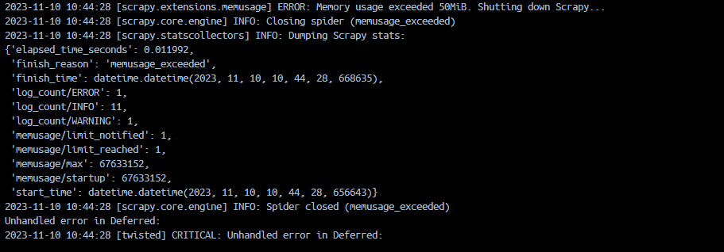
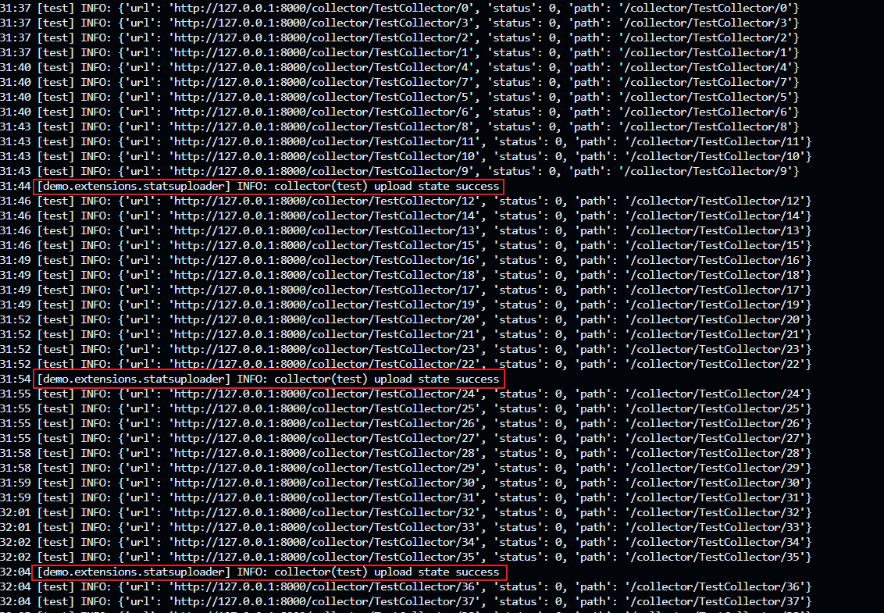
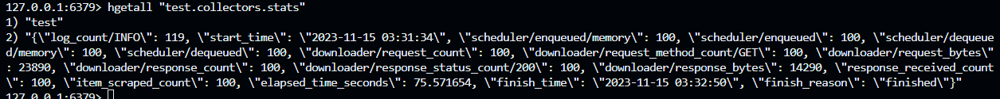

# Scrapy-运行状态监控组件的实现原理分析

-------------------------------------------------------
## 1. 概述
**运行状态监控** 是完善的数据采集系统中的一个重要组成部分，随着采集系统的规模增长，其重要性也越加显现。本文主要探讨 *Scrapy* 框架中 **运行状态监控** 功能相关的扩展组件的实现原理分析，并提出一个简单的状态统计数据的持久化和集中化监控方案。

* [Scrapy-运行状态监控组件的实现原理分析](#scrapy-运行状态监控组件的实现原理分析)
    * [1. 概述](#1-概述)
    * [2. 日志中的运行状态统计信息](#2-日志中的运行状态统计信息)
        * [2.1. 从一段日志开始](#21-从一段日志开始)
        * [2.2. LogStats扩展组件的源码分析](#22-logstats扩展组件的源码分析)
    * [3. 核心状态监控扩展组件 - CoreStats](#3-核心状态监控扩展组件---corestats)
        * [3.1. stats对象从何而来？](#31-stats对象从何而来)
        * [3.2. 状态存储容器 - StatsCollector](#32-状态存储容器---statscollector)
        * [3.3. 运行状态值是如何统计的？](#33-运行状态值是如何统计的)
        * [3.4. CoreStats监控的状态统计参数](#34-corestats监控的状态统计参数)
    * [4. 内存使用状态监控与预警 - MemoryUsage](#4-内存使用状态监控与预警---memoryusage)
        * [4.1. 使用样例](#41-使用样例)
        * [4.2. 原理分析](#42-原理分析)
        * [4.3. 应用场景](#43-应用场景)
    * [5. 运行状态的持久化和集中化监控方案](#5-运行状态的持久化和集中化监控方案)
    * [6. 总结](#6-总结)

- Meta
```json
{
    "node": "4AFBE0F5-838E-D2D1-E177-18D18322871A",
    "name": "Scrapy-运行状态监控组件的实现原理分析",
    "author": "Ais",
    "date": "2023-11-16",
    "tag": ["数据采集", "scrapy", "状态监控", "源码分析"] 
}
```

-------------------------------------------------------
## 2. 日志中的运行状态统计信息

### 2.1. 从一段日志开始
当 *Scrapy* 爬虫在运行时，每隔一段时间就会在日志中看到以下形式的信息：

```log
1970-01-01 00:00:00 [scrapy.extensions.logstats] INFO: Crawled 44775 pages (at 53 pages/min), scraped 37289 items (at 88 items/min)
```

从上述日志信息中我们可以了解当前爬虫的抓取速度和数据产出情况，接下来分析一下这条日志是如何产生的。

### 2.2. LogStats扩展组件的源码分析
从日志信息中可以看到该日志是由 **scrapy.extensions.logstats** 模块打印的，通过追踪源码发现是由该模块中的 **LogStats** 扩展组件实现的，核心逻辑如下：

```py
class LogStats:
    """Log basic scraping stats periodically"""

    def log(self, spider):
        items = self.stats.get_value('item_scraped_count', 0)
        pages = self.stats.get_value('response_received_count', 0)
        irate = (items - self.itemsprev) * self.multiplier
        prate = (pages - self.pagesprev) * self.multiplier
        self.pagesprev, self.itemsprev = pages, items

        msg = ("Crawled %(pages)d pages (at %(pagerate)d pages/min), "
               "scraped %(items)d items (at %(itemrate)d items/min)")
        log_args = {'pages': pages, 'pagerate': prate,
                    'items': items, 'itemrate': irate}
        logger.info(msg, log_args, extra={'spider': spider})
```

其中的两个关键变量 *items* 和 *pages* 分别存储 *已产生的item数量* 和 *已爬取的页面数量*，这两个统计值是从 *self.stats* 属性中获取的，而 *self.stats* 属性则由 *from_crawler* 方法在外部传入，*stats* 的具体构建流程将在后面探讨：

```py
def from_crawler(cls, crawler):
    interval = crawler.settings.getfloat('LOGSTATS_INTERVAL')
    if not interval:
        raise NotConfigured
    # self.stats对象是从crawler中获取的
    o = cls(crawler.stats, interval)
    crawler.signals.connect(o.spider_opened, signal=signals.spider_opened)
    crawler.signals.connect(o.spider_closed, signal=signals.spider_closed)
    return o
```

另外两个对象属性 *self.itemsprev* 和 *self.pagesprev* 则用来保存上一次 **log** 方法调用时的 *items* 和 *pages* 值，通过计算该统计值在两次 *self.log* 函数调用之间的差值来计算“速率”。 

而 *self.log* 方法的定时执行则是在 *spider_opened* 方法中，通过 *twisted* 提供的API实现的：

```py
def spider_opened(self, spider):
    self.pagesprev = 0
    self.itemsprev = 0

    self.task = task.LoopingCall(self.log, spider)
    self.task.start(self.interval)
```

到此为止，**LogStats** 扩展组件的运行流程已经明了。当框架调用 *from_crawler* 创建实例时，会将 *crawler.stats* 属性传入实例，以便 LogStats 扩展对象进行引用来获取目标统计值。同时将 *spider_opened* 方法注册到 *signals.spider_opened* 信号上，当该信号被触发时，执行 *LogStats.spider_opened* 方法，在其内部通过 *twisted* API来定时执行 *LogStats.log* 核心逻辑，从而实现每隔 60s 在日志中打印一次统计信息。

需要注意的是，统计间隔是可自定义的，通过在采集配置中指定 **LOGSTATS_INTERVAL** 参数来设置（默认为60s统计一次）。

-------------------------------------------------------
## 3. 核心状态监控扩展组件 - CoreStats

### 3.1. stats对象从何而来？
在上述对 **LogStats** 扩展组件的源码分析过程中有一个未解决的关键问题，即 *self.stats* 对象的实际来源和具体结构。

通过对源码进行进一步的追踪分析，可以在 **scrapy.crawler.Crawler** 中找到 *stats* 对象的实例化过程：

```py
# scrapy.crawler.Crawler
class Crawler:

    def __init__(self, spidercls, settings=None):
        ...
        self.stats = load_object(self.settings['STATS_CLASS'])(self)
        ...
```

通过查找默认配置 *scrapy.settings.default_settings* 中的 **STATS_CLASS** 具体值，可以定位到 *stats* 对象的类，即 **scrapy.statscollectors.MemoryStatsCollector**。

### 3.2. 状态存储容器 - StatsCollector

**MemoryStatsCollector** 是 **StatsCollector** 的派生类，因此 *stats* 对象的数据结构如下：

```py
# crapy.statscollectors
class StatsCollector:

    def __init__(self, crawler):
        self._dump = crawler.settings.getbool('STATS_DUMP')
        self._stats = {}

    def get_value(self, key, default=None, spider=None):
        return self._stats.get(key, default)

    def get_stats(self, spider=None):
        return self._stats

    def set_value(self, key, value, spider=None):
        self._stats[key] = value

    def set_stats(self, stats, spider=None):
        self._stats = stats
    
    ...
```

从上述源码可以看到，**StatsCollector** 的设计并不复杂，内部使用一个字典来存储数据值（self._stats），并提供了一些访问操作，因此运行状态信息的获取逻辑并不在 *stats* 对象中。

### 3.3. 运行状态值是如何统计的？
既然 **StatsCollector** 只是作为一个存储容器，那么系统的运行状态值是怎样统计并写入 *Crawler.stats* 中的？ 

通过在源码中搜索 `set_value` 的引用，可以发现一个关键模块 —— **scrapy.extensions.corestats**。

```py
# scrapy.extensions.corestats
class CoreStats:

    def __init__(self, stats):
        self.stats = stats
        ...

    @classmethod
    def from_crawler(cls, crawler):
        o = cls(crawler.stats)
        ...
        crawler.signals.connect(o.item_scraped, signal=signals.item_scraped)
        crawler.signals.connect(o.item_dropped, signal=signals.item_dropped)
        crawler.signals.connect(o.response_received, signal=signals.response_received)
        return o

    ...

    def item_scraped(self, item, spider):
        self.stats.inc_value('item_scraped_count', spider=spider)

    def response_received(self, spider):
        self.stats.inc_value('response_received_count', spider=spider)

    ...
```

在上述源码中可以看到，对于 **LogStats** 扩展中引用的状态值 **item_scraped_count** 是在 *CoreStats.item_scraped* 方法中进行统计的。在 **CoreStats** 创建时，通过将 *item_scraped* 方法注册到 *signals.item_scraped* 信号上来进行方法的调用，从而实现 *item_scraped_count* 值的自增统计。*signals.item_scraped* 信号的触发逻辑位于 *scrapy.core.scraper* 中：

```py
# scrapy.core.scraper
class Scraper:

    ...

    def _itemproc_finished(self, output, item, response, spider):
        """ItemProcessor finished for the given ``item`` and returned ``output``
        """
        ...
        return self.signals.send_catch_log_deferred(
                signal=signals.item_scraped, item=output, response=response,
                spider=spider)
```

### 3.4. CoreStats监控的状态统计参数
**CoreStats** 扩展组件监控统计的完整状态统计参数如下：
| 状态值 | 意义 | 注册信号 |
| ------ | ---- | ------- |
| start_time | 运行起始时间 | signals.spider_opened | 
| finish_time | 运行结束时间 | signals.spider_closed | 
| elapsed_time_seconds | 运行时间(s) | signals.spider_closed | 
| finish_reason | 结束原因 | signals.spider_closed | 
| item_scraped_count | 已产生的item数量 | signals.item_scraped | 
| item_dropped_count | 丢弃的item数量 | signals.item_dropped |
| item_dropped_reasons_count/%s | 按异常原因区分的丢弃的item数量 | signals.item_dropped |
| response_received_count | 已爬取的页面数量 | signals.response_received |

-------------------------------------------------------
## 4. 内存使用状态监控与预警 - MemoryUsage
**scrapy.extensions.memusage.MemoryUsage** 是 scrapy 官方提供的一个扩展组件，用于对框架运行过程中的内存使用状态进行监控和预警。通过定时读取内存占用情况，当内存占用到达预警阈值时，触发邮件通知。需要注意的是，由于该插件依赖于 *resource* 模块，因此只能在 *unix* 平台使用。

### 4.1. 使用样例
**MemoryUsage** 扩展组件的使用非常简单，只需要进行一些简单的配置便可。

首先需要在项目的 *settings.py* 配置文件中启用扩展：

```py
EXTENSIONS = {
    ...
    'scrapy.extensions.memusage.MemoryUsage': 300,
    ...
}
# 启用开关
MEMUSAGE_ENABLED = True
```

需要注意的是，上述配置在默认已经启用，但还是建议显示地设置一下。接着来配置预警邮件相关的参数：

```py
# 预警邮件的接受邮箱列表
MEMUSAGE_NOTIFY_MAIL = ["email_1", "email_2", ...]
# SMTP邮件服务器地址
MAIL_HOST = "xxx"
MAIL_PORT = 25
# 预警邮件的发送邮箱
MAIL_FROM = "xxx"
# 发送邮箱认证信息
MAIL_USER = "xxx"
MAIL_PASS = "xxx"
```

**MemoryUsage** 扩展组件的两个关键预警阈值参数如下： 

```py
# 内存告警阈值
MEMUSAGE_WARNING_MB = 10
# 内存限制阈值
MEMUSAGE_LIMIT_MB = 50
```

当框架运行时的内存占用超过上述两个阈值时将会触发邮件预警，但是区别在于，当内存占用超过 *MEMUSAGE_LIMIT_MB* 阈值时，将停止爬虫。测试效果如下：




### 4.2. 原理分析

**MemoryUsage** 的核心实现逻辑如下：

```py
# scrapy.extensions.memusage
class MemoryUsage:
    
    def __init__(self, crawler):
        # 判断是否启用扩展
        if not crawler.settings.getbool('MEMUSAGE_ENABLED'):
            raise NotConfigured
        ...
        # 最大内存限制
        self.limit = crawler.settings.getint('MEMUSAGE_LIMIT_MB')*1024*1024
        ...
        # 将 engine_started 注册到信号
        crawler.signals.connect(self.engine_started, signal=signals.engine_started)
        ...

    def engine_started(self):
        # 记录启动时的内存占用量
        self.crawler.stats.set_value('memusage/startup', self.get_virtual_size())
        # 通过 twisted API 循环调用 self.update 来更新最大内存占用量
        self.tasks = []
        tsk = task.LoopingCall(self.update)
        self.tasks.append(tsk)
        tsk.start(self.check_interval, now=True)
        # 当设置了 MEMUSAGE_LIMIT_MB 参数，循环调用 self._check_limit 方法来检查是否到达内存占用限制
        if self.limit:
            tsk = task.LoopingCall(self._check_limit)
            self.tasks.append(tsk)
            tsk.start(self.check_interval, now=True)
        ...

    def update(self):
        # 更新最大内存占用量
        self.crawler.stats.max_value('memusage/max', self.get_virtual_size())

    def _check_limit(self):
        # 当前内存占用超过最大内存限制值
        if self.get_virtual_size() > self.limit:
            self.crawler.stats.set_value('memusage/limit_reached', 1)
            mem = self.limit/1024/1024
            logger.error("Memory usage exceeded %(memusage)dM. Shutting down Scrapy...",
                         {'memusage': mem}, extra={'crawler': self.crawler})
            # 触发预警邮件通知
            if self.notify_mails:
                subj = (
                    "%s terminated: memory usage exceeded %dM at %s"
                    % (self.crawler.settings['BOT_NAME'], mem, socket.gethostname())
                )
                self._send_report(self.notify_mails, subj)
                self.crawler.stats.set_value('memusage/limit_notified', 1)
            # 关闭爬虫
            open_spiders = self.crawler.engine.open_spiders
            if open_spiders:
                for spider in open_spiders:
                    self.crawler.engine.close_spider(spider, 'memusage_exceeded')
            else:
                self.crawler.stop()
```

当 **MemoryUsage** 类实例化时，会将 *engine_started* 方法注册到 *signals.engine_started* 信号量，并在引擎启动时触发调用，而在 *engine_started* 方法中则通过 *twisted* API来循环调用 *update* 和 *_check_limit* 方法。其中 *update* 方法用于持续更新最大内存占用量，而 *_check_limit* 方法则检查当前内存占用是否超过限制值，当超过设定阈值时，触发邮件预警并关闭爬虫。

### 4.3. 应用场景

对于我个人的主观观点来看，**MemoryUsage** 在实际场景中的用处可能不多，可以考虑作为采集框架的一种针对内存消耗的 **熔断机制**，防止内存泄漏导致的其他风险。但是从理想的设计来看，采集系统的内存消耗应该是在一定范围内稳定的，如果一个采集系统的内存消耗会持续无限制增长，那说明代码设计上存在问题或者存在内存泄漏。这些问题可以在开发和测试阶段通过框架提供的 **scrapy.extensions.memdebug.MemoryDebugger** 扩展组件来进行调试分析。

-------------------------------------------------------
## 5. 运行状态的持久化和集中化监控方案
通过上述的源码分析可以发现，默认情况下 *scrapy* 采用 **scrapy.statscollectors.MemoryStatsCollector** 来存储运行状态信息，即采用内存存储的方式，因此无法进行持久化。同时虽然 **LogStats** 插件可以将其输出到日志中，但是这种方式会导致与其他日志信息混合，不利于进行后续预警处理。

因此，为了解决运行状态持久化和集中化监控的需求，在此探讨一种解决方案。初步思路是通过构建一个 **状态上传扩展组件** 将运行状态信息上传到一个数据库进行集中存储（比如redis）。

**StatsUploader** 的核心设计代码如下：

```py
class StatsUploader(object):
    """上传运行状态统计数据进行持久化和集中存储"""

    def __init__(self, stats, connector, upload_mode="UPLOAD_ON_CLOSE", upload_interval=60, gen_spider_id=None):
        # 状态统计数据
        self.stats = stats
        # 数据库连接器
        self.connector = connector
        # 上传模式(UPLOAD_ON_CLOSE, UPLOAD_ON_IDLE, UPLOAD_INTERVAL)
        self.upload_mode = upload_mode 
        # 上传间隔
        self.upload_interval = upload_interval
        # 定时上传任务
        self._upload_task = None
        # 生成spider_id
        self.gen_spider_id = gen_spider_id or (lambda spider: spider.name)
        # 空闲上传模式数据上传标记(限制在进入空闲状态时只上传一次数据)
        self._idle_mode_uploaded_flag = False

    @classmethod
    def from_crawler(cls, crawler):
        # 构建连接器对象
        connect_confs = crawler.settings.get("STATSUPLOADER_CONNECT_CONFS")
        if crawler.settings.get("STATSUPLOADER_CONNECTOR_CLASS"):
            connector_class = load_object(crawler.settings.get("STATSUPLOADER_CONNECTOR_CLASS"))
        else:
            connector_class = RedisConnector
        connector = connector_class(**connect_confs)
        # 构建状态上传器对象
        stats_uploader = cls(
            stats = crawler.stats,
            connector = connector,
            upload_mode = crawler.settings.get("STATSUPLOADER_UPLOAD_MODE") or "UPLOAD_ON_CLOSE",
            upload_interval = crawler.settings.get("STATSUPLOADER_UPLOAD_INTERVAL") or 60,
            gen_spider_id = crawler.settings.get("STATSUPLOADER_GEN_SPIDERID"),
        )
        # 注册事件
        if stats_uploader.upload_mode == "UPLOAD_ON_IDLE":
            crawler.signals.connect(stats_uploader.spider_idle, signal=signals.spider_idle)
            crawler.signals.connect(stats_uploader.request_scheduled, signal=signals.request_scheduled)
        crawler.signals.connect(stats_uploader.spider_opened, signal=signals.spider_opened)
        crawler.signals.connect(stats_uploader.spider_closed, signal=signals.spider_closed)
        return stats_uploader
    
    def get_stats(self):
        """获取状态统计数据"""
        stats = self.stats.get_stats().copy()
        for k, v in stats.items():
            if type(v).__name__ == "datetime":
                stats[k] = v.strftime("%Y-%m-%d %H:%M:%S")
        return stats
    
    def upload_stats(self, spider):
        """上传状态统计数据"""
        spider_id = self.gen_spider_id(spider)
        try:
            self.connector.upload(spider_id, self.get_stats())
            logger.info(f'collector({spider_id}) upload state success')
        except:
            logger.error(f'collector({spider_id}) upload state failed')

    def spider_opened(self, spider):
        if self.upload_mode == "UPLOAD_INTERVAL":
            self._upload_task = task.LoopingCall(self.upload_stats, spider)
            self._upload_task.start(self.upload_interval)
        hasattr(self.connector, "connect") and self.connector.connect()

    def spider_closed(self, spider, reason):
        if self._upload_task and self._upload_task.running:
            self._upload_task.stop()
        self.upload_stats(spider)
        hasattr(self.connector, "close") and self.connector.close()

    def spider_idle(self, spider):
        if self._idle_mode_uploaded_flag is False:
            self.upload_stats(spider)
            self._idle_mode_uploaded_flag = True

    def request_scheduled(self, request, spider):
        self._idle_mode_uploaded_flag = False
```

相关配置参数如下：

| 配置键名 | 描述 | 样例值 | 
| ------- | ---- | ----- |
| STATSUPLOADER_CONNECTOR_CLASS | 指定启用的连接器，用于进行状态数据上传 | RedisConnector（默认值） | 
| STATSUPLOADER_CONNECT_CONFS | 连接器配置 | {"key": "test.collectors.stats","host": "127.0.0.1"} |
| STATSUPLOADER_UPLOAD_MODE | 状态上传模式 | UPLOAD_ON_CLOSE（默认值） |
| STATSUPLOADER_UPLOAD_INTERVAL | 使用 UPLOAD_INTERVAL 模式时的上传间隔 | 60s | 
| STATSUPLOADER_GEN_SPIDERID | spider_id生成器，用于标记状态数据产出位置，默认使用 spider.name | | 

**StatsUploader** 支持3种上传模式：

* UPLOAD_ON_CLOSE：默认模式，在爬虫结束时上传状态统计数据，通过 *signals.spider_closed* 信号触发。

* UPLOAD_ON_IDLE：在空闲时上传状态统计数据，通过 *signals.spider_idle* 信号触发，主要用于 scrapy-redis 的架构，因为在此架构中，采集经常通常是持久化的，因此 *signals.spider_closed* 信号无法自动触发。

* UPLOAD_INTERVAL：通过 *STATSUPLOADER_UPLOAD_INTERVAL* 设置的间隔时间，按照一定时间间隔（默认60s）上传状态统计数据，主要用于实时性要求较高的监控需求。需要注意的是，在使用远程数据库进行状态存储时，由于该模式下会由产生额外io开销，因此在间隔时间设置较小时，可能会对采集系统的性能产生影响。

**StatsUploader.connector** 是一个依赖对象，在实例化时由外部传入，主要负责状态数据的具体上传逻辑。通过 *STATSUPLOADER_CONNECTOR_CLASS* 和 *STATSUPLOADER_CONNECT_CONFS* 配置来进行构建。采用 *鸭子类型* 的设计，最低要求实现 **upload** 方法，用于上传状态统计数据到指定存储位置。通过上述两个配置，可以灵活的切换数据的存储方案。 默认情况下使用 **statsuploader.RedisConnector**，内部使用 *redis* 的 *hash* 结构进行存储。
 
通过一个简单的demo来测试 **StatsUploader** 插件，使用 *UPLOAD_INTERVAL* 模式的测试效果如下：



连接 *redis* 验证状态统计数据是否上传成功： 



**StatsUploader** 扩展组件的完整代码详见 [StatsUploader](./src/statsuploader.py)

-------------------------------------------------------
## 6. 总结
通过对 *scrapy* 框架中运行状态统计与监控相关组件的实现原理分析，现在来整理一下其设计思路。

核心原理是利用框架提供的 **事件钩子系统**，扩展组件通过将核心逻辑注册到指定事件信号上来收集运行状态统计数据，并通过 **MemoryStatsCollector** 容器进行存储，以实现不同扩展组件之间的数据同步和共享。这种基于事件钩子系统的扩展组件架构以低耦合的方式增强了框架的扩展性，实现了一种即插即用的扩展模式。

需要注意的是，上述讨论的运行状态统计数据的监控是针对采集框架层，而非具体的业务层，特别是针对 *scrapy-redis* 架构的项目，无法从单个“任务”层面来获取运行状态信息。而针对业务层的运行状态监控，怎样构建一个低侵入式的监控方案是一个值得研究的问题。

后续的问题研究主要从以下方向展开：
1. scrapy事件钩子系统的实现原理
2. 进一步完善运行状态的持久化和集中化监控方案
3. scrapy-redis架构项目怎样实现“任务”层面的运行状态监控(低侵入式)


