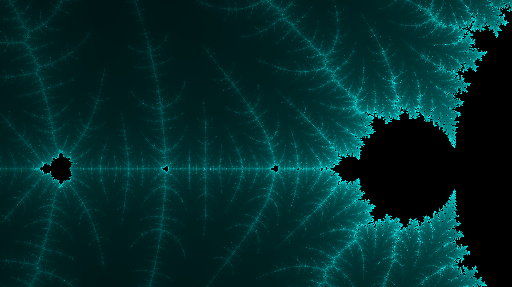
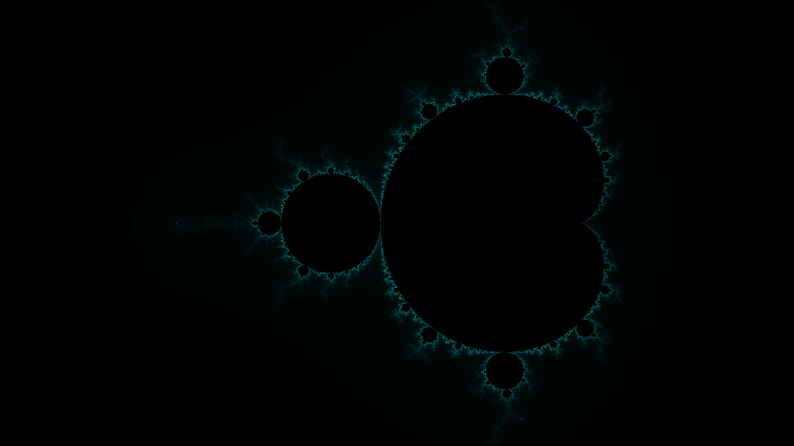
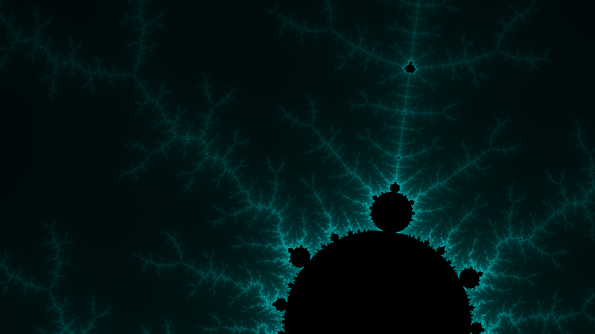
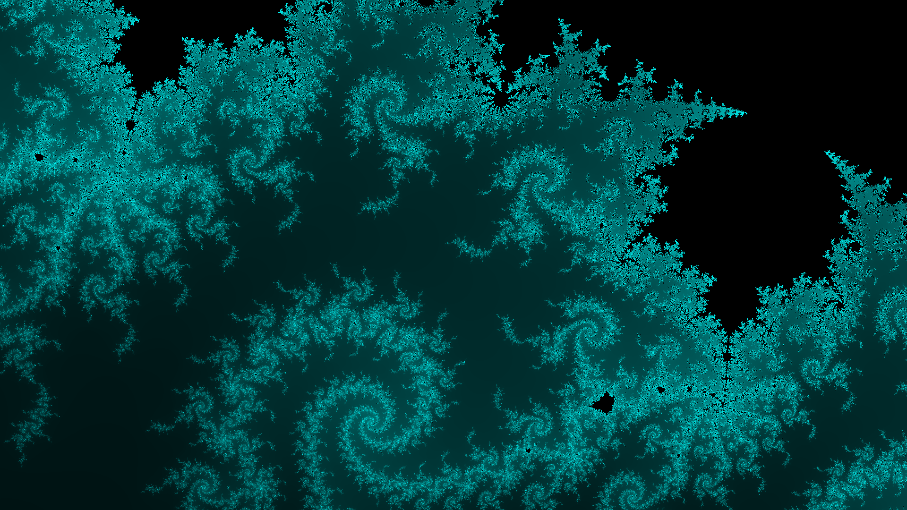

# 基于JavaScript和Canvas绘制曼德勃罗特集

-------------------------------------------------------


-------------------------------------------------------
## 1. 概述

本文主要介绍我的个人项目 [Vision](https://github.com/Ais137/Vision) 的一个应用样例，使用 *Javascript* 和 *Canvas* 来绘制曼德勃罗特集，并通过 WebWorkers 对高分辨率下的计算和绘制进行优化。完整代码详见 [MandelbrotSet](./src/MandelbrotSet.html)。

- [基于JavaScript和Canvas绘制曼德勃罗特集](#基于javascript和canvas绘制曼德勃罗特集)
    - [1. 概述](#1-概述)
    - [2. 曼德勃罗特集](#2-曼德勃罗特集)
    - [3. 计算与绘制流程](#3-计算与绘制流程)
        - [3.1. 定义复数计算](#31-定义复数计算)
        - [3.2. 迭代计算逻辑](#32-迭代计算逻辑)
        - [3.3. 坐标系变换](#33-坐标系变换)
        - [3.4. 颜色填充方案](#34-颜色填充方案)
        - [3.5. 绘制曼德勃罗特集](#35-绘制曼德勃罗特集)
    - [4. 绘制效果演示](#4-绘制效果演示)
    - [5. 朱利亚集合](#5-朱利亚集合)
    - [6. 使用 WebWorkers 加速计算](#6-使用-webworkers-加速计算)

* Meta
```json
{
    "node": "4ED2456C-38E7-D170-EF32-9B6508182537",
    "name": "基于JavaScript和Canvas绘制曼德勃罗特集",
    "author": "Ais",
    "date": "2023-09-22",
    "tag": ["Vision", "Javascript", "Math", "曼德勃罗特集", "MandelbrotSet"]
}
```

-------------------------------------------------------
## 2. 曼德勃罗特集

> 曼德博集合（英语：Mandelbrot set，或译为曼德布洛特复数集合）是一种在复平面上组成分形的点的集合，以数学家本华·曼德博的名字命名。曼德博集合与朱利亚集合有些相似的地方，例如使用相同的复二次多项式来进行迭代。

曼德勃罗特集的定义如下：

有一个复二次多项式：

$$Z_{n+1} = {Z_n}^2 + C$$

其中 $Z$ 和 $C$ 为 **复数**，$n = 0, 1, 2, ...$，从 $Z=0$ 开始迭代有：

$$Z_0 = 0(0, 0)$$

$$Z_1 = Z_0^2 + C$$

$$Z_2 = Z_1^2 + C$$

$$...$$

$$Z_{n+1} = {Z_n}^2 + C$$

上述迭代过程的复数模长构成一个序列：$(|Z_0|, |Z_1|, |Z_2|, ..., |Z_n|)$，对于不同的参数 $C$，这个序列可能发散也可能收敛到有限范围。

曼德勃罗特集 *M* 是使序列不发散到无限大的所有复数 *C* 的集合。

*PS: 下述用 MBS 来代指曼德勃罗特集*

-------------------------------------------------------
## 3. 计算与绘制流程

在了解了 *MBS* 的基本概念后，可以通过以下流程来进行计算和绘制：

1. 给定一个复数 $C$，通过上述定义进行迭代，判断 $|C|$ 是否收敛到有限值，从而判断复数 $C$ 是否在集合中。

2. 扫描指定范围内的复数，依次判断是否在集合中。

3. 根据判定结果进行绘制，绘制时通过不同的样式来区分集合内外的点。

### 3.1. 定义复数计算
第一步是定义复数计算，用于支持后续的迭代计算：

```js
class Complex {

    /**
     * @classdesc 复数: 实现复数计算
     * 
     * @property { number } r - 实部
     * @property { number } i - 虚部
     * 
     * @param { number } r - 实部
     * @param { number } i - 虚部
     * 
     * @example
     * let c = new Complex(1, 1);
     */
    constructor(r, i) {
        //实部
        this.r = r;
        //虚部
        this.i = i;
    }

    /**
     * 复数加法
     * @param { Complex } 操作数 
     * @returns { Complex } this
     */
    add(complex) {
        this.r += complex.r;
        this.i += complex.i;
        return this;
    }

    /**
     * 复数乘法: (a+bi)(c+di)=(ac-bd)+(bc+ad)i
     * @param { Complex } 操作数 
     * @returns { Complex } this
     */
    mult(complex) {
        let a = this.r, b = this.i, c = complex.r, d = complex.i;
        this.r = a * c - b * d;
        this.i = b * c + a * d;
        return this;
    }

    /**
     * 计算模长
     * @returns { number } 模长
     */
    norm() {
        return Math.sqrt(this.r * this.r + this.i * this.i);
    }
}


//Test
let c1 = new Complex(2, 3);
let c2 = new Complex(-3, 5);
c1.add(c2);   //Complex { r: -1, i: 8 }
c1.mult(c2);  //Complex { r: -21, i: 1 }
c1.norm();    //3.605551275463989
```

### 3.2. 迭代计算逻辑

在实现复数的计算逻辑后，基于该组件构建迭代逻辑，曼德勃罗特集合的核心计算逻辑如下：

```js
/**
 * 曼德勃罗特集: Z(n+1) = Z(n) ^ 2 + C
 * 
 * 判断给定参数(C)经过有限次迭代是否收敛
 * 
 * @param { Complex } C - 复数参数 
 * @param { number } n - 迭代次数(int&n>0)
 * 
 * @returns { Array } [是否属于该集合, 迭代次数]
 * 
 * @example
 * MandelbrotSet(new Complex(0, 0)) -> [true, n]
 */
const MandelbrotSet = function (C, n = 500) {
    let z = new Complex(0, 0);
    for (let i = 0; i <= n; i++) {
        z = z.mult(z).add(C);
        if (z.norm() > 2) {
            return [false, i];
        }
    }
    return [true, n]
}
```

在 *MBS* 的定义中需要通过一个迭代过程来进行判断，但由于实际的计算过程无法无限迭代，因此通过一个参数 *n* 来控制计算的迭代次数，当 *n* 越大时，判定结果就越精准，但同时计算量也会递增。

可以注意到上述函数在迭代过程中有一个特殊的跳出条件 `z.norm() > 2`，即当迭代过程中，复数的模长大于2时跳出循环，并将当前计算的复数判定为不属于集合中的点。这个条件是基于以下定理：

$$z \in M, 则有 |z| \leq 2$$

完整推导过程参考 [wikipedia](https://zh.wikipedia.org/zh-hans/%E6%9B%BC%E5%BE%B7%E5%8D%9A%E9%9B%86%E5%90%88)。

### 3.3. 坐标系变换

在实现 *MBS* 的核心计算逻辑后，下一步就是扫描复数 $C$ 的定义域，来计算定义域中所有复数的判定结果，这个过程中会涉及到两个坐标系之间的变换。

*MBS* 中的 **复数** 可以看作是一种具有特殊规则的 **向量**，这意味着可以将 *MBS* 的定义域中的复数与 **屏幕像素坐标系** 中的坐标构建一种映射关系。

在使用 *Canvas* 进行绘图时，*Canvas* 的 **屏幕像素坐标系(PCS)** 定义如下：

```
  o(0, 0) ----------> (+x)  dx=1(pixel)
  |
  | 
  |
  V
 (+y)                 
```
其中坐标原点 o(0, 0) 位于屏幕左上角，x轴正方向水平向右，y轴正方向垂直向下，坐标系刻度为1个像素单元。

而在计算 *MBS* 时，复数 $C$ 的定义域则是在 **复平面**。

```
 (虚轴)
 ^
 | 
 |        
 |         
 o(0, 0) ----------> (实轴) 
```

由于不涉及到其他计算，为了方便，可以将 $C$ 的定义域(复平面) 当成 **实数向量坐标系** 来处理。

上述坐标系的核心变换逻辑如下：

```js
//实数坐标系
class RCS {

    /**
     * @classdesc 实数坐标系: 将屏幕像素坐标系映射到实数域中进行计算
     * 
     * @property { number[] } co - 屏幕像素坐标系原点坐标
     * @property { number } scale - 标度比例，一个像素对应的值(scale>0)
     * 
     * @param { number[] } co - 屏幕像素坐标系原点坐标
     * @param { number } [scale=1] - 标度比例
     * 
     * @example
     * let rcs = new RCS([canvas.cx, canvas.cy], 0.5);
     */
    constructor(co, scale = 1) {
        this._co = co;
        this._scale = scale;
    }

    /**
     * PCS(屏幕像素坐标系) -> RCS(当前坐标系)
     * 
     * @param { number } x - 屏幕像素坐标x分量
     * @param { number } y - 屏幕像素坐标y分量
     * @returns { number[] } 转换后的坐标
    */
    to(x, y) {
        let _x = (x - this._co[0]) * this._scale;
        let _y = (-1) * (y - this._co[1]) * this._scale;
        return [_x, _y];
    }

    /**
     * RCS(当前坐标系) -> PCS(屏幕像素坐标系)
     * @param { number } x - 当前坐标系x分量
     * @param { number } y - 当前坐标系y分量
     * @returns { number[] } 转换后的坐标
    */
    from(x, y) {
        let _x = (x / this._scale) + this._co[0];
        let _y = ((-1) * y / this._scale) + this._co[1];
        return [_x, _y];
    }

    ...
}
```

### 3.4. 颜色填充方案

在绘制 *MBS* 时，通常采用两种颜色来区分集合内外的点，但是这种方式展示的图像比较单调，因此可以根据指定坐标点的复数在发散时的迭代次数来生成颜色值，具体的填充方案如下：

```js
/**
 * 颜色填充器
 * 
 * 对于集合内的点，根据 color_confs.color_in 进行填充
 * 对于集合外的点，以 color_confs.color_out 为基准，根据发散时的迭代次数(iter_n)来生成颜色值。
 * 
 * @params { object } color_confs - 颜色配置
 * @params { number } [color_confs.color_in=[0, 0, 0]] - 集合内填充颜色
 * @params { number } [color_confs.color_out=[0, 255, 255]] - 集合外填充颜色
 * @params { object } state - MandelbrotSet函数的返回值([表示是否在集合内，为发散时的迭代次数])
 */
const color_filler = function (color_confs, state) {
    let [inSet, iter_n] = state
    if (inSet) {
        return color_confs.color_in;
    } else {
        let rate = iter_n / color_confs.n;
        return [
            color_confs.color_out[0] * rate, 
            color_confs.color_out[1] * rate, 
            color_confs.color_out[2] * rate
        ];
    }
}
```

### 3.5. 绘制曼德勃罗特集

在实现上述前置组件后，通过组合这些组件来实现曼德勃罗特集的绘制逻辑：

```js
/** 计算和渲染曼德勃罗特集 */
const MandelbrotSetRenderer = function(confs) {
    //构建图像容器
    let img = context.ctx.createImageData(confs.width, confs.height);
    //中心坐标
    let C0 = new Complex(...confs.C0);
    //遍历屏幕像素坐标系
    for(let y=0; y<confs.height; y++) {
        for(let x=0; x<confs.width; x++) {
            //计算
            let state = MandelbrotSet(new Complex(...rcs.to(x, y)).add(C0), confs.n);
            //绘制
            let color = color_filler(confs, state);
            let index = (y * confs.width + x) * 4;
            img.data[index] = color[0], 
            img.data[index+1] = color[1], 
            img.data[index+2] = color[2], 
            img.data[index+3] = 255; 
        }
    }
    context.ctx.putImageData(img, confs.offset_x, confs.offset_y);
}

//渲染参数
const confs = {
    //像素尺寸
    "width": window.screen.width,
    "height": window.screen.height,
    //中心点
    "C0": [0, 0],
    //迭代次数
    "n": 500,
    //集合内填充颜色
    "color_in": [0, 0, 0],
    //集合外填充颜色
    "color_out": [0, 255, 255],
    ...
}

MandelbrotSetRenderer(confs);
```

通过遍历 **屏幕像素坐标系** 中的坐标点，经过坐标系变换，转换成 *MBS* 的定义域坐标中的复数，并通过 *MandelbrotSet* 迭代计算是否在集合内，根据判定结果对指定坐标的像素点进行颜色填充，从而实现曼德勃罗特集的绘制。完整代码详见 [MandelbrotSet](./src/MandelbrotSet.html)。

-------------------------------------------------------
## 4. 绘制效果演示






-------------------------------------------------------
## 5. 朱利亚集合

**Julia_Set(朱利亚集合)** 与 **曼德勃罗特集** 有相似的迭代形式，其区别在于复数 $C$ 是一个固定值，而 $Z_0$ 并不一定是从 $(0, 0)$ 开始迭代。 

```js
/**
 * 朱利亚集: Z(n+1) = Z(n) ^ 2 + C
 * 
 * 固定参数C, 判断Z0是否在有限次迭代后收敛
 * 
 * @param { Complex } Z0 - 初始迭代参数 
 * @param { Complex } C - 固定复数参数
 * @param { number } n - 迭代次数(int&n>0)
 * 
 * @returns { Array } [是否属于该集合, 迭代次数]
 * 
 * @example 
 * Julia_Set(new Complex(0, 0), new Complex(-0.8, 0.156)) -> [true, n]
 */
const Julia_Set = function(Z0, C, n=500) {
    let z = Z0;
    for(let i=0; i<=n; i++) {
        z = z.mult(z).add(C);
        if(z.norm() > 2) {
            return [false, i];
        }
    }
    return [true, n]
}
```

以下是一些指定 $C$ 值的样例：

$C = (-0.8, 0.156i)$


$C = (0.285, 0.01i)$


-------------------------------------------------------
## 6. 使用 WebWorkers 加速计算

在进行 *MBS* 的计算和渲染时，由于原生 *JavaScript* 是单线程模型，这类计算密集型任务会很消耗时间，当进行缩放或平移后需要重新计算和绘制时，会感受到明显的延迟。特别是在渲染高分辨率图像时，延迟尤为明显。

为了解决上述问题，考虑通过 **WebWorkers** 技术来进行加速计算。**WebWorkers** 是浏览器环境的多线程方案，通过将计算密集型任务分配到 *worker* 后台进程执行，从而防止主进程阻塞，同时也可以用于提高计算效率。

在 *MBS* 的计算和绘制场景中，核心思路是将 **目标渲染区域切分成一系列子区域**，从而拆分成 **子任务** 的形式，并通过 **WebWorkers** 分配到不同的 *worker* 进程中执行，以进行 “并行计算”，再将计算结果回传到主进程进行绘制显示。

首先在原有代码的基础上添加一个 `<script type="text/js-worker"></script>` 标签，将计算和渲染逻辑简单修改后迁移进去，并绑定 **onmessage** 事件：

```js
//执行渲染任务
onmessage = function(event) {
    //任务参数 {"p": [x, y], "dx": n, "dy": n}
    let task = event.data.task;
    //渲染参数
    let confs = event.data.confs;
    //计算和渲染曼德勃罗特集
    let img = MandelbrotSetRenderer(task, confs);
    //回传数据
    postMessage({"img": img, "p": task.p});
}
```

这个标签内的源码就是 *worker* 进程的运行逻辑，**onmessage** 用于与主线程进行通信时获取子任务，*task* 中包含了计算与渲染区域的 *起始坐标(p)* 和 *区域尺寸(dx, dy)*，*worker* 计算和渲染完成后，将结果通过 *postMessage* 方法回传到主进程。

通过以下方式构建 *worker* 进程：

```js
//构建工作线程
let blob = new Blob(Array.prototype.map.call(document.querySelectorAll("script[type=\"text\/js-worker\"]"), function (oScript) { return oScript.textContent; }),{type: "text/javascript"});
let workers = [];
for(let i=0; i<confs.N; i++) {
    workers[i] = new Worker(window.URL.createObjectURL(blob));
    //渲染图像
    workers[i].onmessage = function(event) {
        context.ctx.putImageData(event.data.img, event.data.p[0], event.data.p[1]);
    }
}
```

`workers[i].onmessage` 绑定了主进程接受到回传数据后的处理逻辑，将 *worker* 进程的处理结果渲染到 *Canvas* 中。

主进程中通过调用 ***MandelbrotSetRenderer*** 来进行子任务的生成和分配。

```js
//构建渲染任务
const MandelbrotSetRenderer = function(workers, confs) {
    //按y轴切分渲染区域
    let dy = parseInt(confs.height / workers.length);
    //分配子任务到工作线程
    for(let i=0; i<workers.length; i++) {
        workers[i].postMessage({
            "task": {"p": [0, i*dy], "dx": confs.width, "dy": dy}, 
            "confs": confs
        });
    }
}
```

完整代码详见 [MandelbrotSet_ver_WebWorker](./src/MandelbrotSet_ver_WebWorker.html)，通过运行测试可以发现，其延迟要明显小于单线程的版本。